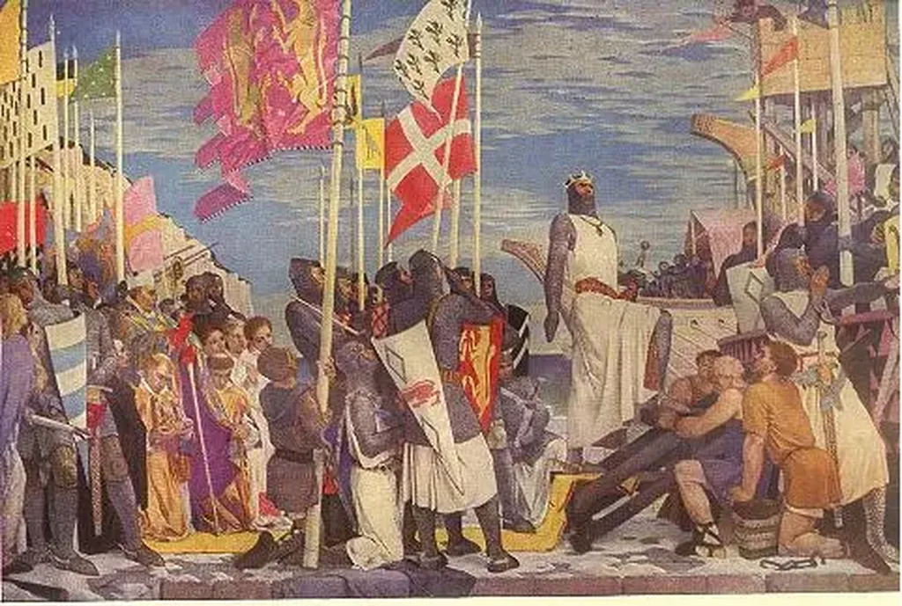

# Un an de twiller

Paul Valéry avait prédit que plus personne n’écrirait des phrases du type « La marquise sortit à cinq heures. » Je viens aujourd’hui de passer exactement une année à enchaîner de telles phrases sur Twitter pour construire pas-à-pas les 60 premiers chapitres de [*Croisade*](http://twiller.tcrouzet.com/).

J’avoue que ça me fait beaucoup de bien et que je me marre comme quand je faisais du jeu de rôle. Je comprends pourquoi autant d’auteurs depuis s’acharnent à démentir la prophétie de Paul Valéry. Et ils ne se prêteraient peut-être pas autant au jeu si les lecteurs eux-mêmes ne les suivaient en masse.

Certes la plupart des auteurs de Thriller (et même nos Goncourt) tentent d’écrire des phrases originales, de se parer d’un vernis littéraire, mais au fond, quand on enlève les fioritures qui crèvent les yeux, on en revient toujours à l’histoire de marquise.

Outre la contrainte des 140 caractères propre à Twitter, je m’impose cette contrainte du degré zéro de l’écriture. À vrai dire, je n’aime pas les fioritures rococo. Le style ne doit pas se voir. J’admire Gracq par exemple, par ses trouvailles, ses inventions, sa couleur… et, à la fois, il m’irrite parfois tant je le vois en train de chercher un effet. Je me sens plus proche de Stendhal que des travailleurs minutieux, plus proche de McEnroe que d’Yvan Lendl.

Pour moi, la littérature s’écoule comme un flot incontrôlé, elle traduit la particularité d’une structure cérébrale… particularité que l’on ressent chez Proust ou Céline par exemple mais aussi chez Rousseau même si elle se traduit dans un registre moins explicite. Il y a travail chez eux mais travail de sculpture du cerveau pour qu’il produise le bon jus, pas travail sur le jus lui-même (c’est ma façon de voir les choses).

Chez Gracq, je ressens ce travail supplémentaire, l’ajout de circonvolutions a posteriori, souvent géniales j’en conviens, mais quelque peu inhumaines, loin du processus que je ressens en moi. Je reste un admirateur de Gracq. Il a réussi là où tous les autres décorateurs de la langue ont échoué et échouent d’autant plus lamentablement qu’ils n’ont rien de plus à dire que cette histoire de marquise.

Alors j’évite de prendre des risques avec *Croisade* quitte à paraître fade pour les adeptes du rococo et de l’embonpoint stylistique forcé. Je préfère m’amuser avec l’histoire. Comme je n’ai rien prévu, elle ne peut que me surprendre. À la fin de chaque chapitre, je me demande toujours « Et après ? »

Ça fait un bien fou d’écrire pour le plaisir sans rien avoir de particulier à dire sinon jouer avec ce qui vient à l’improviste. Encore deux ou trois mois de tweets quotidiens et puis j’aurai un petit roman de hall de gare. J’espère que l’histoire tiendra debout car, une fois la performance en tant que telle dépassée, c’est l’histoire qui reste. Le processus n’a plus aucune importance.

Longtemps influencé par le Nouveau Roman, je me suis intéressé à l’écriture pour l’écriture. Cette histoire de l’écriture elle-même me paraît aujourd’hui bien peu intéressante, sinon pour les écrivains eux-mêmes. Quand on mange un plat, le plus souvent on se fiche de la cuisine, surtout si on n’est pas cuisinier soi-même.

Nous avons besoin d’inventer des mondes possibles pour penser notre monde. Les histoires des couples qui traversent la crise de la trentaine ou de la quarantaine m’insupportent. Je préfère imaginer que la marquise se lève et se prépare à sortir. Il se passe bien plus de choses dans ma tête.

#croisade #twiller #dialogue #y2009 #2009-12-25-13h38
