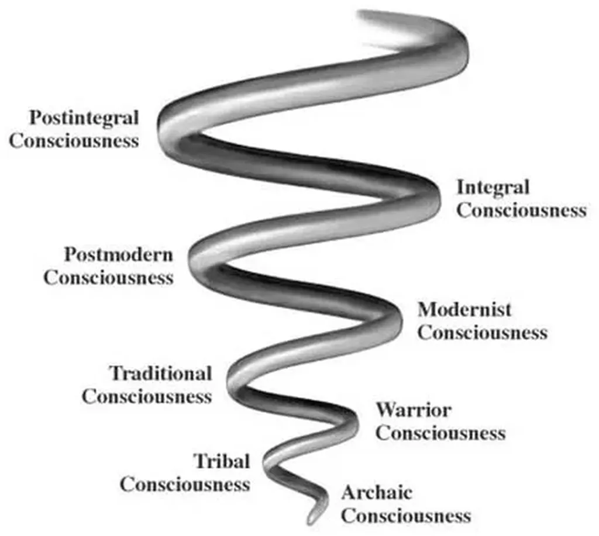
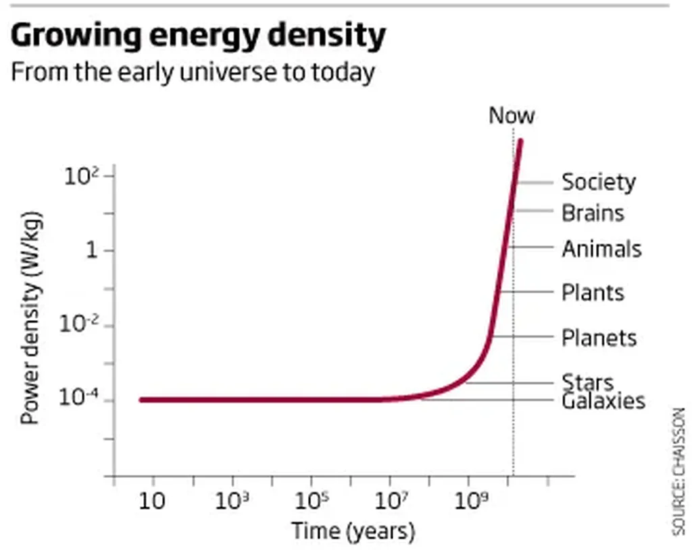
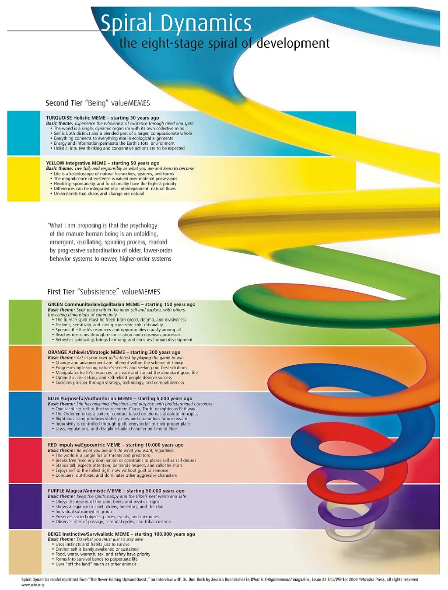

# Complexe ou compliqué ?

Un Airbus serait plutôt compliqué. Un organisme vivant serait plutôt [complexe](http://fr.wikipedia.org/wiki/Syst%C3%A8me_complexe). Différencier ces deux notions me paraît fondamental.

Par compliqué, on tend un système composé d’un grand nombre de sous-systèmes, eux-mêmes composés de sous systèmes et ainsi de suite et où chacun des sous-systèmes est plus simple que l’ensemble auquel il participe. C’est le cas pour un avion. On termine avec les boulons et des composants élémentaires.

En théorie, il n’existe pas de limite à la complication car on peut sans cesse connecter des systèmes compliqués entre eux. En théorie seulement car nous avons de plus en plus de mal à augmenter la complication de nos machines. Nous peinons à produire de nouveaux avions. Nous peinons avec les nouveaux OS.

Même avec l’aide des ordinateurs, la complication soutenable n’est sans doute pas illimitée ; tout comme un progrès technologique qui reposerait sur des systèmes compliqués, cas de figure dans lequel nous nous trouvons depuis le début de la révolution industrielle.

Pour un organisme vivant, tel un humain, la décomposition suivant la logique réductionniste est moins évidente. Un organe, puis une cellule restent immensément compliqués. Mené jusqu’aux lois de la physique le réductionnisme n’est pas d’un grand secours comme le montre [Stuart Kaufman](../../2008/8/autoregulation-vs-auto-organisation.md). Des lois nouvelles émergent qui sont non réductibles aux lois fondamentales : l’évolution par exemple.

Dans d’autres systèmes complexes, comme les automates cellulaires de [Wolfram](http://www.stephenwolfram.com/publications/articles/ca/84-complex/2/text.html) dont je parle dans *Le peuple des connecteurs*, les parties sont connues, immensément simples, mais leurs interactions engendrent des comportements qui échappent au réductionnisme (notamment à cause des comportements émergents).

Comment mesurer la complexité ? Comment la différencier de ce qui est compliqué ? Ces questions apparemment abstraites ont d’immenses conséquences philosophiques. Par exemple, [Teilhard de Chardin](../../2008/9/teilhard-de-chardin.md) et les tenants de l’integral philosophy supposent que la complexité ne cesse de croître par un phénomène que Wilber résume par *transcender et inclure*.

Leur hypothèse initiale est-elle légitime ? J’ai l’impression qu’ils n’ont jamais défini ce qu’était la complexité, ni surtout comment l’estimer. Sommes-nous vraiment plus complexes qu’une termitière ? J’ai envie de dire oui mais comment en être sûr ?

### La vie, la mort

Peut-être est-il possible de différencier le compliqué du complexe en disant que le complexe présente un caractère vivant opposé au caractère mort du compliqué. Un système complexe, tel un organisme ou même un automate cellulaire, n’est complexe que tant qu’il consomme de l’énergie pour se maintenir loin de l’équilibre thermodynamique, souvent à un point de transition de phase où se produisent l’auto-organisation et les phénomènes émergents.

Un avion, une fois posé, ne consomme pas d’énergie mais il reste un avion. Son état au sol ne diffère guère de son état en vol. Un organisme congelé n’est plus en revanche que l’ombre de lui-même malgré le fait qu’il puisse parfois être réveillé. Pour se révéler, il doit obligatoirement consommer de l’énergie.

[En mathématique](http://www.larecherche.fr/content/recherche/article?id=3156), on mesure la complexité en estimant la taille du programme le plus court capable de reproduire un phénomène. Mais les automates de Wolfram de nécessitent que quelques lignes et génèrent des résultats complexes. Soit cette complexité est illusoire, soit il faut introduire une autre notion.

L’avenir d’un système complexe ne peut pas être connu sans faire tourner le programme qui le génère. Il a beau être simple, il faut le faire tourner, c’est-à-dire consommer de l’énergie pour atteindre l’avenir désiré. La suite des nombres premiers peut ainsi être définie comme complexe. L’imprévisibilité est donc une des caractéristiques des systèmes complexes. On ne peut pas prédire ce qu’ils vont donner sans attendre de voir ce qu’ils donnent. En d’autres mots, il n’y a pas de raccourci vers l’avenir.

### L’approche connexionniste

Intuitivement, je définis souvent la complexité par un nombre croissant de connexions. J’ai l’impression que si on cartographie les interactions dans un système, on doit aboutir à une carte, cette carte doit d’un coup d’œil nous révéler si le système est complexe ou non.

Si le système est compliqué et se divise en sous-systèmes indépendants ou avec peu d’interactions, on aboutit à un organigramme, parasité de quelques liaisons transversales. C’est en gros comme ça qu’on apprend à programmer et que la plupart des logiciels sont construits.

Si le système est complexe, si la subdivision n’aide pas à progresser dans la compréhension du système, la carte doit sans doute ressembler à un réseau décentralisé et distribué. En théorie la taille d’un tel réseau n’a pas de limite il me semble, donc la complexité serait en effet illimitée.

Maintenant, rien ne prouve que la croissance du réseau, au delà d’un seuil à définir,  ajoute nécessairement des connexions utiles. Il peut y avoir de la redondance pour ajouter de la solidité mais peut être les liaisons supplémentaires ne font que compliqué le déjà complexe.

Je n’en sais rien, je réfléchis tout haut. Pour les tenants de l’integral philosophy, la conscience se développe en intégrant les stades antérieurs, suivant la [spirale dynamique](http://en.wikipedia.org/wiki/Spiral_Dynamics). Ce processus de complexification apporterait sans cesse de la nouveauté. Franchement, j’en doute. Je pense que la conscience évolue, mais pas nécessairement vers plus de conscience mais plutôt vers d’autres formes. Aujourd’hui, nous rêvons de la conscience collective tout en ayant perdu la conscience que devaient éprouver les premiers hommes.

Je ne crois pas non plus que « intégrer et transcender » soit une réalité. Ma conscience d’enfant existe encore un peu en moi mais elle s’est grandement diluée. On gagne quelque chose, on perd autre chose. Je veux bien qu’on gagne plus qu’on ne perd mais, à partir d’un certain stade, je ne suis même pas sûr que ce soit le cas. Il peut y avoir évolution sans progrès.

### La complexité maximale

Pour Wolfram, il existe un seuil de complexité maximale car il pense que les programmes susceptibles de générer les phénomènes complexes que nous observons ne sont jamais très longs. C’est ce qu’il appelle le principe d’équivalence computationnelle.

> But at least one point of the principle of computational equivalence is, that once you are past the threshold of universality, there isn’t any fundamentally new behavior to add, peut-on lire sur le forum de [Wolfram Science](http://forum.wolframscience.com/showthread.php?s=59a1edf2c833d6d315bf63796cc9bf3e&threadid=862&highlight=*chapter+12*). Maximal complexity is already there, in a sense.

Si Wolfram ne se trompe pas, les bases naturalistes de l’integral philosophy volent en éclat. Notre conscience ne serait pas plus complexe qu’une conscience plus ancienne mais elle posséderait simplement une autre forme d’organisation, plus évoluée (au sens darwinien). Si cette conscience n’est pas plus complexe, elle ne peut donc pas intégrer et transcender les consciences plus primitives. À mon sens, elle peut simplement les transcender, ce qui n’est qu’une façon mystique de dire évoluer.

Ma méfiance vis-à-vis des structures hiérarchiques et de l’essentialisme me pousse à interroger l’integral philosophie. Je ne suis sans doute pas objectif. Et si je m’intéresse au sujet, c’est parce que j’ai longtemps étudié les textes sur la conscience et les états de consciences. Qu’il existe indéniablement des niveaux de conscience n’implique pas que certains niveaux soient supérieurs aux autres. L’éveil est-il supérieur au rêve ? Ils sont surtout différents. J’ai bien du mal à les hiérarchiser.

D’un autre côté, un progrès éventuel de la conscience me plait. En tant qu’athée, c’est dans cette direction que je place l’espoir, celui d’une sorte de communion. Pour moi, ce progrès s’apparente à une évolution, une transformation… mais je doute que nous puissions intégrer et transcender systématiquement. Peut-être que la complexité maximale a été atteinte depuis longtemps par nos cerveaux. Nous ne ferions alors que réorganiser cette complexité pour révéler de nouvelles possibilités.

### La complexité se nourrit d’énergie

Pour gagner quelque chose, nous devons perdre autre chose, sinon nous consommerions de plus en plus d’énergie.

À ce sujet, j’ai lu un [article](http://www.newscientist.com/article/mg20227026.800-the-heat-to-come.html?full=true) d’Eric Chaisson qui évalue l’évolution de la consommation en énergie de différentes structures dans l’univers. En tant que civilisation, nous serions très gourmands, ce qui tendrait à dire que nous sommes aussi plus complexes.

> The rate of energy used by our hominin ancestors goes like this: hunter-gatherers a million years ago used about 0.05 kilowatts each; farming societies of several thousand years ago used about 0.5 kilowatts per person; industrialists a couple of centuries ago used about 2.5 kilowatts; and every resident of the affluent US now uses about 15 kilowatts.

Allons-nous continuer ainsi ou allons-nous finir par nous heurter à une barrière ? À priori, si nous nous contentons des énergies renouvelables, nous avons une bonne marge de manœuvre, donc de la place pour accroître la complexité qui serait liée à la consommation énergétique.

### La spirale dynamique

 Dans une des images canoniques qui illustre la spirale dynamique et l’évolution des civilisations et des consciences, j’ai trouvé une citation de C. Graves partout reproduite et dont un point particulier me dérange (en gras) :

> Briefly, what I am proposing is that the psychology of the mature human being is an unfolding, emergent, oscillating spiraling process marked by progressive **subordination of older, lower-order behavior systems to newer, higher-order systems** as an individual’s existential problems change. Each successive stage, wave, or level of existence is a state through which people pass on their way to other states of being. When the human is centralized in one state of existence, he or she has a psychology which is particular to that state. His or her feelings, motivations, ethics and values, biochemistry, degree of neurological activation, learning system, belief systems, conception of mental health, ideas as to what mental illness is and how it should be treated, conceptions of and preferences for management, education, economics, and political theory and practice are all appropriate to that state.

Je me répète mais je ne vois pas en quoi ma conscience actuelle subordonne ma conscience d’enfant. Elle l’étouffe plus qu’autre chose. Je continue à lire les tenants de l’integral philosophy mais j’ai l’impression qu’il s’inventent un monde idéal (j’aimerais y croire mais c’est une conversion qu’ils nous demandent).

Dans les prochains posts, j’essaierai de réfléchir au dernier niveau de la spirale dynamique. Quel avenir nous propose-t-il ? Je suis sûr qu’on peut imaginer bien d’autres possibilités, divergentes et tout aussi intéressantes. J’ai un peu l’impression que toutes ces théories, ces chemins prétracés, ont avant tout pour but de rassurer les gens comme les bonnes vieilles religions.

#auto-organisation #connecteur #integral_philosophy #wilber #y2009 #2009-4-17-21h58
