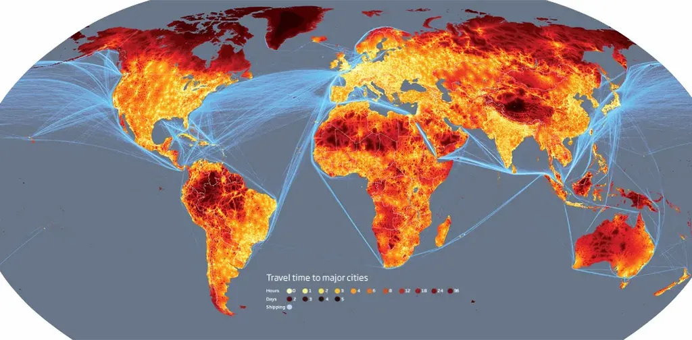

# La complexité géographique

Cette carte parle d’elle-même. Le monde est devenu minuscule, géographiquement massivement interconnecté. Encore une raison pour ne plus chercher à vouloir lui appliquer les règles inventées au temps des Égyptiens, des Grecs ou des Romains, voire, ce qui est à peine plus moderne, durant la révolution industrielle. Aucun de nos ancêtres ne s’est trouvé dans la situation où nous trouvons tous aujourd’hui. [Moins de 10 % de la surface terrestre se trouve à plus de 48 heures de voyage !](http://www.newscientist.com/article/mg20227041.500-wheres-the-remotest-place-on-earth.html)

#connecteur #y2009 #2009-4-22-11h7
