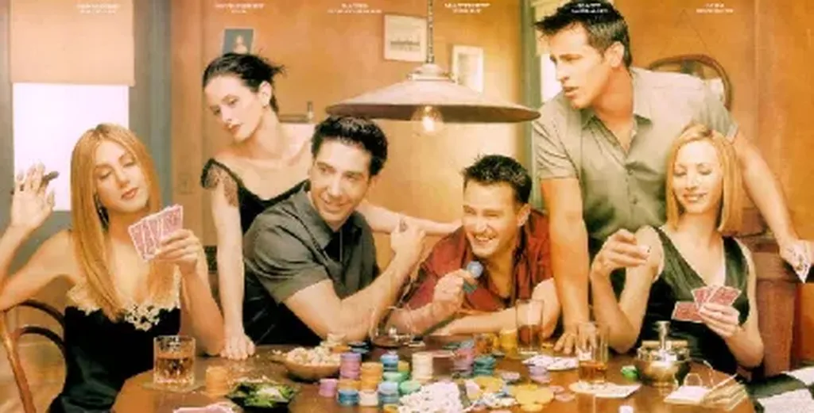

# Internet ne serait qu’un moyen

Chaque fois que je donne une conférence, alors même que je ne fais parfois aucune référence aux nouvelles technologies, des gens s’insurgent et prétendent que je décris un monde où il n’y aurait pas de place pour l’homme.

J’ai au contraire l’impression de partir de l’homme. Quand je dis que nous avons créé un gigantesque réseau social, ce n’est ni une métaphore ni un objectif, c’est un fait. Que cette structure donne le vertige, qu’elle remette en question de vieilles croyances, ne l’empêche pas moins d’être présente et si nous refusons d’en prendre conscience il ne peut rien nous arriver de bon.

On me dit alors que ce qui compte c’est d’avoir des amis réels avec qui on partage des expériences exceptionnelles. On me dit qu’on ne peut avoir que quatre ou cinq véritables amis. On me dit que mes amitiés numériques ne sont que du vent. Je demande à quel titre des gens peuvent se permettre de juger les amitiés des autres ?

J’ai alors l’impression de parler avec les croyants qui sont persuadés de savoir ce que signifie vivre juste et qui méprisent ceux qui ne partagent pas leur croyance. Laissons plutôt les autres vivre leurs amitiés comme ils l’entendent. Ce qui compte c’est ce que nous expérimentons et non ce qu’il est bon idéalement d’expérimenter.

C’est alors qu’on m’assène l’argument massue : Internet n’est qu’un moyen. Je me demande bien un moyen pour quoi faire. Cette remarque est aussi conne que de dire qu’un marteau n’est qu’un moyen. De quoi ? De planter des clous, de fracasser des crânes, de sculpter des chefs-d’œuvre…

Si Internet n’était qu’un moyen il aurait déjà une quasi-infinité de fonctions. Première originalité. Mais Internet est aussi un méta outil, un outil pour créer d’autres outils. Il est un langage de programmation, mieux un environnement de développement. Il est comme je le dis toujours un nouveau territoire.

On me répond alors que, dans ce territoire virtuel, il n’y a pas de place pour l’homme. Comme si vous qui me lisiez étiez virtuels. Comme si tous les commentaires échangés sur les blogs, Messenger, Facebook, Twitter… étaient virtuels. Au contraire, ils étendent la réalité d’une manière extraordinaire, ils l’enrichissent d’une dimension nouvelle, ils nous ouvrent de nouvelles perspectives spirituelles. Ils mettent justement l’homme plus que jamais au cœur de la réalité.

Bien sûr la plupart des gens qui me font ses remarques n’utilisent pas vraiment Internet. Même s’ils ont une connexion, même s’ils surfent et envoient des mails, ils ont peur de ce qui se développe en ce moment. Alors, ils prennent un ton supérieur, et prétendent qu’ils mettent l’homme au-dessus de tout.

Moi, je mets l’homme au-dessus de l’homme, je crois que l’homme peut se grandir… comme il l’a fait en développant la conscience, le langage, la culture… L’histoire est loin d’être achevée. Que ceux qui veulent se contenter du contact humain à l’ancienne le fassent. Qu’ils se serrent dans les bras les uns des autres. Mais qu’ils n’oublient pas que le monde est dans un état lamentable et que, sans un sursaut de notre part, nous ne continuerons pas longtemps de nous étreindre de bonheur une fois par semaine après nos heures syndicales de travail.

#coup_de_gueule #y2009 #2009-5-18-8h0
