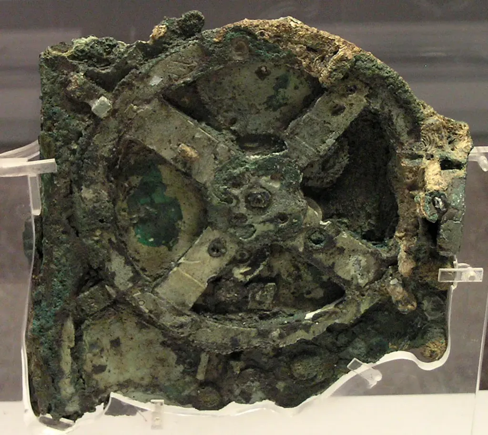

# Du premier ordinateur à Starglider

Je voudrais un peu vous dire où j’en suis dans ma tête, pour que vous puissiez peut-être m’aider à l’occasion. Quand j’écrivais [*Ératosthène*](http://ihl.tcrouzet.com) (faut que je termine de le mettre en ligne), j’ai entendu parler du mécanisme d’Anticythère, souvent considéré comme le premier calculateur analogique, peut-être inspiré d’un modèle fabriqué par Archimède. À l’automne dernier, quand j’ai esquissé [ma brève histoire de l’informatique](../../2008/3/la-breve-histoire-de-l%E2%80%99informatique.md), j’ai logiquement écrit une historiette sur le mécanisme.

---

Octobre 1900. L’été s’achevait en Méditerranée. Le capitaine Dimitrios Kondos estima qu’il devenait dangereux de poursuivre les plongées sous-marines le long des côtes africaines. Il ordonna à son équipage de pêcheurs d’éponges d’appareiller vers la Grèce. Une tempête automnale les força à s’abriter dans le port de Potamos sur l’île d’Anticythère, au large de la Crête.

Le vent du sud se calma mais le capitaine jugea la météo encore instable. Il préféra mouiller quelques jours et ses hommes en profitèrent pour effectuer quelques ultimes plongées. Avec leur scaphandre, ils explorèrent les eaux cobalts au pied des escarpements rocheux.

Elias Stadiatos se trouvaient à 60 mètres de fond lorsqu’il tira sur la corde de sécurité. Il émergea en criant qu’il avait découvert des cadavres d’hommes et de chevaux. Croyant qu’Elias souffrait de l’ivresse des profondeurs, le capitaine plongea à son tour. Il s’approcha d’une silhouette fantomatique enrobée de sédiments. Il lui saisit le bras et l’arracha, c’était le bras en bronze d’une statue antique. Les pêcheurs avaient découvert l’épave d’un navire romain qui aurait sombré vers 65 avant Jésus-Christ alors que, chargé de trésors, il regagnait l’Italie.

Durant les deux ans qui suivirent, les archéologues explorèrent le site. Le 17 mai 1902, ils notèrent non loin de l’épave une roue avec engrenages enchâssée dans un rocher. C’était comme si une horloge avait été immergée durant deux millénaires. Mais les horloges de cette complexité ne furent inventées qu’au XIXe siècle par les horlogers suisses !

-- Cet appareil est tout simplement extraordinaire, explique [le professeur Michael Edmunds qui étudie ce mécanisme](http://en.wikipedia.org/wiki/Antikythera_mechanism). Le seul de son espèce. Au regard de sa valeur historique, je le considère comme plus précieux que la Joconde.

Michael Edmunds et son équipe découvrirent sur les engrenages des inscriptions qui laissent supposer une [origine syracusaine du mécanisme](http://news.bbc.co.uk/2/hi/science/nature/7533457.stm) et qui le rattachent au IIIe siècle avant Jésus-Christ et à Archimède. Celui que l’on considère comme le plus grand mathématicien et ingénieur de tous les temps aurait été le créateur du mécanisme, tout au moins d’un de ses prototypes, car le modèle exhumé fut assemblé entre 150 et 100 avant Jésus-Christ.

Les anciens construisirent cette horlogerie pour prévoir la position des planètes et anticiper les éclipses. Des engrenages et des roues de bronze représentaient le soleil, la lune, la terre et leurs orbites. Quand ils s’animaient, ils imitaient l’univers, ils le simulaient.

Ce modèle réduit est l’ordinateur analogique le plus ancien dont nous possédions des vestiges. Ils témoignent d’un art et d’un niveau de technologie que nous ne soupçonnions pas durant l’antiquité. Quel aurait été le cours de l’histoire si les Romains n’avaient pas délaissé les innovations grecques ? Artur C. Clarke, l’auteur de *2001 l’Odyssée de l’espace*, affirme que nous aurions déjà atteint les étoiles.

---

J’ai terminé en évoquant Clarke parce que le mécanisme l’a beaucoup intrigué et parce que, dans un article sur le mécanisme, j’ai trouvé cette question qu’il s’était posé au sujet des romains. J’ai alors lu *Fountain of Paradise*, roman où il se demande ce qu’il serait advenu si la science grecque avait suivit son cours. Au milieu du récit, qui décrit la construction d’un ascenseur spatial, la sonde exploratrice Starglider visite le système solaire et communique avec les hommes. J’ai été frappé par l’effet, par la façon dont il était facile de lancer des généralités, de jouer avec le décalage culturel. J’en suis resté là.

En parallèle, j’esquissais ce qui devait être mon prochain essai, parfois appelé *[Boom](../2/boom.md)*, parfois *[Les crapauds fous](../5/les-crapauds-fous-fous.md)*. Je voulais parler de la transition historique que nous vivons, une sorte de suite d’Ératosthène.

Mon point de départ était simple. Nous disposons aujourd’hui de la technologie pour résoudre nombre de problèmes globaux comme la faim ou la soif mais nous ne faisons pas grand-chose. Le problème n’est donc pas technologique mais humain. Si l’homme ne change pas, je ne vois aucune raison pour qu’il réussisse à régler les problèmes globaux, notamment le problème climatique.

Nous devons donc transiter, franchir une nouvelle étape dans notre évolution. C’est une condition nécessaire, pour la faim et la soif par exemple, même si elle n’est sans doute pas suffisante pour les dérèglements climatiques.

Mais une transition vers quoi ? Depuis longtemps, j’évoque ici ou là une hypothétique conscience globale qui donnerait à chacun de nous une sensation intime de ce qui se passe hors de nous. Une façon d’éprouver le corps global de l’humanité. J’ai alors commencé à réfléchir à ce qu’était ce corps global, ce super organisme, j’ai commencé à écrire… mais je m’ennuyais moi-même, soit trop sérieux, soit trop gourou.

C’est alors que j’ai repensé à Starglider. J’ai commencé à écrire les messages que la sonde nous adresserait aujourd’hui, les réponses que nous lui donnerions. J’ai alors pris conscience que je réécrivais *Les lettres persanes*. Pour recréer le choc des cultures proposé par Montesquieu, je n’invoquais pas un Terrien d’origine lointaine puisque le lointain n’existe plus, mais une intelligence extraterrestre.

C’est ainsi que je me suis mis à écrire un livre qui pourrait s’appeler *Le socialisme selon Starglider*, socialisme parce qu’il y a l’idée d’une vie plus encline au lien social qu’à l’échange, pous tournée vers l’esprit que vers la matière. C’est en cours… Je n’ai aucune idée de là où je vais. Ce n’est que comme ça que l’écriture m’amuse. Et j’espère que ce texte sera amusant.

#starglider #superorganisme #dialogue #y2009 #2009-6-13-13h45
