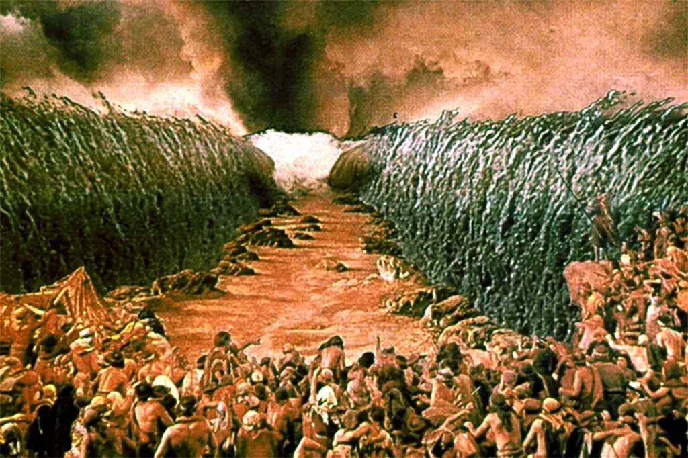

# Mes dix commandements

Je ne prétends les imposer à quiconque mais ils guident ma vie, en tout cas aujourd’hui. Même s’ils n’ont d’autre but que de fixer une limite à dépasser, ils fondent, en cet instant précis, ma morale sociale.

### 1. Tu ne commanderas pas

Quelle prétention faut-il avoir pour se croire capable de dire à d’autres ce qui est bon pour eux. Celui qui ordonne est, tout au plus, capable de dire ce qui est bon pour lui… et cela n’est pas nécessairement bon pour les autres. Je préfère coopérer. Même avec mes enfants, je tente d’adopter cette attitude, je dis bien je tente car mes commandements ne sont pas toujours facile à suivre.

### 2. Tu ne révolutionneras pas

À quoi bon abattre un système pour souvent reconstruire le même après avoir tué beaucoup de gens ? Il vaut mieux, à côté du système décrié, en construire d’autres qui, s’ils s’avèrent viables, remplaceront peut-être l’ancien. Même quand la catastrophe semble inévitable, je cherche des solutions, ce qui ne m’empêche pas de me préparer au pire.

### 3. Tu ne maximiseras pas

Pourquoi essayer de tirer le maximum de tout, de jouir au maximum, de gagner un maximum, de dépenser un maximum… Je rêve de la sérénité tranquille, avoir ce dont j’ai besoin sans rêver de ce que possèdent les autres. Sorte de retour à l’idéal épicurien. Une seule chose m’a toujours fait envie, la discussion infinie.

### 4. Tu ne seras pas altruiste

Quelle autre prétention d’affirmer œuvrer pour les autres et pas pour soi-même. On ne peut aider les autres que si on commence par s’aider soi-même. La politique commence par la philosophie, la politique ne peut qu’être philosophique, elle débute par une initiation personnelle, jusqu’à ce qu’on devienne soi-même le changement qu’on veut voir dans le monde. Tout le reste n’est qu’usurpation.

### 5. Tu n’emprunteras pas

Dépenser ce qui n’est pas encore produit revient à avancer la date où notre environnement ne sera plus capable de nous soutenir. Je préfère dépenser ce qui existe déjà. J’ai l’espoir que plus tard nous trouverons toujours des solutions. Quand on me dit que la fin du crédit impliquerait la fin de notre civilisation, je pense que ça signifierait, au contraire, le début d’une autre civilisation, une civilisation où les hommes arrêteraient de courir en avant par mimétisme. Quand des enfants vivent aux crochets des parents, je n’y vois aucun mal si les parents sont assez riches. Les enfants dépensent ce qui est déjà disponible. C’est normal.

### 6. Tu ne travailleras pas

Quand on parle de travail, en général on l’oppose à des moments de non travail. Je refuse cette dichotomie. Je vis. Je ne vais pas au travail, je ne rentre pas du travail. Je fais, toujours.

### 7. Tu ne relativiseras pas

Le relativisme consiste à dire que tout est acceptable, que tout le monde a raison et que tout le monde est gentil. Toutes les idéologies seraient équivalentes. Non. Des causes méritent d’être défendues, d’autres combattues et peu importe si les combats changent avec le temps.

### 8. Tu n’idéaliseras pas

Il s’agit de l’idéalisme philosophique, celui qui tend à placer une réalité au-dessus de la réalité, des essences au-dessus des choses. Mais il s’agit aussi de l’idéalisation plus prosaïque. Par exemple, tu n’idéaliseras ni le hasard ni l’ordre parce qu’ils sont intimement liés et se renvoient l’un l’autre. Ou encore, tu n’idéaliseras ni l’auto-organisation ni le pyramidal parce qu’ils ont chacun des avantages et des inconvénients, tout dépend des situations. Et surtout tu n’idéaliseras aucun de tes semblables, tu ne verras aucun hommes comme supérieur et tu ne t’agenouilleras au pied d’aucun d’entre eux. Quand j’admire quelqu’un, je cherche à le rencontrer pour échanger avec lui, et transformer cette admiration en amitié.

### 9. Tu ne t’isoleras pas

En conséquence du point précédent, tu chercheras à nouer sans cesse de nouvelles relations et à remplir cet espace qui te sépare des autres et constitue le corps global de l’humanité, tu participeras à la conscience collective et tu en ressentiras la force à chaque instant, ce qui t’emplira de joie autant que la vénération d’une divinité. Ce n’est qu’à ce moment qu’on peut réellement s’entraider les uns les autres sans arrières pensées.

### 10. Tu ne t’informeras pas

Moins tu t’informes plus tu es heureux. Moins tu t’informes plus tu comprends le monde car tu commences à le regarder par toi-même. Moins tu t’informes plus tu es au contact des autres car c’est eux qui te nourrissent et non des médias abstraits. Tu écriras tes propres commandements, tu ne vénèreras pas les commandements écrits une fois pour toutes et pour tous.

#dialogue #y2009 #2009-6-1-19h17
