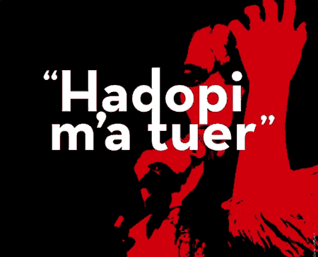

# anti-Hadopi ou l’incohérence morale

Je suis contre Hadopi parce que je suis pour la libre circulation des données numériques.

Si je dispose de films, de livres, de musiques ou d’autres données numérisées, je veux pouvoir les partager avec tous ceux que ça intéressent sans que personne ne se mêle de nos échanges. Ces biens sont devenus aussi fugitifs que les idées et ils appartiennent à tous les hommes curieux.

Au passage, je sais que je peux violer des droits d’auteur. Je suis donc pour une nouvelle forme de rémunération des auteurs. Plutôt qu’elle s’effectue a priori, j’achète puis je vois, elle doit s’effectuer a posteriori, je vois puis j’achète si je suis satisfait.

D’une société régie par la rareté (je dois avoir de l’argent qui est rare pour voir), j’entre dans une société de l’abondance (je peux tout voir et ne payer que ce qui m’intéresse vraiment). Modèle de l’open source.

Ma position anti-hadopi implique donc une position politique au-delà même du problème du piratage. Si la dématérialisation est possible, il faut développer des modèles open source : les créateurs investissent leur temps et ignorent le monde de la finance.

### De la cohérence

Si je défends des modèles non open source là où ils sont possibles, je n’ai aucune légitimité morale de m’opposer à des lois visant à limiter les échanges numériques. Elles ont pour but de défendre la rareté, c’est-à-dire défendre l’ancien modèle économique. Je ne peux pas un coup défendre la rareté, un coup l’abondance, je dois choisir mon camp sous peine d’incohérence.

Si je demande aux créateurs de données digitales de basculer dans le modèle open source, je ne peux pas accepter que des entreprises Web ne choisissent pas ce modèle. En le refusant, en se plaçant dans le modèle de la rareté, celui du code propriétaire par exemple, elles affirment à leur façon qu’il faut des lois de type Hadopi. C’est le cas de 99 % des entreprises Web existantes : elles offrent leur service, créant une abondance d’un côté, maintenant la rareté de l’autre pour espérer une rémunération à l’ancienne.

Toutes ces entreprises ont un pied dans chaque monde, l’ancien monde nourrissant le nouveau. Notre objectif doit être de créer un nouveau monde viable et non plus de phagocyter l’ancien.

### Changement de repère

Je viens peut-être de déplacer le débat sur un terrain incertain mais il s’est pour moi toujours joué là. Notre gouvernement défend un modèle de société, celui de la rareté, nous sommes un certains nombre à défendre celui de l’abondance.

Nous devons veiller à être clair sur nos positions. Il ne suffit pas d’utiliser des outils open source pour se placer dans la société de l’abondance, il faut soi-même travailler comme les créateurs des produits open source. C’est ce que nous faisons sur les blogs en diffusant nos productions sans barrière initiale. C’est [ce que j’ai proposé pour les écrivains](reinventer-l%e2%80%99edition-experience-pratique.md) qui pourraient systématiquement diffuser une version électronique de leurs textes.

Cette approche doit valoir aussi pour tous ceux qui travaillent dans le domaine du dématérialisé. Marketeux. Communicants. Créateurs de services web. Journalistes. Pour tous ceux qui utilisent seulement leur temps pour produire de la richesse. Combien aujourd’hui d’anti-Hadopi se font payer seulement si leurs clients sont satisfaits ? Combien laissent leurs présentations circuler librement ? Vous n’avez tout simplement pas le droit d’être contre Hadopi si vous ne respectez pas l’esprit open source. Ne demandez pas aux autres de faire ce que vous-mêmes êtes incapables de faire.

### Mon cas

Je ne suis pas plus clair que les autres, j’ai mes propres ambigüités. J’espère au moins être conscient de mes oscillations entre société de la rareté et de l’abondance. Je diffuserai mes prochains livres en ligne gratuitement. Je m’efforcerai à l’avenir de ne plus encenser des entreprises qui ne respectent pas la philosophie open source (Microsoft par exemple), même si pendant longtemps encore j’utiliserai leurs services. Mais je le ferai comme un pirate, sans jamais payer a priori. Le piratage devient un acte militant, une façon de pousser vers l’open source, de provoquer le changement.

#hadopi #coup_de_gueule #y2009 #2009-7-31-14h48
