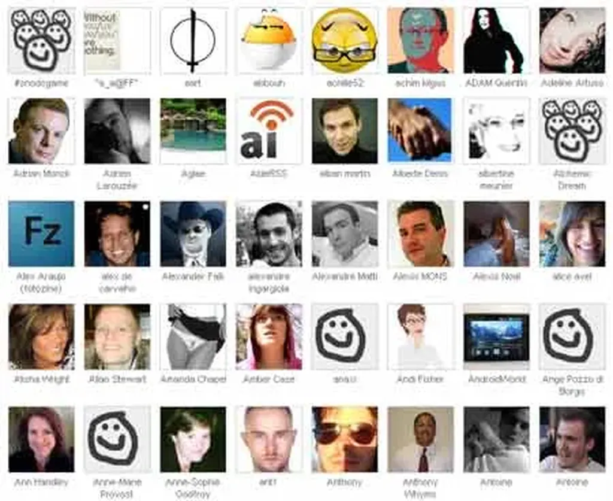

# Facebook et Friendfeed : la stratégie de l’enfermement

De plus en plus d’outils cherchent à nous éloigner de notre URL personnel, chez nous quoi, pour nous attirer chez eux. « Visitez dans notre centre commercial, ne restez plus sur votre terrasse à discuter avec vos amis, nous dit-on. Vous n’avez même plus besoin d’aller chez eux, ils viennent aussi. » Super.

[Facebook](http://www.facebook.com/tcrouzet) m’insupporte pour cette raison, [Frienfeed](http://friendfeed.com/tcrouzet) aussi. Ces services finissent par vous faire croire que le web se résume à eux seuls. Plus besoin de surfer. « Pour votre confort, nous rassemblons tout sous une interface homogène. » Les applications comme Seesmic Desktop ont la même ambition. On se croirait revenu à l’époque de CompuServe.

Je me suis souvent exprimé à ce sujet. Plus nous utilisons des services centralisés, plus nous renonçons à nos libertés numériques en même temps qu’à notre identité numérique. Pas la peine après de gueuler contre Hadopi. Quand tu places tout ton contenu ailleurs que chez toi, faut pas se plaindre si après tu te rends compte que tu n’as plus de chez toi, que plus personne ne sait où tu habites.

C’est un peu comme si après avoir eu des maisons individuelles, les blogs, on nous conseillait de vivre à l’hôtel. D’y venir avec nos bagages, de les déballer un peu partout, d’acheter des tonnes de trucs en plus, de s’installer quoi. Moi j’aime bien les hôtels mais uniquement en voyage et provisoirement. J’en repars avec mes bagages.

Ce que vous faites sur FriendFeed vous ne le faites pas chez vous. C’est comme si vous alliez repeindre à l’œil les bureaux de Total. Agrégez vos flux, c’est très bien. Créer du contenu spécifique sur un agrégateur, c’est un peu le serpent qui se mort la queue. Bientôt il faudra intégrer les flux FriendFeed à FriendFeed.

Peut-être suis-je un peu obsédé mais j’aime, quand j’écris quelque chose, de ne pas le perdre de vue. Souvent, quand j’ai eu envie de commenter un billet sur un blog, j’ai écrit un billet chez moi avec un lien. Quand je twitte, je compile automatiquement mes tweets dans des billets. Sur mon blog, je rassemble ma vie numérique. Je n’ai aucune envie que quelqu’un se charge de ce travail à ma place, sinon j’aurais l’impression de lui remettre les clés de ma maison et de l’ensemble de mes données.

Que mon contenu soit repris, sur Facebook, Friendfeed ou ailleurs, ne me gêne pas. En revanche, idéalement, je voudrais que les commentaires et tout ce qui tourne autour se synchronisent, et dans les deux sens. Qu’il existe plusieurs images d’une même information, disponible sous diverses interfaces ok, mais que chaque interface donne lieu à des débats séparés, me paraît stérile, en tout cas quasi impossible à gérer pour l’auteur qui devrait partout se répéter. Pour le moment, j’ai envie que mon URL reste chez moi et que mes données restent dans ma bases de données.

### Notes

1. J’utilise [Twitter](http://twitter.com/crouzet) pour capter l’humeur du temps. Je pêche souvent au vol des informations qui m’intéressent. Je teste des idées, recueillent vite des réactions. Intéressant quand on écrit un livre. C’est un complément du blog.
2. Je n’utilise pas Twitter pour discuter ou expliquer quoi que ce soit. On m’a parfois demandé de développer une idée. Twitter n’est pas le lieu, surtout pas le lieu adapté à la discussion.
3. J’utilise Seesmic Desktop pour agréger mes deux comptes Twitter et mon compte Facebook, pour filtrer les messages et les trier.
4. FriendFeed reste pour moi une sorte de Seesmic Desktop qui autorise la conversation et qui affranchit de la limitation des 140 caractères (ni plus ni moins qu’une plateforme de blog déguisée en fait – avec fonctions sociales et agrégation – ok, ça fait beaucoup de différences). On peut créer des groupes, filtrer, chercher…
5. On peut animer une communauté sur FriendFeed mais pour un blogueur pourquoi ne pas l’animer sur le blog, au contact direct avec la source, avec les lecteurs qui connaissent l’historique des thèses défendues ? Pourquoi déménager de chez soi, sinon pour accroître la valeur de FriendFeed ? Dans l’espoir d’un retour vers la source ? Les gens oublient déjà que les blogs repris sur Facebook existent ailleurs. Ce sera bientôt le cas sur FriendFeed.
6. Pour le moment, FriendFeed en France, c’est un peu le café du commerce, ça reste amusant, surtout pour ceux qui n’ont pas de blog. Heureusement, avec les fonctions d’agrégations de FriendFeed, on peut y être sans jamais y aller.
7. À l’occasion je regarderai les plugins de synchronisation avec WordPress. [Pour Twitter, j’ai déjà été obligé de créer le mien.](../5/wp-twiller-perfectionne.md) Je ne voulais pas afficher les tweets mais les compiler, les afficher, les stocker ailleurs que chez Twitter.
8. J’écris ce billet après [l’emballement qu’a connu le FriendFeed francophone](http://www.authueil.org/?2009/07/23/1397-acceleration-brutale) (j’ai gagné plus de 100 followers rien qu’aujourd’hui mais ça chauffait depuis la disponibilité des nouvelles fonctions d’importation). Ce qui me tue c’est que Scoble fait la promo du truc depuis un ans.

#facebook #coup_de_gueule #y2009 #2009-7-23-22h10
