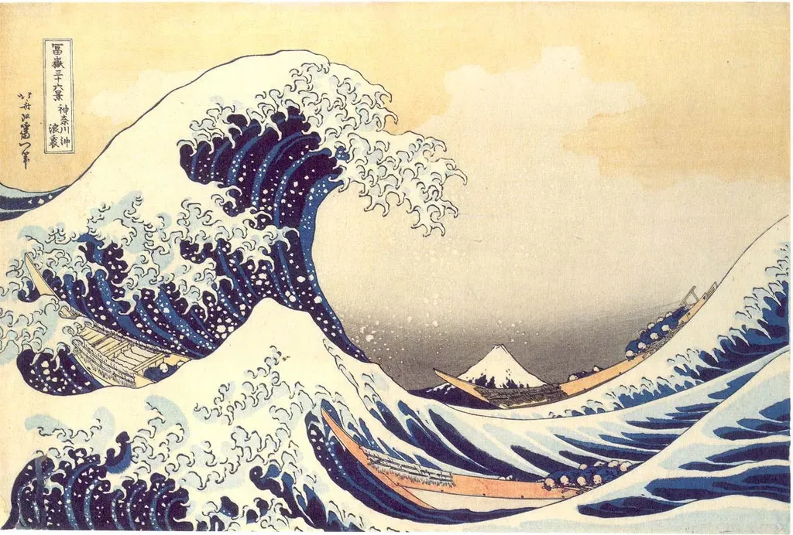

# FriendFeed : ça mérite pas tant de vagues

Tout d’abord une mise au point pour expliquer pourquoi j’ai écrit trois billets sur FriendFeed ([1](facebook-et-friendfeed-la-strategie-de-l%e2%80%99enfermement.md), [2](friendfeed-ou-la-dissolution-de-la-conscience.md), [3](facebook-et-friendfeed-tueurs-de-reves.md)). Mes amis blogueurs m’ont énervé. Je les ai vus soudain faire la promotion d’une entreprise au nom d’un service génial. Chaque fois qu’ils écrivaient FriendFeed, je lisais Total. Et tout ce qu’ils écrivaient prenait une couleur différente. Par réflexe, je me suis mis à écrire contre Total plus que contre FriendFeed qui est un service web pas si mauvais.

Ma critique dépasse de loin l’outil qui n’est qu’un prétexte, mon dernier billet ne mentionne d’ailleurs Friendfeed que dans les notes. Mais une entreprise reste pour moi une entreprise, surtout quand, comme Total ou FriendFeed, elle a pour ambition de maximiser les profits. Je n’ai plus envie de cautionner ce modèle qui implique la croissance économique infinie. Je sais que nombre de ceux qui ont vanté FriendFeed pensent comme moi. Peut-être emporté par une amplification provoquée par le buzz, j’ai exagéré leur incohérence et me suis énervé.

En 2007, j’ai participé à la mode Facebook. Je suis tombé dans le piège que je dénonce aujourd’hui. Les journaux me citaient, les radios m’invitaient pour parler de Facebook comme si j’étais Mark Zuckerberg. J’ai fini par dire stop et par cesser d’utiliser Facebook qui ne m’apportait rien en définitive, sinon l’ivresse de la nouveauté.

J’ai aussi parlé de Twitter mais, justement, non pour vanter une entreprise/produit mais pour expliquer pourquoi ce produit, par sa simplicité, était déjà devenu [open source](http://identi.ca/). Il est un principe copiable à l’infini. Il est une technologie plus qu’un produit, ce que nous promet Google avec Wave, et qui d’ailleurs enverra peut-être FriendFeed aux oubliettes.

J’ai connu trop de vagues numérico-enthousiastes depuis que j’ai écrit mes premiers articles sur les technos en 1991. Ce n’est pas la nouveauté qui me lasse, toujours présente, mais le discours sur la nouveauté qui n’a plus rien de nouveau, surtout quand il est professé par les prosélytes parfois parties-prenantes dans la nouveauté, puis copier-coller par les journalistes.

Utilisons FriendFeed, n’en faisons pas un fromage. Vous allez dire que c’est moi qui fais du fromage. Mais l’outil est pervers. Pour qu’il ait un intérêt, il faut le dire à tous vos contacts. Il suffit d’ailleurs d’appuyer sur un bouton pour spammer vos relations virtuelles. Et hop 500 nouveaux comptes créés sur FriendFeed. C’est la magie des réseaux sociaux, véritables réseaux de recrutement, armes marketing de séduction massive. Vous ne pouvez plus les utiliser en silence.

Quand les gens se connectent, je suis heureux car je pense que c’est ainsi que nous traverserons les crises en cours et peut-être bâtiront une nouvelle humanité. Mais ne nous connectons pas à travers des entreprises construites sur l’ancien modèle car alors nous resterons prisonniers d’elles et ne ferons que déplacer les anciens centres de pouvoirs. Rien de plus qu’une révolution ordinaire. « Il faut que tout change pour que rien ne change. » écrivit Giuseppe Tomasi de Lampedusa. Prenons garde à ne pas nous enflammer pour rien. Dans un monde décentralisé, nous devons nous-mêmes devenir les centres.

### Notes

1. La biosphère est un écosystème qui ne réagit qu’à la polémique. Il faut entrer dans le lard pour que la mayonnaise prenne. N’oubliez pas que je suis aussi joueur et qu’il m’arrive de m’amuser avec mon blog. Le cynisme marche pas trop mal vu les réactions.

- Le web est en lui-même une machine à créer des liens entre les informations. Au départ, c’était les auteurs qui créaient les liens. Un peu élitiste ok. Les réseaux sociaux proposent entre autre que les lecteurs créent eux-mêmes du lien. L’approche actuelle est centralisée mais c’est pas la seule possible. Rien n’empêche d’ouvrir tous les sites aux lecteurs (c’est un peu ça les commentaires).

- Le génie de Tim Berners Lee est d’avoir créé un langage hypertexte sans base centrale, ce qu’avaient proposé les théoriciens avant lui. Le web se soutient lui-même. Nous devons poursuivre sur cette voie, non pas passer par des nœuds centraux qui impliquent le contrôle. Qu’il existe des Google pour faciliter la navigation, c’est une chose. Ils doivent rester la carte et pas devenir le territoire (ce qu’ils cherchent tous à devenir malheureusement).

- Pour conclure, le débat. Commentez où vous voulez, lisez où vous voulez, je tenterai de maintenir l’intégrité ici, tant que c’est possible peu importe où les choses se passent, ici, sur FriendFeed ou Facebook. Mais ne perdez pas de vue que si vous passez du temps sur un site vous lui donnez de la valeur à lui, pas au contenu qui vous intéresse. Dans mon cas, ça n’a aucune importance, en tout cas aujourd’hui. Pour d’autres, ça deviendra vite vital s’ils veulent monétiser leur création.

- Toute cette histoire m’aura forcé à mieux interfacer mon blog avec les réseaux sociaux. J’ai bricolé un plugin, je teste maintenant la solution [backtype.com](http://www.backtype.com/home) ([testé par Narvic sur son nouveau blog](http://narvic.fr/2009/07/ma-nouvelle-vie-sur-le-web/)).

#facebook #coup_de_gueule #y2009 #2009-7-28-17h18
