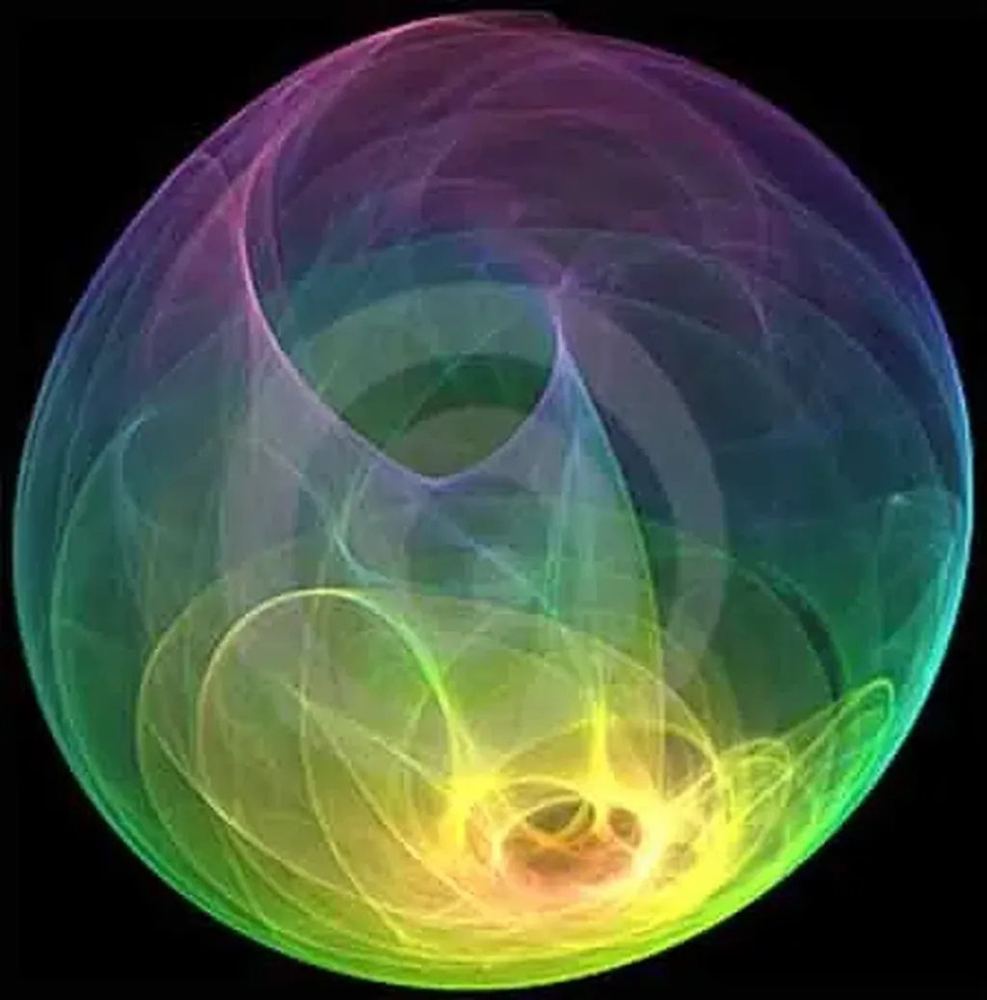

# Friendfeed ou la dissolution de la conscience

J’ai éprouvé hier soir une étrange sensation. Immédiatement après la publication de [mon billet sur Frienfeed](facebook-et-friendfeed-la-strategie-de-l%e2%80%99enfermement.md), il a été retwitté, commenté ici-même, sur Facebook et sur Friendfied. J’ai un moment répondu partout, puis je suis descendu sur la terrasse prendre le frais avec Isabelle avant d’aller me coucher.

À ce moment, je ne me suis pas senti bien. Mes aller-retour entre plusieurs sites m’ont donné l’impression que je me dispersais, que je m’éparpillais, sans guère de logique, sans guère choisir, juste répondant à des stimulations éloignées de mon moi numérique habituel, moi que je tiens le plus proche possible de ce que je suis à tout instant.

J’ai alors connecté cette sensation avec le sujet auquel je consacre mon temps en ce moment : [le superorganisme](le-socialisme-selon-starglider.md). Et si j’avais un instant expérimenté l’entrée dans ce superorganisme ? Et si j’étais devenu un propagateur d’influx nerveux, une espèce de pousseur de bits ? Mais au passage me niant moi-même, c’est-à-dire entrant dans un superorganisme inconscient-conscient, celui justement dont la possibilité m’effraie.

Que je m’explique rapidement. Je dénombre quatre formes de superorganisme.

1. Inconscient-inconscient (une fourmilière).

- Conscient-inconscient (l’humanité aujourd’hui).

- Conscient-conscient (l’humanité selon Chardin).

- Inconscient-conscient (l’humanité après que les hommes se soient oubliés eux-mêmes au profit d’un tout auquel ils ne comprennent rien).

Hier soir, l’affaire d’un instant, je me suis cru dans cette phase 4. J’ai eu peur, peur de perdre ce que je suis au profit de quelque chose d’étranger et que n’ai aucune envie de regarder en face.

Que l’humanité forme un superorganisme conscient-inconscient je n’en doute pas. C’est une façon métaphorique de nous voir qui implique quelques conséquences politiques. Que cette humanité constituée de consciences deviennent consciente, c’est envisageable. Mais l’autre possibilité, le superorganisme inconscient-conscient implique de renoncer à tout ce que nous sommes.

Jusqu’à hier soir, je croyais que cette phase 4, souvent décrite en SF, ne pouvait survenir qu’après une longue période de phase 3. J’ai changé d’avis. Nous pouvons y plonger directement si nous devenons seulement les neurones indifférenciés d’un vaste cerveau.

#facebook #coup_de_gueule #y2009 #2009-7-24-12h53
