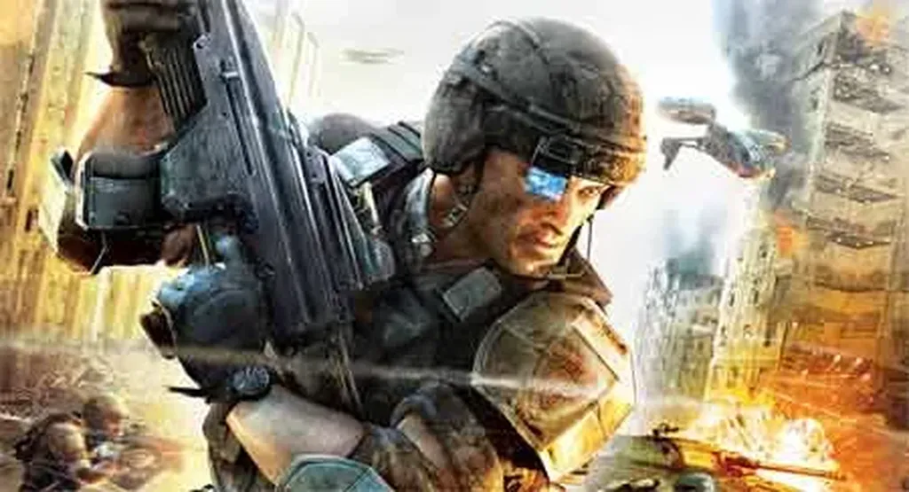

# Plus jamais de guerres !

Il est tentant de voir l’homme comme un cancer qui se répand sur la terre. Le pessimisme ambiant en temps de crise peut nous y pousser plus qu’à d’autres époques. Mais quelle est la réalité chiffrée ? [Un article publié dans *NewScientist* démonte les idées reçues.](http://www.newscientist.com/article/mg20327151.500-winning-the-ultimate-battle-how-humans-could-end-war.html?full=true) La guerre ne serait pas une fatalité.
1. Il existe des cultures non belliqueuses (Aborigène, Inuit…). La guerre n’est donc pas codée génétiquement mais émerge dans certaines situations (la sédentarité par exemple).
2. Le pourcentage de morts à la guerre tend à diminuer (3% pour le XXe siècle, ce qui est peu comparé aux siècles antérieurs – mais j’avoue que n’aime pas parler de progrès humain en pourcentage).
3. Même la violence interpersonnelle à l’intérieur d’une culture diminuerait. Nous avons dix fois moins de chance de mourir d’un homicide qu’au moyen-âge.
4. Plus l’interdépendance augmente, moins il y aurait de guerres (qui impliquent sans doute trop de conflits d’intérêt).

Ces observations me paraissent encourageantes, surtout dans la perspective du superorganisme. Les forces d’intégration seraient supérieures à celles de désintégration.

Les nomades semblent beaucoup moins belliqueux que les sédentaires. Mais ne sommes-nous justement pas en train de devenir des nomades culturels et économiques ? Nous sommes des nomades du cyberspace ? Nous nous mêlons les uns aux autres ? Et si nous voulons aboutir à un équilibre durable, il nous faudra aller plus loin. Nous détacher des possessions matérielles, de tous ce qui nous entrave, encore une caractéristique des nomades.

Bien sûr rien n’est acquis. Mais j’ai l’impression que chaque fois que nous réussirons à nous auto-organiser un peu plus, nous nous pacifierons un peu plus. Quand nous nous auto-organisons, personne ne décide, personne n’impose, il n’y a rien à combattre sinon des comportements. Mais fait-on la guerre pour changer les comportements ? La guerre contre qui d’ailleurs puisque personne ne dirige ? On peut tenter d’influencer les gens, c’est une autre forme de combat. Mais nous pouvons résister en disant ce que nous pensons. Nous avons une arme, Internet. C’est peut-être l’arme de dissuasion ultime !

#connecteur #y2009 #2009-7-21-15h13
