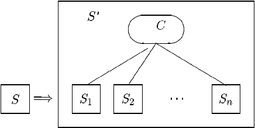

# D’Arthur Koestler à Ken Wilber

Hier, après avoir exprimé mes doutes sur l’utilité de l’idée de superorganisme, on m’a renvoyé à la théorie des holons proposée par Koestler et vulgarisée par Wilber. [Je me suis expliqué à ce sujet l’année dernière lorsque j’ai lu Wilber.](../../2008/10/de-l%E2%80%99idealisme-a-la-complexite.md)

> Définition. Un holon est une entité qui est en même temps une part de quelque chose et, en elle-même, une totalité. Exemple. Une cellule dans un organisme.

Bien sûr, je pense souvent à la philosophie intégrale lorsque je m’interroge sur la fécondité de l’idée de superorganisme. [Je viens de lire un nouveau texte sur le sujet.](http://www.integralworld.net/edwards13.html) Je tombe très vite toujours sur le même bug. La théorie des holons ne permet pas d’expliquer un organisme ordinaire à moins de le schématiser trop simplement.

Sur ce schéma, les organes sont des holons eux-mêmes des touts qui appartiennent à l’organisme, un tout hiérarchiquement supérieur. Mais ce schéma oublie tous les systèmes distribués qui imprègnent la totalité de l’organisme, organes compris : système sanguin et nerveux, et plus particulièrement le système immunitaire qui traverse l’ensemble des organes.

Les systèmes distribués ne sont pas des holons puisqu’ils ne peuvent exister par eux-mêmes. Pour reprendre [l’image de Koestler en 1969](http://www.panarchy.org/koestler/holon.1969.html), on ne peut pas les transplanter. Il existe donc des composantes non-holoniques dans un organisme (un philosophe intégral dira alors qu’elles appartiennent à l’organisme lui-même). Un holon n’est donc pas toujours composé uniquement de holons et les holons ne permettent pas de décrire l’ensemble des choses.

Les holons eux-mêmes ne sont rien sans les systèmes distribués comme nous ne sommes rien sans notre environnement. L’idée que quelque chose est un tout en lui-même est absurde, ne serait-ce que parce qu’une chose ne peut maintenir son intégrité que grâce aux forces naturelles souvent modélisées comme des champs.

Déjà en 1977, donc avant la formulation par Wilber de la philosophie intégrale, le cybernéticien Valentin Turchin avait montré [qu’un métasystème a besoin d’un mécanisme de contrôle pour intégrer les sous-systèmes](http://pespmc1.vub.ac.be/MST.html) (le système immunitaire est un des mécanismes de contrôle pour l’organisme). Les holons ne suffisent pas.

Un système distribué peut être dans le holon et hors du holon. En dessous et en dessus hiérarchiquement. C’est-à-dire sans aucun lien proprement hiérarchique avec lui mais plutôt en symbiose. Sans le système distribué, le holon se désintègre, meurt. Il n’est donc pas un tout autonome mais une structure qui maintient son intégrité en interdépendance avec d’autres.

Un holon serait alors juste un système transplantable. On pourrait changer le système immunitaire dans lequel il baigne et qui le baigne. Ce système servirait de lien, de connexion. C’est lui qui permet l’existence d’un holon plus grand (et ainsi de suite). Holons + liants = mayonnaise (toute la question est de savoir à quoi ressemblera la mayonnaise pour les nouveaux métasystèmes).

Le monde n’est ni totalement hiérarchique, ni totalement distribué (comme le résume mon second gribouillis). Des hiérarchies existent mais traversées de forces qui les dépassent et les unissent. Je crois que notre société respecte cette structure.

[La fable des horlogers qui inspira Koestler se réduit à une histoire de Lego.](http://www.integralworld.net/edwards13.html) L’un des horlogers fabrique des sous-montres avant de les assembler en une montre, l’autre fabrique directement la montre.

Nous sommes loin des systèmes complexes qui ne peuvent pas être découpés en parties. Au sein d’une structure complexe, on découvre des structures stables mais pas forcément indépendantes, pas forcément liées dans un rapport de hiérarchie ou d’hétérarchie. C’est ainsi que je conçois la société humaine, un espace où la liberté peut s’exprimer.

L’approche intégrale, celle du superorganisme en fait, revient à simplifier l’humanité, à lui appliquer les critères d’un organisme inférieur. C’est le meilleur moyen d’oublier la nouveauté. La société n’est pas que la somme des individus mais quelque chose de plus… une mayonnaise.

Un philosophe intégral dirait qu’elle transcende mais sans proposer la moindre explication technique. Le fait de transcender, je le vois dans ce qui n’est pas contenu dans les holons, dans ce qui se glisse entre eux pour qu’une émergence se produise. Avant de parler d’un superorganisme humain, il faut donc s’intéresser à ce nouveau liant, ce que j’appelle la connexion.

*PS : Il va s’en dire, que remettant en cause le principe des holons (ils existent mais ne constituent pas la totalité des choses), la philosophie intégrale me paraît fumeuse. J’ai peut-être rien compris aux holons. Si c’est le cas, j’espère qu’un philosophe intégral me proposera de m’ouvrir les yeux. Pour le moment, pour le peu que je l’ai lu, [Geoffrey D. Falk](http://www.normaneinsteinbook.com/) semble plutôt me convaincre que Wilber est tout simplement doué pour le marketing, et la mauvaise fois consubstantielle, que pour la philosophie.*

#integral_philosophy #wilber #dialogue #y2009 #2009-8-21-9h38
