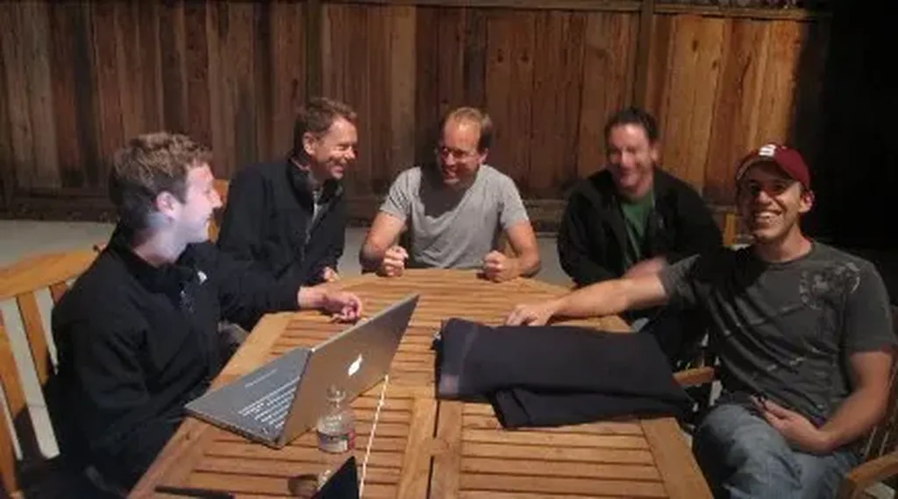

# FriendFeed égale Total, non, égale Facebook

J’étais en vacances, déconnecté à 99 % (j’y suis encore mais connecté à 100 % maintenant), pourtant la nouvelle du rachat de FriendFeed par Facebook m’est arrivée. Je n’ai rien lu d’autres que les tweets à ce sujet qui m’ont été adressés (merci à tous) et les liens attenants. J’espère que cette nouvelle aidera les techno-enthousiastes, pas forcément dotés de la dernière update, à mieux comprendre mes billets de juillet sur [FriendFeed et Facebook](#friendfeed).

Résumé. Si tu mets tes données dans les mains d’une entreprise, elles ne t’appartiennent plus, ton identité numérique ne t’appartient plus car l’entreprise en fait ce qu’elle veut. Combien de personne m’ont dit que FriendFeed n’était pas Total mais une petite boîte sympathique ? Terminé. C’est Facebook maintenant. Demain qui ce sera ? Qui sera Facebook ? Avez-vous toujours envie de bosser gratos pour Zuckerberg ?

Ceux qui se placent du côté de la résistance, plutôt du côté des autres mondes possibles, n’ont pas d’autre choix que de s’appuyer sur des solutions open source ou, tout au moins, des solutions offertes par de nombreux acteurs. Je me suis déjà étendu sur le sujet, un article de [siliconAngle](http://siliconangle.com/ver2/2009/08/11/could-wordpress-be-the-natural-successor-to-twitter-friendfeed-and-facebook/) évoque la possibilité de transformer WordPress en plate-forme sociale. Je ne sais pas si c’est la solution, mais c’est toujours mieux que de donner de son temps aux startupers qui ne pensent qu’à se faire du fric à l’ancienne, pire sur notre dos, comme les esclavagistes.

Une entreprise est une entreprise. Une entité qui repose sur l’ancienne logique du « Je suis à vendre ». Êtes-vous libres ou à vendre ? J’espère être libre et j’utilise les entreprises (je l’ai fait avec Google, rappelez-vous), je n’entends pas qu’elles m’utilisent.

Quand je vois ces jeunes derrières toutes ces boîtes high-tech se comporter exactement comme leurs ainés, les mimer avec juste un genre décontracté, je suis dégoûté, désespéré quand à notre avenir. Ils ont abandonné le costume mais pas l’esprit du costume.

#facebook #coup_de_gueule #y2009 #2009-8-13-9h51
