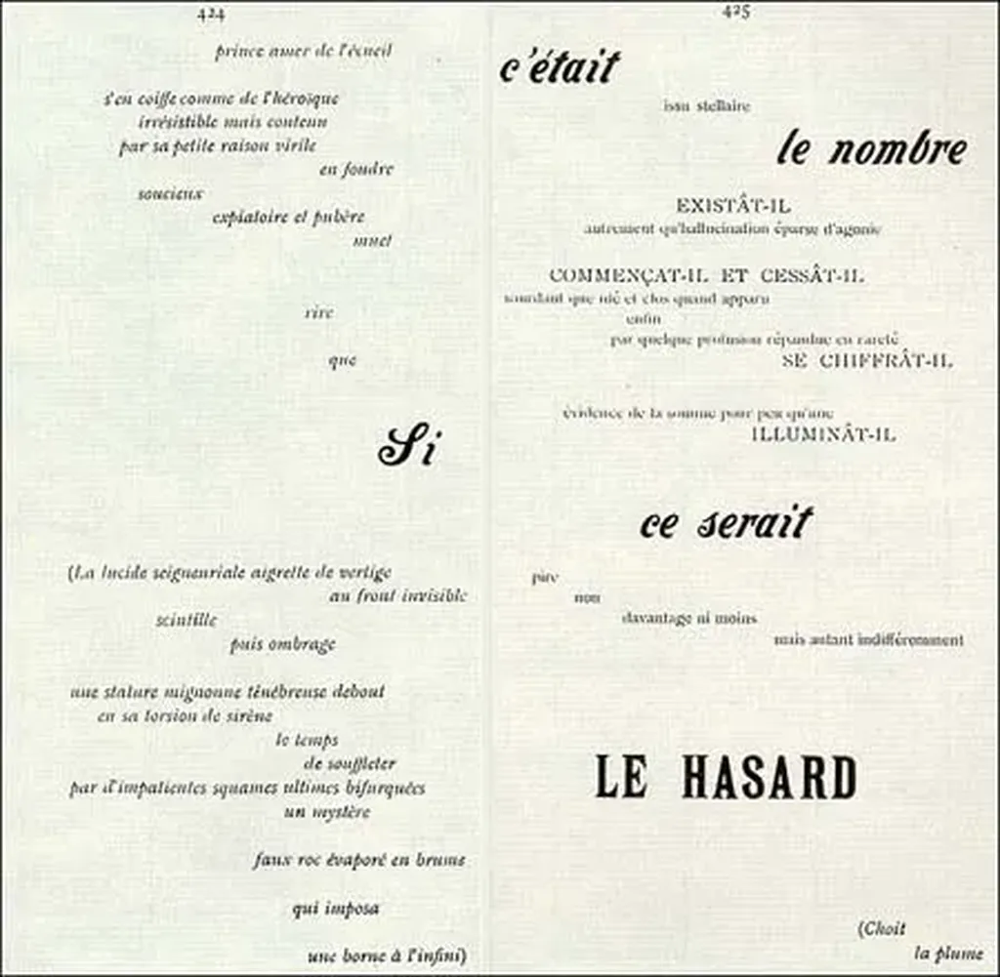

# Même le livre n’échappera pas aux flux

Micro-posts, articles, livres… ils deviennent ou deviendront flux, se libérant du papier comme de la page web qui était censée le remplacer. Toute information se prête à la copie, à la propagation, à la réorganisation, à la représentation selon de multiples perspectives. Plus aucune raison technique ne l’attache à une forme graphique particulière quelle qu’en soit la volonté de l’auteur.

Qui sinon Mallarmé pensa fond et forme comme un tout indissociable avec son poème [*Un coup de dés jamais n’abolira le hasard*](http://www.direz.org/site/uploads/Mallarme/Coupde.pdf). Et pourtant. Une simple recherche me montre que ce texte a été transformé par ses éditeurs successifs, traduit, recomposé. Je ne suis pas chez moi en ce moment, je n’ai pas consulté mon édition depuis longtemps, mais je suis sûr qu’elle ne respecte pas [le format travaillé par Mallarmé](http://chroniques.bnf.fr/archives/fevrier2007/numero_courant/collections/acquisitions.htm).

S’il avait mené à bien son projet, s’il avait signé un bon à tirer définitif avant sa mort, il se serait néanmoins produit la même chose avec son œuvre. Elle aurait circulé, elle aurait inspiré d’autres poètes, d’autres typographes, elle serait peu à peu devenu flux, un potentiel formel infini.

### L’information pure

Quand je parle d’information pure, cette information débarrassée de sa forme, j’effectue bien sûr un raccourci. Restent les mots pour un texte, leur ponctuation, leur regroupement en paragraphes… toutes ces innovations pour la plupart imaginées en Alexandrie comme je l’évoque dans mon [*Ératosthène*](http://ihl.tcrouzet.com).

Aujourd’hui, notre ponctuation s’appelle XML. Une façon de façonner l’information indépendamment de sa représentation, une façon de la détacher de son support matériel, le papier, comme numérique, la page Web. Nous vivons une double révolution. Pour moi, l’information pure, c’est la version minimaliste en XML. Elle reste encore hautement formelle puisque le style est une histoire de forme mais une forme *embedded*, incluse dans le message lui-même.

[René Audet m’a reproché de négliger le lien entre le texte et la typographie](http://contemporain.info/audet/archives/555), cet art qui donnerait à un texte sa force réelle. Je trouve cette critique peu réaliste quand 99,9 % des textes publiés, notamment littéraires, n’utilisent qu’une poignée de polices indistinctes et toutes inspirées du Garamond. Promenez-vous dans une librairie. Feuilletez. Ne cherchez pas à me faire croire que tous les auteurs sont des Mallarmé. La plupart savent tout juste faire la différence entre une police moderne et antique. Ils n’ont jamais effectué leur mise en page eux-mêmes, écrivant leurs textes en Times New Roman sur PC ou en Helvetica sur Mac.

J’ai moi-même créé plusieurs livres objets, justement pour montrer que face à la fluidification des contenus, leur inévitable volatilisation, on pouvait expérimenter des formes de résistance, des textes qui xmlisés perdent toute saveur comme le poème de Mallarmé. C’est une expérience marginale, un effet de bord esthétique, utile à mon sens, mais qui n’empêche pas l’immense majorité des textes de ne rien perdre en devenant flux.

Au contraire, ils ont tout à y gagner car chaque lecteur peut se faire metteur en page. Là où l’auteur ne s’est préoccupé que de la forme *embedded*, là où l’éditeur n’a fait preuve d’aucune originalité, le lecteur peut donner une représentation du texte plus prégnante, au moins pour lui. Une nouvelle profession de metteur en scène des textes peut naître. Des artistes qui diffuseront leurs templates de représentation.

La forme et le fond ne seront pas dissociés, au contraire, ils deviendront un terrain de création ouvert. Un livre n’aura pas une mise en page banale mais des milliers de mise en page aussi originales les unes que les autres. La fluidification des textes exacerbera la créativité graphique en la déplaçant à la fin de la chaîne du livre.

Quelques auteurs expérimentateurs joueront toujours avec l’objet texte comme Mallarmé mais ils laisseront aussi glisser leurs œuvres comme flux pour que d’autres cocréent avec eux. Refuser le flux reviendra vite à refuser d’être lu. La volonté de contrôle n’a jamais fait bon ménage avec la liberté et avec l’art. On va découvrir des interprètes de texte comme jadis on avait des interprètes de musique !

### Les larmes des lecteurs

[Après mon billet sur la mort de l’édition](../7/apres-la-presse-cest-ledition-qui-meurt.md), on m’a dit que rien ne remplacerait l’odeur du papier, sa texture au bout de nos doigts, nos larmes d’émotion qui viennent le tâcher… Croyez-vous que je ne ressente pas tout cela comme vous ?

J’aime aussi dans des ruines antiques laisser mes mains courir sur les vieilles inscriptions. C’est un des grands plaisirs de la vie mais d’autres sont venus le compléter, celui du papier, celui aujourd’hui du numérique. Je trouve les larmes dans les commentaires qui accompagnent les textes, dans les réponses hyperlinkés, les reprises, les retwitt exaspérés ou enthousiastes… les larmes imbibent le flux.

Dans ce cyberspace, au texte de l’auteur s’ajoutent toutes les expériences des lecteurs. Le texte continue de vivre, même en temps réel. Chaque chapitre, chaque page, chaque phrase peut devenir sujet de discussion entre l’auteur et les lecteurs. C’est une nouvelle dimension, par certains côtés tactile, qui s’offre à nous.

Comme j’explore encore les cités perdues, nous continueront à goûter les livres anciens, mais pour nous dépayser, pour communier avec nos ancêtres, pour nous ressourcer. Notre route se trouvera ailleurs, sur d’autres chemins, pour compléter le leur et l’enrichir.

> On ne se baigne jamais deux fois dans le même fleuve, écrivit Héraclite.

On pourrait aujourd’hui dire :

> On ne lit jamais deux fois le même texte.

L’auteur propose (ce n’est pas nouveau), l’éditeur compose (ce n’est pas nouveau), le lecteur choisit (c’est nouveau) et l’auteur peut réagir en un rebouclage mutuellement enrichissant. Les œuvres s’ouvrent bien plus largement que ne l’avaient rêvé les avant-gardistes  [des années 1960 décrits par Umberto Eco](http://www.musicologie.org/theses/eco_01.html).

Bientôt quand nous replongerons dans un livre après des années, il sera autre non seulement parce que nous-même ne serons plus le même mais aussi parce que le livre se sera transformé comme un fleuve dont les berges s’érodent, sur lesquelles on construit des maisons, des ponts, des ports…. C’est ainsi que le livre fleuve devient flux.

### Le hors temps

[Comme François Bon](http://www.tierslivre.net/spip/spip.php?article1850), je me demande encore si nous avons encore besoin du mot livre. Et si tout devenait flux, des flux qui coulent plus au moins vite, qui parfois s’évasent en grands lacs où nous pouvons nous noyer, des flux qui se resserrent en torrents de montagne, cascadent avant de finir par se perdre dans la mer.

J’ai autant la nostalgie des vieilles ruines que des heures que je passais adolescent à lire jusqu’à l’épuisement. Pour moi, le livre est un flux tranquille où j’ai envie de plonger le plus longtemps possible. Je ne suis pas là pour comprendre, pour saisir une information mais pour vivre.

Ce n’est pas l’objet, le livre, qui fait le livre mais la nature même du flux qu’il enferme avec ses qualificatifs spécifiques, comme débit ou puissance, liés au temps qui passe comme le remarque François Bon.

Ce n’est pas parce qu’un flux est fluide, qu’il circule vite et se métamorphose que nous devons juste le picorer en mode lecture rapide. Nous pouvons le survoler en avion, le franchir par un pont, y plonger et en ressortir immédiatement ou, au contraire, nous y baigner pendant des heures, des jours et mêmes des années comme je le fais avec la correspondance de Flaubert.

Le livre est une contexture particulière du flux à côté d’autres contextures que nous appelons poème, article, post, haïku…

### L’économie des flux

Selon cette perspective, l’économie du livre doit être repensée dans le cadre plus large d’une économie des flux. Tant que nous ne saurons pas rémunérer des articles courts, nous ne saurons pas rémunérer les textes longs (après l’implosion du modèle actuel qui ne tardera pas vu le nombre de nouveaux readers commercialisés ces derniers temps – qui auront le même effet que le MP3 pour la musique).

On m’inflige encore et encore un argument massue : le livre restera longtemps attaché au papier.

> C’est pourquoi il faut arracher aux dispositifs (à tous les dispositifs) la possibilité d’usage qu’ils ont capturé. La profanation de l’improfanable est la tâche politique de la génération à venir, écrit Giorgio Agamben, que je n’ai jamais lu, [cité par André Rougier dans un texte où il me répond](http://blog.liminaire.fr/post/2009/08/24/Labyrinthe-sans-occupant...).

Nous devrions nous défier de l’ordinateur, nouveau grand Satan et nous précipiter, à 9 milliard, vers un monde naturaliste et non technologique. Bonjour la pagaille. Mais le livre n’est-il pas aussi un dispositif ? Pourquoi le préférer à un autre dispositif qui d’ailleurs n’a encore capturé qu’une infime parcelle de ses possibilités d’usage.

Les gens qui parlent des ordinateurs ne savent souvent même pas ce qu’est un ordinateur. Ils le confondent avec leur Mac ou leur PC. Ils oublient que cette maudite machine peut être greffé dans leur cerveau, qu’elle régule déjà leur vie, qu’ils seraient déjà morts sans elle et que notre monde surpeuplé serait invivable.

Rester attaché au livre pour résister à l’ordinateur ! Voilà quel sera le slogan des éditeurs qui crèveront bientôt de l’explosion des ebooks, de leur piratage massif et de l’entrée des livres dans le monde des flux auxquels ils ne comprennent rien.

Ce n’est pas le statut de l’auteur qui est en question. Il reste le premier propulseur d’un texte. S’il peut disparaître assez facilement derrière un micro-post, voire un post ou un article, il est plus difficile à déboulonner derrière un texte long qui peut impliquer beaucoup de temps de lecture sinon beaucoup de discussions.

L’auteur est celui qui par son style, son sujet, son nom… nous attache dans la durée à un flux. Mais un commentateur habile peut faire oublier l’auteur. On l’a vu en peinture. On l’a vu en littérature quand Baudelaire transcende les textes originaux de Poe. Rien de nouveau de ce côté. On n’est pas dans une histoire du moi et de sa dissolution, sujet qui je l’avoue ne m’a jamais passionné.

Nous sommes au contraire en train de gagner une liberté nouvelle, liberté de propulser. Et qui dit plus de liberté dit plus d’individualité, plus d’existence, plus de puissance d’être. La fluidification du livre est une nouvelle étape dans notre histoire dont la fluidification des news n’a fait que nous donner un aperçu.

L’homme vit avec ses histoires, ses mythes, c’est ainsi qu’il refait le monde. Elles vont enfin circuler librement et à pleine vitesse. Personne ne peut anticiper ce qu’il en résultera. En quoi le passage au flux transformera nos histoires ? En quoi allons-nous écrire des choses jadis impensables ? C’est à mon sens la question la plus intéressante.

#netculture #dialogue #y2009 #2009-8-26-16h21
