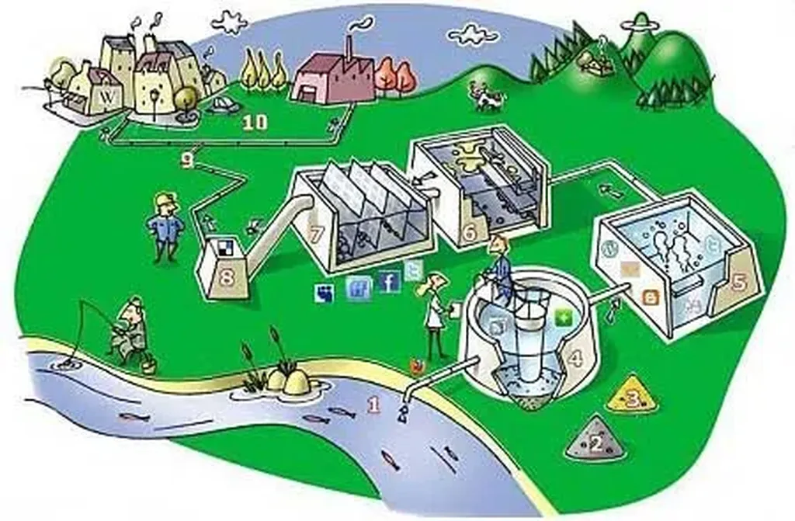

# Nouveau business model de l'édition

Ou l’économie des propulseurs…

Le fleuve coule. Les gens qui vivent au bord du fleuve puisent de l’eau. L’eau restante finit à la mer. Elle s’évapore, puis pleut sur la montagne où le fleuve prend sa source.

Imaginez un autre scénario. Un immense barrage à la source. Quand quelqu’un veut boire, il paye et on lui envoie une bouteille ou on ouvre le barrage, laisse couler assez d’eau pour qu’elle arrive à l’assoiffé. Sur le cours d’eau, des riverains de plus en plus déshydratés se transforment en pillards (je pense aux Somaliens qui arraisonnent les navires). Il faut donc toujours lâcher de plus en plus d’eau pour satisfaire les consommateurs. Gaspillage, guerres, rareté de l’offre et engraissement au passage des maîtres du barrage. Leur business : maintenir la rareté.

Cette seconde fable est une métaphore du monde capitaliste, plus particulièrement du monde de l’édition numérique qui se cherche un modèle. [Dans la logique des flux](#flux), ne vaudrait-il pas mieux s’inspirer des fleuves naturels ?

1. Si [le propulseur](vers-un-web-sans-site-web.md) verrouille son missile par un prix de mise à feu, le missile risque d’exploser dans le silo de lancement (cas des ebooks vendus pour quelques euros).
2. Il faut laisser fuser le missile, le laisser voguer, traverser le monde, c’est à l’arrivée, au moment de son explosion aux yeux du lecteur qu’il faut essayer d’être récompensé du travail fourni.
3. Comment savoir que le missile arrive ? Pas nécessairement besoin de technologie. C’est au lecteur de se manifester. Plus il clique, plus il aime et donc plus il avance dans le livre.
4. Avec les readers Wifi et GSM, il sera facile de savoir jusqu’où les gens lisent et donc de leur indiquer combien les autres lecteurs arrivés au même stade ont donné et combien idéalement l’auteur/éditeur aimerait recevoir (espérons au passage que nous n’allons pas devenir des lecteurs sous écoute).
5. [Le flux long implique un rapport fort et durable avec l’auteur](le-livre-echappera-pas-aux-flux.md), une forme d’intimité, qui peut-être facilitera le déclenchement du don par rapport à d’autres relations plus volatiles.
6. L’éditeur aura un double rôle, celui de propulseur, celui d’accompagnement du lecteur. Il devra nouer avec lui une relation presque intime comme l’ont dans l’imaginaire l’auteur et le lecteur. Il devra se placer en début et en fin de la chaîne.
7. C’est un véritable partenariat éditeur/auteur/lecteur qui s’installera car le lecteur devient aussi un propulseur. Il l’a toujours été avec le bouche-à-oreille toutefois il ne s’agira plus de faire vendre des livres mais de faire déclencher des dons pour les livres qu’on a fait aimés et poussé soi-même sur le réseau.
8. Beaucoup disent que ce système n’a aucun intérêt pour le livre qui coûte peu par rapport au temps que nous passons à le lire. Vrai sans doute quand on achète un livre connu mais faux quand on batifole et qu’on explore la longue traîne à la recherche de pépites.

Je reste persuadé que remplacer « Payer puis voir » par « Voir puis payer si j’aime » est la véritable révolution en cours, initiée par le mouvement open source.

Quand un ami me présente un autre ami, je commence par discuter avec lui avant de l’inviter à passer les vacances avec lui1. Notre monde marchand a nié cette logique de la vie, mettant au même niveau les produits que nous avons déjà vus avec ceux que nous ne pouvons déjà avoir vus parce qu’ils sont nouveaux (ne peuvant que l’être dans le cas des biens culturels).

Pour être en accord avec ce que je pense, j’ai décidé de ne plus laisser mes livres publiés sur le papier. [Comme beaucoup d’autres l’ont déjà fait](http://www.guardian.co.uk/technology/2009/aug/18/free-ebooks-cory-doctorow?showallcomments=true), je les diffuserai sans doute au format [ePub](http://en.wikipedia.org/wiki/EPUB) et PDF. Me reste à trouver le temps et le courage d’effectuer la conversion.

1 En juillet 1999, je suis parti au Mexique avec une inconnue dans le seul but d’écrire le journal de ce qui se passerait. Résultat : un livre appelé *Turista* qui dort dans mon disque dur.

#netculture #dialogue #y2009 #2009-8-27-9h28
