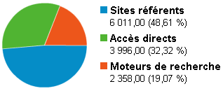

# On va pouvoir dire merde à Google

Notre vie en ligne ne dépend plus de Google. Nous pouvons exister sans lui. Pour mon blog, il reste le premier apporteur de trafic mais Twitter, FriendFeed, Facebook… apportent plus que lui au total. Je trouve ça plutôt rassurant. En plus, c’est du trafic beaucoup moins aléatoire.

#google #breves #y2009 #2009-8-19-15h9
