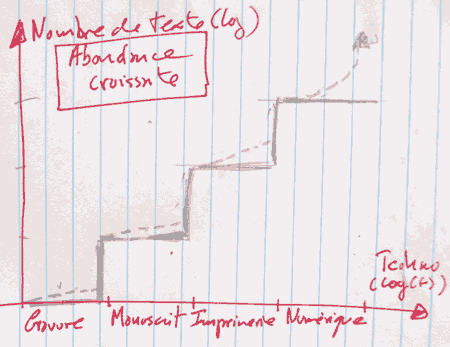
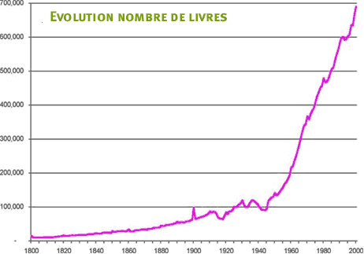

# Impression de déjà vu : Anderson plagiaire ?

> […] every man is now able, at a little cost, to be learned, and it is a fortunate age which has acquired this gift from God. Once there was a great **scarcity** of books, when they were prepared at a great price and expense. But now there exists a large **abundance** of volumes, and this in every kind of literary subject, by means of which each and every person is now easily able to achieve competence in the knowledge of letters.

Devinette : qui a écrit ce texte ? Chris Anderson, le spécialiste de la rareté face à l’abondance ? Non. Il faut chercher plus loin, beaucoup plus loin, et remonter en 1492 quand Johannes Trithemius écrit *De viris illustribus ordinis sancti Benedicti* (*Des hommes illustres dans l’ordre de saint Benoît*). Mais bientôt il se plaignit des méfaits de l’imprimerie. Elle rendait selon lui fainéants les moines et il imposa à ceux de son abbaye de maintenir la tradition des scribes, dont il fera l’éloge dans *De laude scriptorum manualium*, livre qu’il fera néanmoins imprimer ! [The Abbot Trithemius (1462-1516): the renaissance of monastic humanism](http://books.google.fr/books?id=qkgXAAAAIAAJ&pg=PA144&lpg=PA144&dq=Johannes+Trithemius+De+laude+scriptorum+manualium&source=bl&ots=P0kTFmQW0d&sig=Cfuqe0Q334iZYkdTeEFcUs7inCc&hl=fr&ei=_umcSoq4MMahjAfk2ITbDQ&sa=X&oi=book_result&ct=result&resnum=2#v=onepage&q=Johannes%20Trithemius%20De%20laude%20scriptorum%20manualium&f=false)

Pour moi, l’édition connaît sa quatrième phase. À chacune, un palier est franchi dans l’accroissement de l’abondance des textes. Je n’ai guère trouvé de statistiques sinon une courbe d’évolution du nombre de livres publiés entre 1800 et 2000.

#dialogue #y2009 #2009-9-3-16h6
