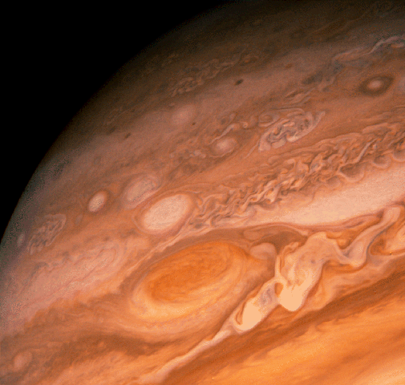

# Into the flux

Ou la vie sans objets

Ou le temps des propulseurs

Ou quand les petits ruisseaux font de grandes rivières.

À force de parler de [flux](#flux) et de penser par flux, je me demande si je ne suis pas en train d’écrire un nouveau livre, suite du *Peuple des connecteurs* et du *Cinquième pouvoir* tout en mettant en suspend [*Le socialisme selon Starglider*](#starglider).

> FLUX nom masculin (1306 ; du latin fluxus qui signifie écoulement). Écoulement d’un liquide quelconque hors de son réservoir habituel. Marée montante. Le flux impétueux de la foule. Flux de paroles, bavardage. Flux lumineux : quantité de lumière émise par une source lumineuse dans un temps déterminé. Par extension : écoulement de l’information en même temps que l’information elle-même qui s’écoule. Alors synonyme de flot.

> PROPULSEUR nom masculin Qui transmet le mouvement. (1846) Engin de propulsion assurant le déplacement d’un bateau, d’un avion, d’un engin spatial. (2009) Par extension : celui qui crée le flux d’information, le met en mouvement, le filtre, le redirige, l’enrichit, le fusionne à d’autres flux… Exemple : écrivain, musicien, journaliste, éditeur, blogueur, commentateur sur Internet…

Flux, traduction approximative de *stream*, doit être vu comme cet écoulement hors d’un réservoir initialement rempli par le propulseur. Il faut avoir en tête l’image d’un fleuve, ou plutôt de l’eau qui coule dans le fleuve, quelque chose de liquide, de palpable, qui ne se laisse pas enfermer, qui se déplace mais qui reste matériel, consistant, qui fusionne avec d’autres flots, s’enrichit, se divise en delta avant d’inonder la mer. Le Nil comme métaphore du flux.

Le flux s’inscrit dans la durée. Une fois qu’il a commencé à couler, il peut couler longtemps. Un livre, par exemple, ressemblait à une bouteille d’eau remplie une fois pour toute. On buvait tout les mots. Un flux se déploie dans le temps. Une fois la bouteille remplie par l’auteur, d’autres propulseurs viennent la faire déborder (de l’objet livre par exemple), l’auteur se joignant éventuellement à eux. Ainsi un livre devient flux en même temps qu’il circule et s’enrichit de commentaires et de discussions qui lui donnent une existence nouvelle. Tout cela s’attache, s’agrège, vit.

> Mauriac a toujours aimé cette image du flux et du reflux autour d’un roc central – qui exprime à la fois l’unité de la personne humaine, ses changements, ses retours et ses remous. Citation de Maurois dans le Robert.

Le flux peut ainsi s’enrouler sur lui-même, s’auto-maintenir comme la tache rouge dans l’atmosphère de Jupiter. Il n’est pas par essence fugitif même s’il garde toujours sa capacité de s’écouler. Il peut résister aux perturbations plus qu’un objet solide car il a la possibilité d’absorber de nouvelles données en même temps que de se délester du trop plein. Un flux ressemble à un organisme. Tant qu’il y a circulation, il y a vie (un livre que personne ne lit n’est pas mort mais en hibernation).

À quoi donc pourrait ressembler *Into the Flux* ?

### Préface

Vous lisez peut-être ce texte sur papier, peut-être aussi sur l’écran de votre ordinateur ou de votre mobile, ou peut-être sur une liseuse ou vous l’écoutez alors que vous conduisez ou il se matérialise dans votre esprit. Tout dépend de quand vous l’abordez. En 2010, peu après sa rédaction, ou plus tard, quand le monde est devenu flux. […]

### Sommaire imaginaire

1. [Le livre sans papier](../8/le-livre-echappera-pas-aux-flux.md) (avec rappel de la musique sans disque).
2. [Le web sans site web](../8/vers-un-web-sans-site-web.md).
3. Les objets sans matière (avec les nanotechnologies même les objets deviennent flux).
4. La vie sans principe (indispensable Thoreau ou comment la liberté s’accroît avec la coopération grandissante – quand la vie devient liquide, elle s’écoule mieux).
5. [La distribution sans prix.](../8/leconomie-des-flux.md)
6. La finance sans banque (monnaie vient de *currency* en anglais qui vient du latin *currere* qui signifie courir ou s’écouler – la finance est par essence un flux).
7. La politique sans politicien (ou la politique des flux).
8. L’art sans œuvre d’art (en parlant bien sûr de Fluxus – vivre est un art et la vie est une œuvre).
9. La spiritualité sans dieu (ou la métaphysique des flux).

#connecteur #netculture #y2009 #2009-9-1-10h31
