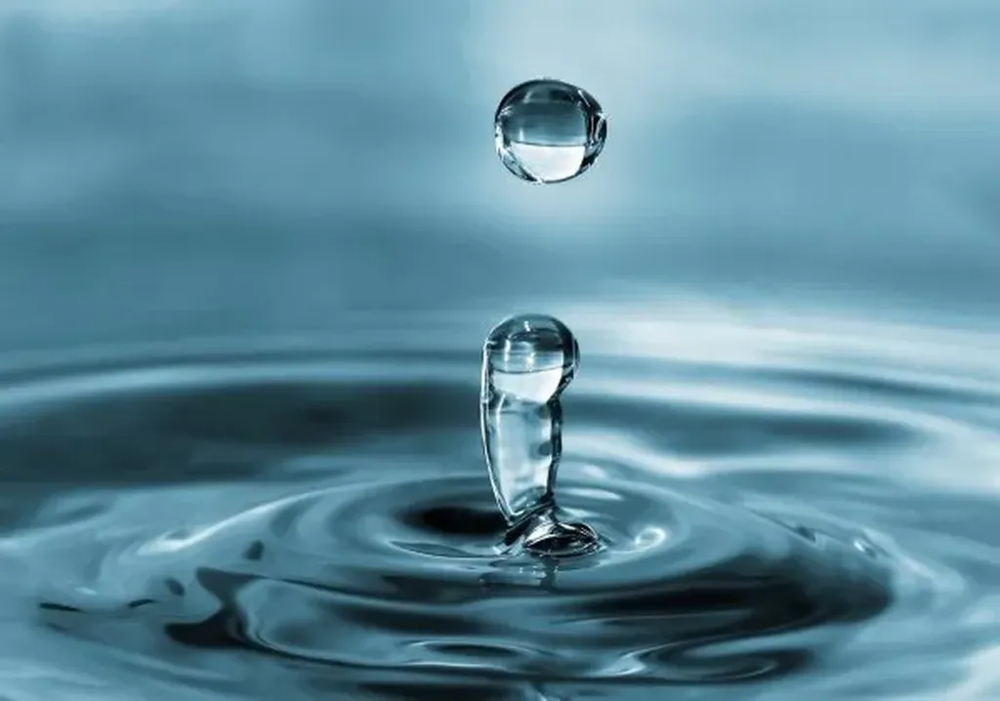

# La fin du matérialisme

Je tourne dans tous les sens les titres possibles pour mon livre sur [les flux](#flux). *La fin du matérialisme* est sans toute le titre le plus plat mais aussi celui qui décrit bien de quoi il s’agit : la migration progressive vers toujours plus d’immatériel, vers un monde où la culture primera sur la possession, condition nécessaire pour que notre monde puisse prétendre à une quelconque durabilité. J’ai rassemblé toutes vos propositions, plus d’autres surgis en cours de route.

### Mes préférés

La numérisation du monde

L’homme déchaîné

Liquide = durable

Plus jamais solide

Le livre sans titre

Liquidéconomie

Totalement liquide

Un nouvel état du monde

La grande digitalisation

Tout s’écoule

Enfin libre

Libéré du matérialisme

### Tangents

Ceci n’est pas qu’un livre

Que faire sans ?

La civilisation de l’impalpable

Tout doit disparaître

La civilisation immatérielle

La civilisation fantôme

Vers un monde désincarné

Un monde intouchable

Le monde a disparu

La Grande Cité digitale

Real time web

Le futur au présent

Matière à penser

### Cryptique

Le troisième état de l’information

Transition

AVEC

Dégel

Le Styx

The flush

Stream lines

Rêvirtualité

Le point triple

Liquéfraction

Metadématérialisation

Le monde du sans

Du sens au sans

Avec ou sans ?

Le paradigme de l’immatériel

### Double sens (pas top pour un essai)

La vie sans objets

Liquidation totale

Sans Dieu, sans mètre

La dérive des contenants

### Avec flux (mot que personne comprend)

Fluxus

Emportés par le flux

Flux et reflux

Homo Fluxus

Tous les flux mènent à vous

Entrer dans le flux

Flux-fiction

Surflux

Superflu

Un flux jeté dans la marre

Tu le sens le gros flux?

Veni vidi fluxi

Fluxi jacta est

Au pays des fluxinets

Le nécessaire et le superflux

Fusion ou la dynamique des flux

L’ingénue fluxion

L’ingénieuse fluxion

L’heureux flux

Tendu le flux!

Refluxion sur le monde

Jamais sans mon flux

Le Flutur

Le flux tue

### Bon pour un roman

L’ère du Verseau

Le veilleur des ondes

Aquarius

Varius, multiplex, multiformis

La rivière sans retour

Le fleuve monde

La mécanique des fluides

Mets de l’huile

Des hommes et des fluides

### Sous titres

Quand les choses et les idées viennent à vous plutôt que vous n’alliez à elles.

Quand le monde passe de l’état solide à l’état liquide.

Quand la culture, l’économie, la politique se liquéfient.

L’avenir d’une révolution culturelle, économique, politique et spirituelle.

L’avenir d’un monde où l’extérieur n’existe plus.

#netculture #dialogue #y2009 #2009-9-19-16h4
