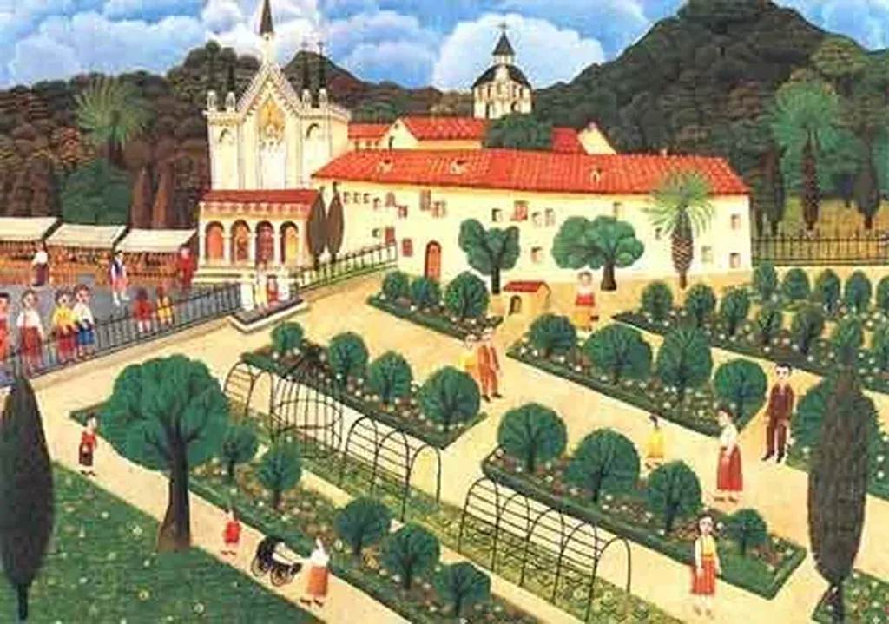

# Lectio spiritualis vs lectio scholastic

Dans [*Du lisible au visible*](http://cercamon.wordpress.com/2005/02/13/du-lisible-au-visible-ivan-illich-paris-cerf-1991/), texte malheureusement épuisé, Ivan Illich évoque une révolution du livre survenue autour de 1150. Grâce à une douzaine de techniques (amélioration de la ponctuation, retraits, insertion de titres et de rubriques, division en chapitres, index des matières classées dans l’ordre alphabétiques…), le livre devient lisible et la culture de la lecture commence, trois siècles avant l’invention de l’imprimerie.

> Cette collection de techniques et d’usages a permis d’imaginer le « texte » comme quelque chose d’extrinsèque à la réalité physique de la page.

Nous avons là les prémisses de XML, du balisage minimal pour donner à un texte toute sa force.

> Mais la réflexion de toute une vie de lectures m’incline à penser que mes efforts pour permettre à l’un des vieux maîtres chrétiens de me prendre par la main pour un pèlerinage à travers la page m’ont, au mieux, engagé dans une lectio spiritualis aussi textuelle que la lectio scholastica pratiquée non au prie-Dieu mais devant un bureau.

Illich attire l’attention vers deux formes de lecture. La *lectio spiritualis* ou lecture livresque : continue, profonde, intense, linéaire, à accès séquentiel, du début à la fin (quand je lis au lit, dans mon hamac, au bord de la mer ou en garrigue). La *lectio scholastica* : pratique, rapide, avec accès direct à l’information recherchée (quand je lis au bureau, devant mon ordinateur où défilent en continu les fils de conversations). Pour Illich, depuis le XIIe siècle, les technologies d’accès direct n’on fait que se perfectionner (et continuent de le faire avec l’informatique). Illich craignait toutefois que, sous l’influence des ordinateurs, la *lectio scholastica* devienne la norme et nous détourne définitivement de la lecture livresque, cette lecture au temps long, qui n’aurait été qu’une étape historique.

Dans le texte de 2006, [Le livre n’est pas condamné et donc la bibliothèque n’est pas morte](http://bibliothecaire.wordpress.com/mots/bibliotheques-numeriques/4-le-livre-nest-pas-condamne-et-donc-la-bibliotheque-nest-pas-morte/), où j’ai trouvé la piste Illich, Michel Roland-Guill est moins pessimiste :

> Il est remarquable qu’à partir du moment où la lecture monastique cesse d’être le modèle dominant de la lecture “légitime”, la forme roman s’impose progressivement dans le domaine de la littérature laïque en langue vernaculaire. Le roman est devenu le lieu de cette expérience, de ce voyage spirituel suivi et initiant qui était le sens de la lecture monastique.

Quand je lis sur Internet, presque toujours, je suis en mode *scholastica*. Mais quand je lis sur mon eReader, je suis en mode *spiritualis*. L’électronique ne tue pas la lecture livresque, au contraire elle va peut-être fusionner avec la *scholastica*, nous permettant de basculer d’un mode à l’autre au gré de nos humeurs. Ce serait d’ailleurs logique dans la perspective des flux. Et comme Illich nous pouvons mêmes rêver de nouveaux lieux de lecture :

> Avec Georges Steiner, je rêve qu’en-dehors du système éducatif qui assume aujourd’hui des fonctions totalement différentes il puisse exister quelque chose comme des maisons de lecture, proches de la yeshiva juive, de la medersa islamique ou du monastère, où ceux qui découvrent en eux-mêmes la passion d’une vie centrée sur la lecture pourraient trouver le conseil nécessaire, le silence et la complicité d’un compagnonnage discipliné, nécessaires à une longue initiation dans l’une ou l’autre des nombreuses « spiritualités » ou styles de célébration du livre.

Et si la lecture livresque était une façon de vivre une expérience spirituelle ? L’humanité ne s’est-elle pas détournée de Dieu en se tournant vers les romans et les héros romanesques ?

#connecteur #netlitterature #breves #y2009 #2009-9-7-12h2
