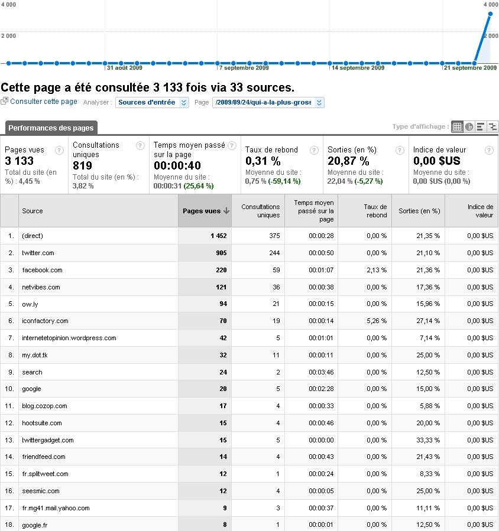

# Les mensurations de la quéquette Twitter

Moins de douze heures depuis la publication de [mon histoire de quéquette](qui-a-la-plus-grosse-quequette-sur-twitter.md) mais voici les stats de la nuit pour ceux qui s’intéressent à l’influence croissante des réseaux sociaux comme apporteur de trafic. [Données à croiser avec celles que j’ai publiées en août.](../8/on-va-pouvoir-dire-merde-a-google.md)

#noepub #twitter #breves #y2009 #2009-9-25-8h0
