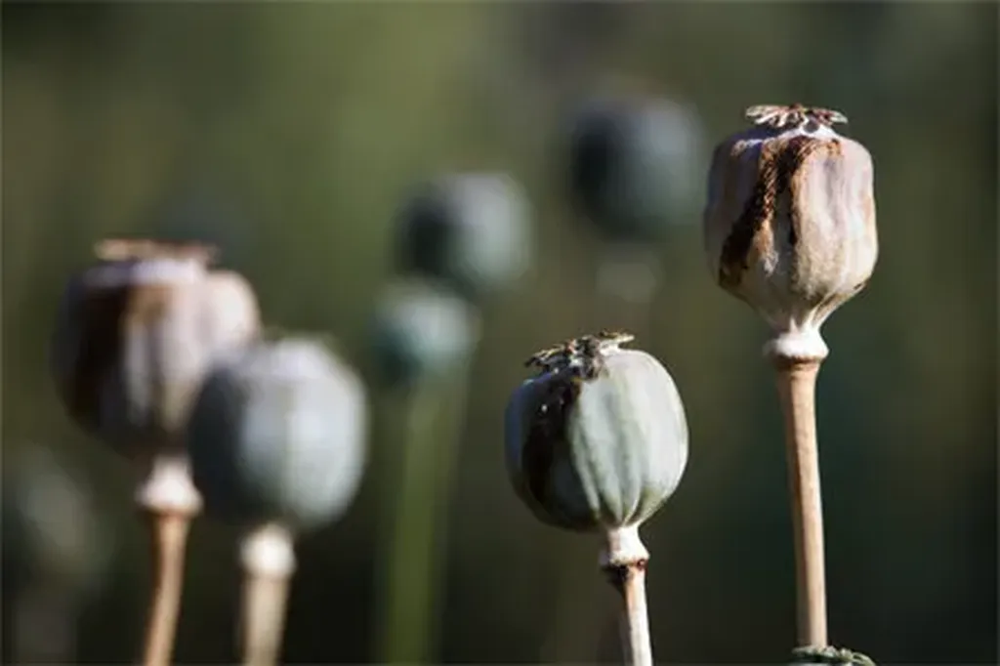

# Piratons pour lutter contre le piratage

Tout le monde connait les conséquences de la prohibition, elle favorise la violence et ne diminue pas l’usage des biens prohibés.

Dans la plupart des pays occidentaux, [les cocaïnomanes recensés par les services de santé depuis cinquante ans](http://www.newscientist.com/article/mg20327251.100-better-world-legalise-drugs.html) sont de plus en plus nombreux. Au États-Unis, un des pays où la répression est la plus forte, la consommation est aussi la plus forte. En revanche, dans les rares pays qui, comme le Portugal, ne pénalisent pas l’usage des drogues, le nombre de toxicomanes reste stable et la mortalité associée diminue.

Se fiant à leur bon sens, à la logique première qui nous dit que la terre est plate, nos gouvernants prennent des mesures qui leur semblent bonnes mais qui ont des effets dévastateurs. Ils n’ont aucune culture scientifique, aucune pratique des expérimentations en double-aveugle qui souvent donnent des résultats opposés à ceux attendus. Sous prétexte de l’urgence qu’ils entretiennent (par réaction à la brièveté de leurs mandats sans doute), nos petits chefs agissent comme des chercheurs qui découvriraient un nouveau traitement et l’administreraient immédiatement à des millions de gens. Insensé ! Quoique à l’époque de H1N1 plus rien ne soit très sensé.

Bon ok, souvent nos amis du pouvoir sont sous influences nocives et pas aussi naïfs qu’on le pense. La prohibition des drogues, mais pas celles qui tuent le plus comme le tabac et alcool, booste le marché noir et la délinquance. Le sentiment d’insécurité s’accroît (tout comme les revenus mafieux qui peuvent financer la politique). Les administrés demandent alors plus de sécurité, ce qui implique plus de police, donc plus de pouvoir entre les mains des gouvernants. C’est un phénomène de feedback positif implacable. Au non de la peur entretenue, nous renonçons peu à peu à nos libertés.

> La destruction violente des vies et des biens que cause la guerre et l’inquiétude permanente qu’entraîne un état de danger permanent obligeront les nations les plus attachées à la liberté à chercher le calme et la sécurité auprès d’institutions qui tendent à détruire leurs droits civils et politiques. Pour être plus protégés, elles finissent par accepter le risque d’être moins libres. John Jay et James Madison cités par Zygmunt Bauman dans *Le présent liquide*.

On entretient la peur à tout prix, toutes les peurs, celles de la grippe, des terroristes, du réchauffement climatique, du piratage… Tous les moyens sont bons pour policer la société et pour réduire les libertés. Car c’est l’objectif, non pas celui de régler les problèmes sous-tendant la peur.

Pourquoi aujourd’hui ce combat prend des proportions extrêmes ? Parce que nous étions en passe de gagner une liberté immense, jamais connue dans notre histoire, une liberté si extraordinaire qu’elle aurait fait perdre aux hommes de pouvoir encore un peu plus de leur pouvoir, un peu trop vraisemblablement. Réaction peu surprenante : ils luttent bec et ongle pour défendre leur caste. Ce sera un combat sans merci dont [Hadopi](#hadopi) n’est qu’une des escarmouches. Nous devons nous élever contre les prohibitions qui n’ont d’autre but que d’entretenir la peur.

1. Banalisons ce qui est prohibé (dans le cas Hadopi, l’acte de copier et de partager).
2. Opposons-nous à la répression qui engendre la violence.
3. Devenons pirates tout en montrant que nous sommes des citoyens responsables.
4. Exerçons notre liberté de partager ce qui est abondant.
5. Allons devant les assises s’il le faut pour défendre nos droits.

*PS. Doit-on faire encore confiance à des politiciens qui nous ont fabriqué un monde absurde ? Mon fils ainé a une angine depuis quelques jours. Ce matin on appelle le centre aéré pour dire qu’il n’ira pas. On nous demande un certificat médical sinon on devra tout de même payer le centre aéré (8 euros). Ok. Si je fais venir le docteur chez moi pour le certificat, c’est 30 euros… et déplacement en voiture, pollution… et nos politiciens se permettent de légiférer sur internet ! **Billet dédié au 285 connards qui ont voté hier la loi Hadopi.***

#hadopi #coup_de_gueule #y2009 #2009-9-16-10h1
