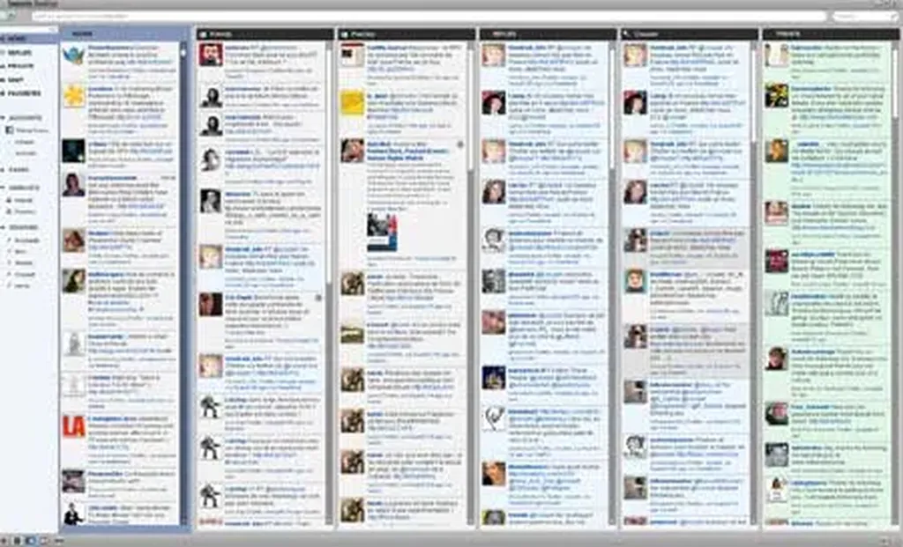

# Qui a la plus grosse quéquette sur Twitter ?

Les journalistes sont naïfs. Ils voient un compte Twitter avec des dizaines de milliers de followers et ils s’extasient. Ils font du détenteur du compte une star. Mais ont-ils un peu gratté derrière les apparences ?

Je voulais avant de vous raconter cette histoire attendre d’avoir moi-même la plus grosse quéquette de la twittosphère francophone en dépassant le fameux @jeanlucr (manquerait plus que je mette un lien vers lui). Mais pas de chance, une rumeur s’ébruite. [Je mènerais une expérience](http://internetetopinion.wordpress.com/2009/09/24/effets-twitter-sur-le-trafic-des-sites/) et [débusquerais des truanderies](http://twitter.com/narvic/status/4154461162).

Je vais donc, plus tôt que prévu, vous raconter une histoire, la mienne, celle d’un jeu de cours d’école. Tout a commencé [le 19 mai 2009](http://twitter.com/crouzet/status/1850191781). Je décide de réserver mon compte Twitter historique @[tcrouzet](http://twitter.com/tcrouzet) à mon [Twiller](#twiller) et d’utiliser @[crouzet](http://twitter.com/crouzet), compte en sommeil, pour mes autres tweets.

Comme je suivais 200 amis sur @tcrouzet, j’ai commencé à les suivre sur @crouzet. Au bout d’un moment, je me suis dit que c’était pas humain d’effectuer ces invitations à la mano. J’ai alors regardé la doc de l’API Twitter, j’ai chargé une librairie PHP, j’ai pondu un bout de code pour transférer mes amis, [le tout terminé en dix minutes](http://twitter.com/crouzet/status/1851131101). Douze heures plus tard, le 20 mai au matin, 70 de mes anciens amis m’avaient suivi sur @[crouzet](http://twitter.com/crouzet/status/1857310929).

Je me suis alors fait deux remarques.

1. Si on peut changer aussi facilement de compte, on peut aussi quitter Twitter pour un autre service au besoin. On n’est pas pieds et poings liés. Ce qui confirmait mon idée que Twitter était une technologie plus qu’une plateforme.
2. Si mes amis me suivent, peut-être que les amis de mes amis qui ne me suivent pas encore me rejoindront.

À 13:18, je publie un [tweet d’explication](http://twitter.com/crouzet/status/1858166009) :

> Expérience en cours. Prendre tous les amis d’un ami @nicolasvoisin et les suivre car logique que nous partagions quelque chose.

[À 17 heures](http://twitter.com/crouzet/status/1859948247), j’avais invité 1000 personnes, quota maximal de nouveaux amis autorisés par jour. À quelqu’un qui me demandait quel intérêt avait ma manip, [j’ai répondu](http://twitter.com/crouzet/status/1860142470) :

> Ce qui m’intéresse avec twitter c’est de saisir le bruit de fond de la conscience globale, pas la conversation.

Et je n’ai pas changé d’avis. J’ai découvert que suivre des milliers de personnes prises au hasard fait sens car la sérendipité, pas de meilleur mot, me fait attraper des choses qui passent fugitivement. Bien sûr, j’utilise un logiciel pour filtrer les tweets. J’ai trois listes « tout le monde », « les gens qui m’intéressent », « les gens qui m’intéressent énormément et dont je lis tous les Tweets ». 200 personnes en gros dans ces deux derniers groupes. Mais j’avoue que je lis plus souvent les articles pointés par mes milliers de faux amis que par mes « amis ».

Voici où j’en suis le soir du 20 mai. Le lendemain quand je reviens devant Twitter, je découvre une avalanche de nouveaux followers. Les amis de Nicolas me suivent en masse, près de 30 % au bout de quelques jours. Et comme toutes ces conversations stimulent mon esprit, je décide d’inviter les amis d’autres amis. Au fur et à mesure, j’améliore mon programme initial. Je crée une base de données pour savoir qui j’invite, quand, est-ce qu’ils finissent par me suivre, sinon, au bout de 48 heures, les virer.

C’est toujours un système artisanal mais qui marche de mieux en mieux. Je règle le moteur pour ne pas qu’il se heurte aux limites imposées par Twitter. Les nouveaux amis s’accumulent : 1000, 2000, 3000 en juillet. Tout cela reste amateur. Mon machin tourne quelques heures, plante, puis je l’oublie. De temps en temps, ça me prend et je le lance.

Arrivent les vacances d’août, les Pyrénées, randonnées, pas de connexion, puis je me retrouve dans la maison familiale de ma femme avec à nouveau un wifi. C’est là que je me dis que je devrais défier virtuellement la plus grosse quéquette française : 68 000 followers à l’époque.

J’importe ses amis et commence à les inviter au rythme de 1000 par jours, du taff pour plus de 70 jours car il progresse aussi le bougre. Et la, stupéfaction. Rendement extraordinaire. Et qui sont mes nouveaux amis : quelques véritables utilisateurs mais une ribambelle de prostituées, de spam bots et d’autres arnaqueurs en tout genre. Pas folichon. La sérendipité en prend un coup.

Début septembre, je perfectionne encore le processus. Je le lance dans un screen sur un serveur Linux. Mon robot tourne depuis 24h/24 et doucement je m’approche des 10 000 amis. Je constate alors que la grosse quéquette progresse presque aussi vite que moi et je commence à soupçonner qu’il utilise une technique comparable. Je peux pas le jurer mais bon.

Pour lui, c’est business as usual. Je ne dis pas que ses tweets ne sont pas intéressants mais on est aussi dans une expérience, une façon de démontrer son expertise, surtout à des clients potentiels.

« Ce mec avec près de 80 000 amis, il peut nous faire une promo de feu. » Belle illusion quand on connait la logique. Je voulais révéler la combine un peu plus tard, je devance, ça change pas grand-chose. Rien de nouveau sur Internet. Les geeks s’amusent. Certains en font un business pour allumer les gogos. C’est la vie.

C’est dit, c’est fait. A priori j’ai pas l’intention de couper le machin. La partie peut continuer, d’autres peuvent s’y joindre, les règles sont maintenant claires pour tout le monde. Journalistes, ouvrez les yeux. La belle histoire dans notre monde est celle que je viens de raconter. C’est celle de la technologie dont on pousse les usages.

PS1 : [première stats à 08:00 le 25/09.](les-mensurations-de-la-quequette-twitter.md)

PS2 : [Stats après quatre jours complets.](statistiques-dun-buzz.md)

PS3 : [Suite et fin de cette histoire.](gonflette-sur-twitter-suite-et-fin.md)

#netculture #twitter #y2009 #2009-9-24-21h23
