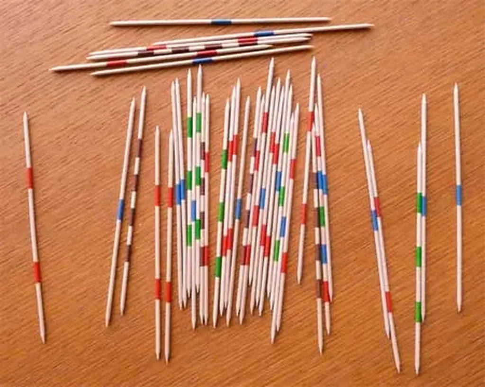
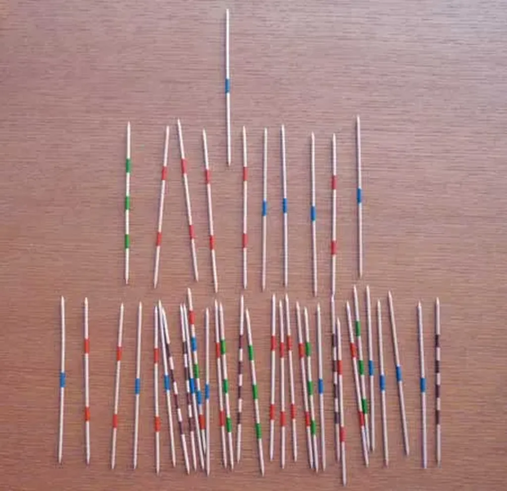
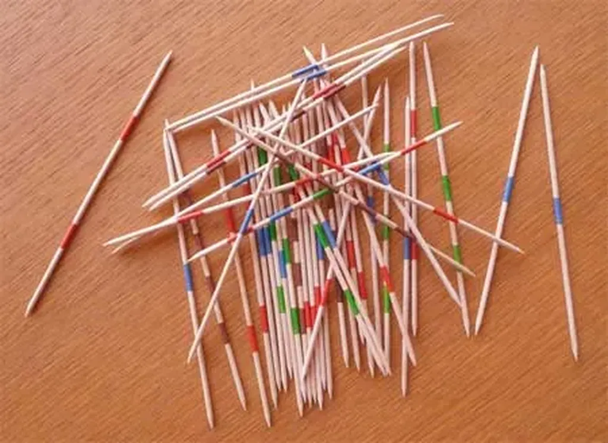
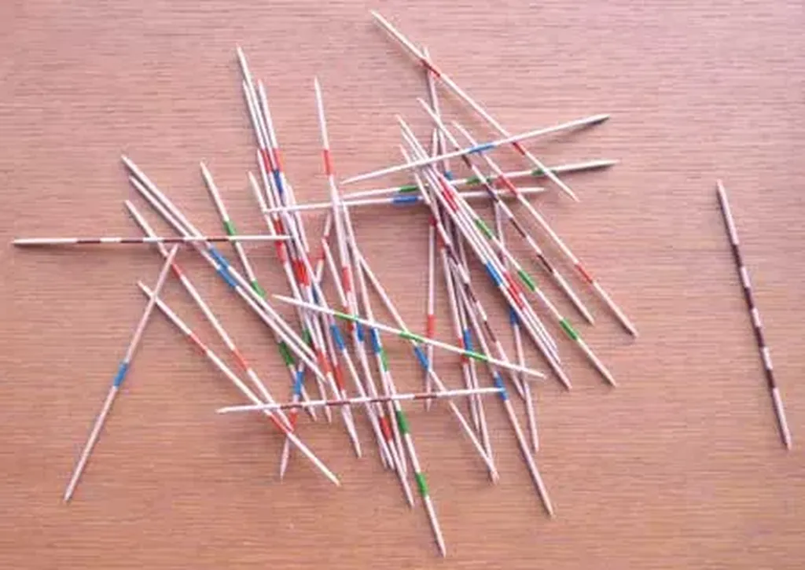

# Sarkozy joue au Mikado !

Pour Sarkozy (remplacez son nom par celui de n’importe quel politicien mais avec le sien ça marche particulièrement bien), le monde est simple. Il ressemble à un jeu de Mikado qui n’existe pas (ci-dessus).

Sarkozy croit qu’il peut saisir n’importe quelle pique et la déplacer sans aucune conséquence pour les autres. Alors il dessine le jeu qu’il apprécie le mieux.

Mais dans la réalité, quand on lâche les piques pour commencer une partie, elles se retrouvent plutôt emmêlées. Certaines roulent hors du tas principal. Sarkozy les a repérées très vite. Il est malin. La sécurité routière par exemple. Il la prend sans rien toucher à côté, il fait un miracle, ce qui accroît sa réputation de metteur d’ordre.

Comme il gagné, il a le droit de rejouer. Il s’appuiera sur sa prouesse, effectuée grâce à un coup facile, pour s’attaquer aux piques empêtrées au cœur du tas. Mais ce qui marche dans une situation simple ne marche pas dans une situation complexe. Patatras !

Le jeu explose, d’autres piques bougent. Partie perdue. Sarkozy demande un joker. Il veut rejouer. « Ça marchait avant, se dit-il. ». Il nous refait le coup de la pique isolée. Bravo ! Puis il va à nouveau s’attaquer à une pique difficile. Manque de chance. D’autres piques vont bouger, c’est comme ça. Appliquer une méthode simpliste dans une situation complexe implique des dommages collatéraux imprévisibles.

Est-ce une raison pour ne pas agir ? Non bien sûr. La méthode Sarkozy implique des pots cassés, parfois irréparables. Il existe toutefois une autre méthode. Les atomes qui constituent les piques ressentent, en quelque sorte, les zones de contact. Ils savent où il faut renforcer la structure pour libérer les piques au préalable bloquées. C’est une réforme de l’intérieur.

C’est impossible dans un jeu de Mikado mais peut-être pas dans la société où des hommes, des institutions et des entreprises équivalent aux piques. Si nous partageons nos informations, nous pouvons mieux comprendre où se trouvent les points de friction. Toute mesure visant à limiter d’une façon ou d’une autre le partage réduit nos chances de résoudre nos problèmes de l’intérieur. Par manque de connaissances intimes du monde, nous multiplions les risques de le casser.

*PS : Les maitres de l’eau*

*Ce film sur l’eau, parfois mystique, parfois inacceptable, surtout par l’usage répété du mot énergie, illustre tout de même cette idée qu’en voulant faire simple on casse la complexité au risque de se faire déborder par elle.*

#politique #coup_de_gueule #y2009 #2009-9-20-22h16
