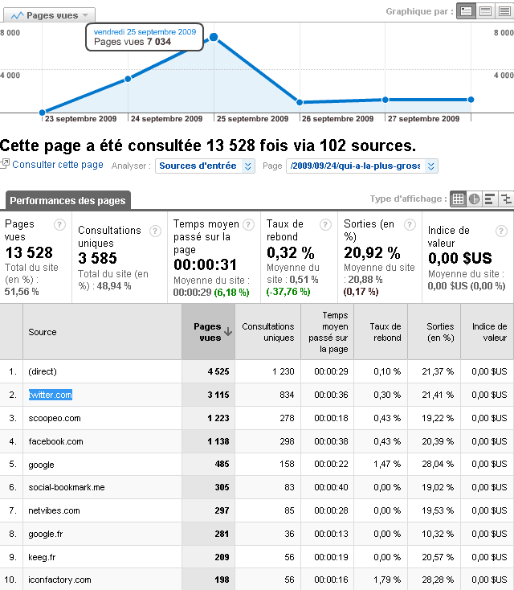

# Statistiques d'un buzz

Voici les statistiques du billet sur [Twitter et les robots](qui-a-la-plus-grosse-quequette-sur-twitter.md). Si le décompte BackType est correct, il a été retwitté 157 fois pour 2 938 entrées via Twitter et 4236 entrées directes, dont une bonne part sans doute via les desktop Twitter. Dans le cas le plus favorable, cela donne 7174 visites directement imputables à Twitter, soit une base de 45 visites par retwitt.

Rien d’extraordinaire. Un blogueur influent avait en 2006 la capacité de générer à lui seul 2000 visites ce qu’est incapable de faire un microblogueur ([voir analyse de Petites phrases](http://www.velico.net/sticky/)). En revanche, de proche en proche, on atteint le même effet, surtout quand on cumule avec Facebook. Si un jour Twitter a une véritable audience en France, les effets seronts ans doute démultipliés. À voir. Pour le moment tout cela reste très modeste.

Sur mon blog, Google n’a jamais été la principale source de trafic mais sa part ne cesse de diminuer au profit des services sociaux. Deux explications opposées.

1. Version optimiste. [On peut aujourd’hui exister sans Google.](../8/on-va-pouvoir-dire-merde-a-google.md)- Mon blog n’est pas irrigué par Google et donc il n’a aucune audience quantitative notoire. En dessous de 10 000 visiteurs uniques/Jour on est bien peu de chose sur le web.

Ces chiffres guère folichons devraient être comparés avec les chiffres d’un papier obscur dans *Le Monde*. Je ne suis pas sûr qu’un blogueur soit moins lu qu’un journaliste qui travaille dans le même domaine. D’autre part, il ne faut pas oublier que les articles sont publiés en de multiples endroits (coZop, Owni, Facebook... au minimum pour moi), ce qui rend difficile le suivi des statistiques.

J’indique tous ces chiffres pour ceux qui s’intéressent au buzz. Pour ma part je n’ai jamais ici poursuivi l’audience mais la conversation. Ce blog est l’atelier d’écriture de mes textes longs, que j’appelle encore livres. Je n’ai pas envie de changer d’habitude.

#noepub #twitter #dialogue #y2009 #2009-9-29-9h13
