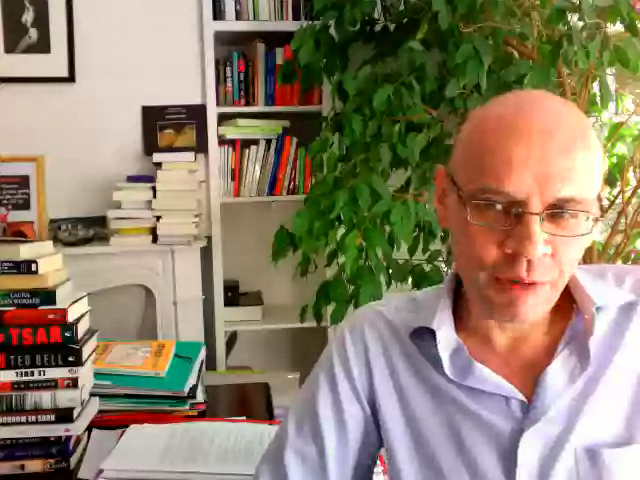

# Un nouveau roman free pas free en France !

Le livre gratuit est-il un modèle ? Tout au moins diffuser pendant une période limitée un livre gratuit a-t-il un sens ? Oui, m’explique Stephen Belfond, patron des [Éditions Gutenberg](http://www.editionsgutenberg.fr), au cours d’une conversation que nous venons d’avoir.

[audio:2009stephen\_belfond.mp3]

Précision. [*Le Conteur*](http://www.editionsgutenberg.fr/Le_conteur.html), second roman d’Omair Ahmad, un écrivain Indien, sortira le 3 novembre. À partir du 28 septembre et jusqu’à sa sortie, il sera lisible gratuitement sur calameo.com [à la façon de mon Twiller](http://twiller.tcrouzet.com/texte-integral/).

Comme toujours, je ne réécoute jamais une conversation avant de la publier. Je retiens un chiffre : la mise en place est passée de 1500 exemplaires à 4500. Les libraires ont parié sur le buzz (auquel je participe) et estimé qu’il ferait vendre le livre. Comme la mise en place est souvent proportionnelle aux ventes, c’est déjà tout bénef pour l’éditeur. C’est aussi tout bénef pour les lecteurs qui découvriront en ligne le livre gratuitement.

Bien sûr, Stephen Belfond aurait pu publier le PDF mais je comprends pourquoi il ne l’a fait pas. Impossible dans ce cas de limiter l’opération dans le temps. Et puis, pour changer les mentalités d’une profession sclérosée, autant avancer en douceur. Bientôt tous les livres seront en lecture libre en ligne et cela advitam exactement comme dans les librairies et les bibliothèques.

Je trouve cette forme de gratuité acceptable en attendant que les modes de rémunération alternatifs se développent. On paye pour avoir l’objet et le confort (ou le fichier et le confort). Si on se contente d’un confort approximatif, on reste dans le gratuit, on paye après, si coup de cœur.

J’ai moi-même déjà annoncé que mon prochain livre sur [la révolution des flux et des propulseurs](#flux), sortie prévue en mars 2010, serait lisible en ligne gratuitement. Et je viens de persuader mon éditeur de proposer aussi en lecture gratuite, du 28 septembre au 5 novembre, [*Capitalisme et Christianisme, 2000 ans d’une tumultueuse histoire*](http://www.bourin-editeur.fr/auteur/long.html), le prochain essai de Didier Long, [le moine capitaliste](http://fr.wikipedia.org/wiki/Didier_Long_%28%C3%A9crivain%29). Merci à Stephen Belfond de faire bouger les barrières.

PS : Je ne connais pas Stephen Belfond. Il m’a contacté après avoir lu [mon article sur Chris Anderson](../8/free-pas-free-arnaque-marketing.md).

#noepub #dialogue #y2009 #2009-9-24-18h5
