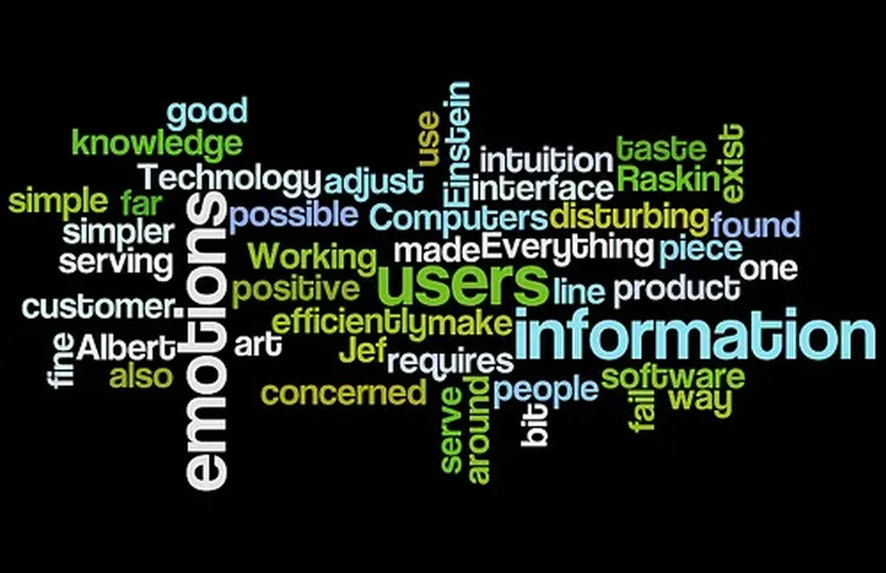

# Blogging manifesto 1.0

1. Notre manifeste ne pourra jamais être écrit. Nos tentatives, nécessairement infructueuses, n’ont pour but que de provoquer la conversation.- Nous ne défendrons notre liberté que si nous nous lions les uns aux autres et respectons des règles qui ont pour effet de fluidifier nos interactions.

- Nous sommes des citoyens comme les autres et ne demandons aucun statut spécifique. Nous voulons simplement exercer notre liberté d’expression.

- Nous exigeons que l’État ne favorise la liberté d’expression d’aucuns acteurs de la société.

- Nous évitons de faire prospérer les plates-formes centralisatrices, notamment propriétaires. Elles tentent d’accaparer tous les trafics pour qu’Internet ne se résume qu’à elles.

- Quand nous publions, nous linkons d’autres articles dès que c’est possible et nécessaire (les sources, les inspirations, les développements…).

- Nous publions chez nous, sur un site avec un nom de domaine qui lui est propre, en utilisant un logiciel Open Source.

- Quand nous n’avons rien à dire, nous ne publions pas. Nous ne reproduisons pas des articles écrits par d’autres.

- Nous nous centrons sur nous-mêmes pour mieux nous tendre vers les autres. Nous ne passons pas notre sur les réseaux sociaux mais les utilisons pour amener les lecteurs chez nous.

- Nous sommes des artisans de l’information, du divertissement, de la philosophie, de la littérature, de la science…

### Commentaire point 1

Depuis dix ans, des manifestes ont été écrits, [la Nétique par exemple](http://nethique.info/). Aujourd’hui, il est peut-être plus urgent que jamais d’en proposer de nouveaux, d’essayer d’établir entre nous quelques grandes lignes de force. Il ne s’agit pas de les prendre comme des lois, mais de les utiliser comme point de réflexion sur notre activité.

Un manifeste du blogueur ne peut exister, car il n’existe pas un blogueur idéal. Un manifeste du fait de bloguer est peut-être plus général, mais il ne peut par principe convenir à tous. Je cherche juste à réfléchir sur quelques mécanismes qui pourraient nous aider à survivre.

Se poser cette question a un peu de sens au moment où [les blogueurs sont de plus en plus souvent attaqués](http://rimbusblog.blogspot.com/2010/01/quand-les-blogs-font-polemique.html), ce qui me semble être la preuve qu’ils prennent de plus en plus de place dans l’espace médiatique.

Quand j’ai évoqué sur Twitter l’idée d’écrire un blogging manifesto, vous avez fait des suggestions, [FrédéricLN](http://demsf.free.fr/index.php?post/2010/01/10/Tentative-charte-blog) a publié un premier essai, ma proposition se veut plutôt politique.

### Commentaire point 2

J’attache une importance fondamentale à ma liberté, notamment ma liberté d’expression, mais il me semble que la blogosphère ne peut garantir cette liberté et survivre tout simplement que si elle adopte des règles comportementales fécondes pour elle…

La liberté absolue n’existe pas. Quelques règles simples peuvent maximiser notre liberté et non la réduire (c’est un des principes de l’auto-organisation). Comme dans tout système évolutif, les règles n’ont d’autres buts que de donner naissance à d’autres règles.

### Commentaire point 3

Le blogueur est un citoyen qui s’exprime sur Internet. Il doit être protégé et contraint par les mêmes lois que les autres citoyens lorsqu’ils s’expriment ailleurs.

Si nous demandions un statut, nous nous désolidariserions des autres citoyens, nous créerions une classe des blogueurs officiels.

Un gouvernement pourrait être tenté de nous accoler un statut, nous devrons nous en défendre au nom d’une liberté d’expression égale pour tous.

Une fédération des blogueurs serait un non sens.

### Commentaire point 4

Quand l’État subventionne la presse ou un autre média, il crée une inégalité par rapport à la liberté d’expression.

Dans une démocratie, aucune raison supérieure ne doit prévaloir sur la liberté d’expression. Si une entreprise de communication dépose le bilan, l’État ne doit pas la secourir, sinon il crée des inégalités par rapport à tous les citoyens qui ont pris la parole et ne reçoivent pas d’aide.

De même, juridiquement, un journaliste est mieux protégé qu’un citoyen. Un blogueur prend plus de risques quand il s’exprime qu’un journaliste. Ce dernier, couvert par son entreprise, ne risque en général par d’inculpation directe (sauf s’il est indépendant… ce qui le ramène au statut de citoyen). Cette inégalité juridique est une entrave à la libre application de la liberté d’expression.

On parlera alors de l’art subventionné... Il me semble que l’État doit subventionner les infrastructures qui servent potentiellement tous les citoyens et non se lancer dans le mécénat. Pas simple cette affaire.

### Commentaire point 5

L’histoire de l’informatique se partage entre tentations centralisatrices, les mainframes, le cloud, et tentations décentralisatrices, Internet, le Web, les PC…

Un monde centralisé, c’est un monde avec des nœuds de pouvoir, des centres de puissance et, en dehors, des zones de moindre pouvoir et inévitablement de moindre liberté.

Ce manifeste s’adresse aux blogueurs qui ne défendent pas l’impérialisme, mais la liberté, en l’occurrence à ceux qui veulent défendre la décentralisation qui garantit l’égale liberté d’expression de tous.

Face aux forces centralisatrices (Google, YouTube, Rue89, Lepost… pour donner quelques exemples), nous devons opposer un réseau de grande densité et d’une grande richesse. Il doit être possible de naviguer dans ce réseau de blog en blog, indépendamment de toute force centralisatrice, notamment Google.

L’État qui subventionne des acteurs de ce monde, crée des nœuds de pouvoir, c’est un État inégalitaire, un État qui recherche tous les pouvoirs, c’est un État qui vire au totalitarisme.

### Commentaire point 6

Nous disposons du pouvoir de créer des liens. Il ne s’agit pas de lier à tort et à travers, mais de lier quand c’est nécessaire pour que des routes partent de chez nous vers ailleurs. Nous avons un monde à créer. Le Web ce n’est que nous, que l’armature en fils de fer que nous construisons jour après jour. Tout ce qui est centré ressemble à un trou noir dans le Web. Une force destructrice. L’étoile noire de *Star Wars*.

### Commentaire point 7

Publier sur une plateforme et ne pas être maître de son nom de domaine, c’est être attaché à un fournisseur, donc ne pas être libre. Si nous agissons ainsi, notre trafic et notre travail profitent à un tiers centralisateur qui en général ne nous rémunère même pas.

Quand on dispose d’un nom de domaine, notre site est mobile de serveur en serveur. Certes nous restons liés par ce nom, mais nous ne faisons pas prospérer d’énormes nœuds sur notre dos. C’est la solution qui aujourd’hui maximise notre liberté.

### Commentaire point 8

Quand nous recopions un contenu découvert ailleurs, c’est comme quand une boutique Zara ouvre près de chez nous. Alors quand on voyage, on voit partout des boutiques Zara, on a l’impression de ne pas voyager.

La tour Eiffel est à Paris, le Parthénon à Athènes, le cirque Maxime à Rome. Ce n’est pas parce que nous pouvons dupliquer l’information que nous devons le faire systématiquement.

La duplication est une arme pour protéger une information fragile ou pour soudain pousser un grand cri de rage. Dupliquer tout et rien à tout moment uniformise le Web. Les médias se livrent à ce jeu et c’est ainsi qu’ils se tirent une balle dans le pied.

Notre réseau ne sera attirant que s’il est divers et original, non pas s’il se mime lui-même. Le lien est une arme plus puissante que la copie. Il pousse les internautes sur la route, donc à se confronter à l’altérité (alors que les approches centralisatrices cherchent à enfermer dans un cadre – même Google voudrait qu’on cesse de remonter les liens et qu’on ne passe plus que par lui).

### Commentaire point 9

Les fameuses plateformes de partage, d’articles comme Lepost ou de vidéos comme youTube ou les réseaux sociaux, sont d’énormes nœuds de centralisation.

Lorsque nous y publions nos contenus, nous travaillons gratuitement pour ces marques tout en accroissant la force de gravité de ces trous noirs. Si par nos créations nous continuons à les alimenter, toute autre forme de vie sera bientôt impossible sur le Web. Nous reviendrons au Minitel.

Il ne s’agit pas de refuser le partage, mais de préférer le partage P2P au partage centralisateur dans lequel les entrepreneurs nous ont orientés depuis une dizaine d’années. Partager une vidéo sur Dailymotion, c’est faire gagner avant tout Dailymotion. C’est remplir le compte en banque de Dailymotion. C’est raser gratis.

Les solutions P2P ne sont pas nécessairement simples d’usage, surtout pour la vidéo. Si nous ne voulons pas nous embêter la vie avec elles, nous devons tout au moins être conscients de ce que nous faisons quand nous engraissons la bête.

Partager, ce n’est pas se lier avec une poignée d’acteurs par lesquels tous les partages s’effectuent. Il existe toujours une approche décentralisée à tous les problèmes techniques. Nous devons en être conscients. N’usons des services centraux que faute de mieux.

### Commentaire point 10

Nous ne sommes pas en guerre contre les anciennes professions. Nombre d’entre nous les ont pratiquées ou les pratiquent encore. Le blogueur ne s’oppose pas au journaliste, l’un et l’autre peuvent sombrer avec la même facilité dans le populisme.

La différence, c’est que le blogueur parle en son nom, non pas en celui d’une entreprise ou d’une corporation. Le blogueur est à la fois seul et à la fois avec tous ceux avec qui il s’est lié. Le blogueur peut être amateur ou professionnel. Il reste artisan.

Il peut y avoir un blog d’entreprise mais pas de blogueur d’entreprise, il n’y a que des salariés dans ce cas.

### Outil 1

Quel est le trafic général de la blogosphère ? Les sites pure-player annoncent leurs millions de visiteurs. Il nous serait assez facile d’avoir un chiffre de comparaison. Dans chacun de nos blogs, nous insérons un iframe invisible qui inclut la page d’accueil d’un site avec un outil de stat. Nous obtenons alors les statistiques globales de la blogosphère.

### Outil 2

Les trackbacks ont été plus ou moins abandonnés, mais ils ont un grand intérêt. Les lecteurs d’un billet peuvent savoir les blogueurs qui ont écrit après coup. Il est ainsi possible de remonter dans le réseau. C’est un véritable outil de navigation alternatif, une façon d’explorer la blogosphère de proche en proche, aussi bien avec les liens entrants qu’avec les liens sortants. Il faudrait développer des plugins qui proposent cette fonction, qui postent par exemple des commentaires sous les billets pour chacun des liens entrants détecté.

#netculture #dialogue #y2010 #2010-1-29-14h55
