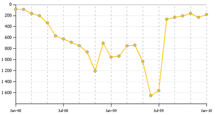

# Comment avoir un blog à succès

Ce [graphique](http://labs.wikio.net/fr/source?url=blog.tcrouzet.com) décrit l’évolution de mon blog dans le classement Wikio. Éloquent non ? Fin 2007, je décide de ne plus parler de politique et de me remettre à travailler, c’est-à-dire à creuser mon sujet, construire quelque chose qui viendrait de moi… pour peut-être finir par écrire une suite du *Peuple des connecteurs* et du *Cinquième pouvoir*.

Conséquences : les blogueurs me citent de moins en moins. Et voilà que je remonte quand je m’amuse avec [mes histoires de quéquettes sur Twitter](../../2009/9/qui-a-la-plus-grosse-quequette-sur-twitter.md) puis quand je tape sur les journalistes. Ainsi va la vie. Le populisme paye. Mais ce n’est pas ainsi que nous construirons l’autre monde auquel vous aspirez tous. Réveillez-vous.

#netculture #noepub #breves #y2010 #2010-1-9-11h57
