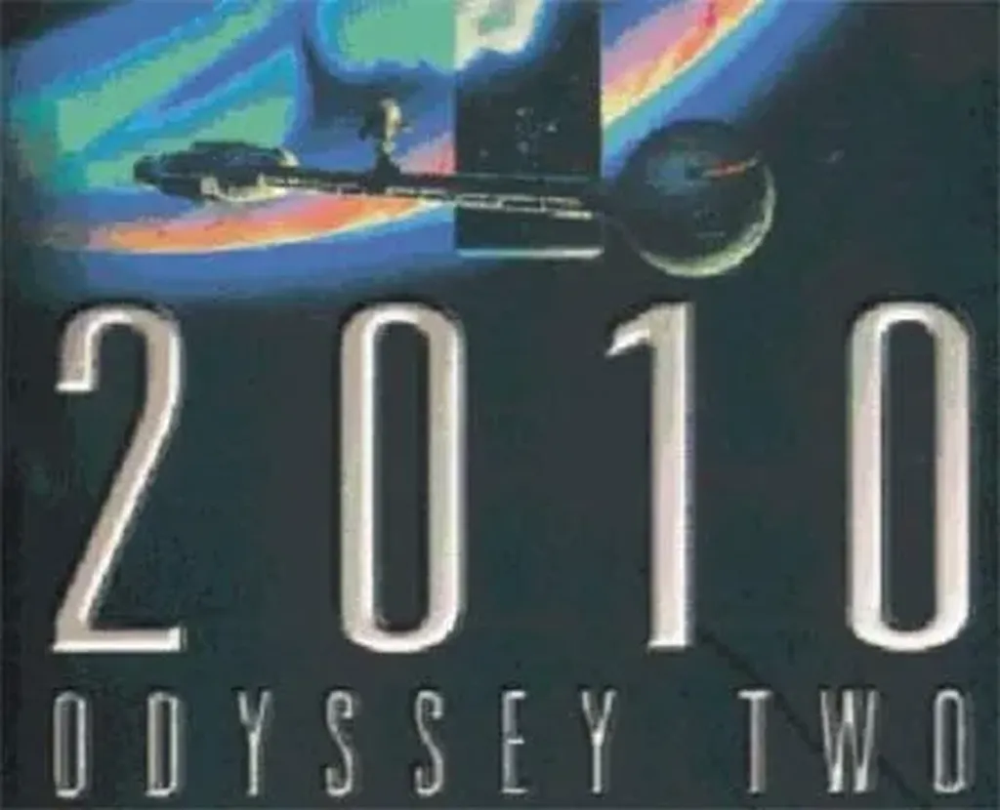

# L’État spolie les blogueurs, le remake

Commençons l’année en beauté. Lisez-vous les billets avant de les commenter ? Les lisez-vous avant de les retweeter ? Les lisez-vous jusqu’au bout ? Pensez-vous aux contradictions volontaires que l’auteur peut y introduire ? Aux dissonances comme en jouent parfois les musiciens ?

J’ai écrit [L’États spolie les blogueurs](../../2009/12/l%E2%80%99etat-spolie-les-blogueurs.md) juste pour déclencher une réaction mimétique. Juste pour effectuer une nouvelle expérience comme Narvic pourra en témoigner. Les réactions mécaniques qui s’ensuivirent, par leur prévisibilité, me désespèrent.

Parfois je me demande si le Web ne nous rend pas con. J’ai encore l’espoir qu’il nous aide à nous individuer, à nous dégager de la masse et que l’idée même de la masse se volatilise. Le Web est un outil puissant pour effectuer cette transition mais est-il capable d’aider beaucoup de gens comme je le prétends dans mon prochain livre ?

Quand je vois à quel point nous pouvons faire réagir à l’aide d’un titre déviant et de quelques provocations populistes, je suis pessimiste. Avant d’écrire mon billet, durant les jours précédents, ma timeline Twitter m’avait donné le bourdon.

« Mais êtes-vous vivants ? » C’était la question que je ne cessais de me poser. « Vous réagissez tous à la même chose, vous imitez les téléspectateurs de TF1, vous avez les mêmes rêves, pourquoi refaire tout cela ici ? » Je n’en tirais qu’une conclusion « Va ailleurs ! »

J’étais bien loin de contempler le peuple des connecteurs. De temps à autres, des François Bon mettaient un peu de lumière dans le brouhaha mais par ailleurs je ne contemplais que ragots médiatiques. Sommes-nous en train de construire un nouveau monde ou bel et bien de sombrer ?

Que je sois clair. Je me fiche pas mal de l’indépendance de la presse que je ne lis pas. Vouloir informer les gens frise la prétention extrême, souvent partagée par les hommes de gauches qui sont persuadés de savoir ce qui est bon pour le peuple dans lequel ils évitent de se ranger.

Je ne m’intéresse qu’à l’indépendance de l’homme, à commencer par la mienne. Alors quand certains ont cru lire dans mon billet que je réclamais quelque chose pour moi… Un mot, une nouvelle fois, s’est affiché dans mon esprit « superficialité », et on commente quelqu’un, sans même savoir ce qu’il pense, on réagit comme un chien de Pavlov… se croyant plus intelligent que celui auquel on s’adresse alors qu’il est préférable, toujours, de se croire plus bête.

Ce billet n’était qu’un piège. Vous auriez dû l’ignorer comme vous ignorez les billets qui pour moi ont beaucoup de sens et que nous ne sommes que trois ou quatre à discuter mais à vraiment discuter, parfois au risque de nous étriper, cherchant à vivre au-delà de notre point de confort.

Je me dis parfois autant ne plus bloguer et me contenter d’échanger des mails avec les gens qui me nourrissent et que je nourris peut-être. Publier un livre de temps en temps et voilà. Non. Je sais bien que l’ouverture de la conversation est fondamentale, bien plus fondamentale aujourd’hui que de publier des livres. Mais tant qu’il y a conversation. Alors bien sûr certains commentaires m’éclairent. Je n’aurais pas écris mon prochain livre sans vos commentaires et je vous en remercie… mais quand je vois les foules lyncheuses débarquer je prends peur.

Ici il peut y avoir de la vie, de l’intensité, je l’ai connue avec autant d’acuité qu’en me promenant en montagne ou qu’au cours de conversations endiablées. C’est possible mais en vérité tout aussi rare que hors d’ici. Alors à quoi bon ? Ce qui m’intéresse c’est aller au-delà. Le Web n’est-il pas en train de prendre une tournure qui nous amène en deçà ? Pas au-delà du désir mimétique comme je l’espère mais bien vers les foules lyncheuses ?

Nous disposons d’une arme de destruction massive. Si nous ne nous dominons pas, nous risquons de sombrer dans la barbarie. Certains autoritaristes pourraient retourner cette arme contre nous. L’indépendance se gagne et se défend à chaque seconde. Ici comme ailleurs. Bonne année tout de même.

#journalisme #netculture #dialogue #y2010 #2010-1-1-18h55
