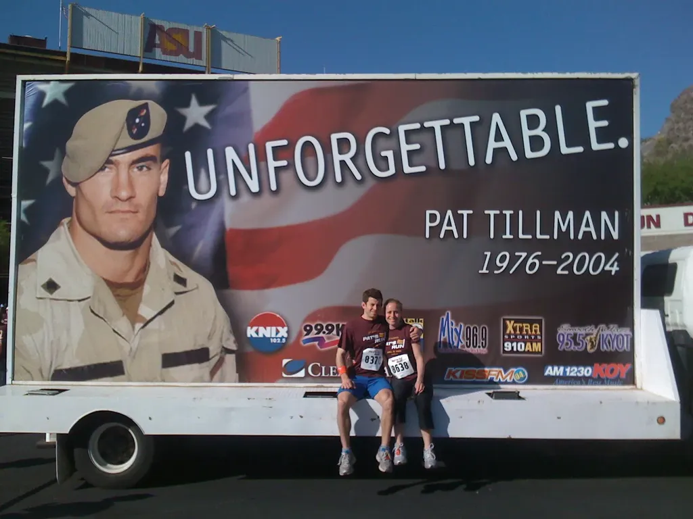

# La trilogie de Jon Krakauer

1996, *Into the Wild*. 1997, *Into thin air*. 2009, *Where men win glory*. Chaque fois Krakauer nous fait accompagner des hommes qui outrepassent leur zone de confort et finissent par succomber, non pas à cause de leur idéal mais d’un manque de chance ou d’une erreur malheureuse.

Chaque fois des hommes, sans doute pas pour rien. Les femmes ont-elles cette habitude de se tester au point de risquer leur vie ? Certaines sans aucun doute mais je crois que nous les hommes avons tous, à un moment ou à un autre, cette tentation de franchir la limite. En vélo, en moto, en voiture, en escaladant des montagnes, en nous lançant des défis parfois absurdes.

Krakauer réveille en moi le souvenir de ces moments où la vie aurait pu basculer. « Ça aurait pu être moi. » Je comprends pourquoi on peut gravir l’Everest ou partir seul dans le nord de l’Alaska. J’ai plus de mal à m’identifier à Pat Tillman, héros de *Where men win glory*, footballeur pro de la NFL qui renonce à un salaire de près de 4 millions de dollars pour s’engager dans l’armée pour chasser Bin Laden.

Mais Krakauer réussit une nouvelle fois à nous faire découvrir la vie d’un homme qui quitte le matérialisme pour expérimenter une autre vie. Il nous fait suivre sa transformation et partager l’espoir qui l’habite, en même temps que sa stupéfiante lucidité.

Tillman déteste Bush, sa politique, il comprend que la guerre en Irak n’est qu’un prétexte mais, après 9/11, il ne supporte pas les donneurs de leçons, notamment ses collègues footballeurs qui se vantent de ce qu’ils feraient en Afghanistan… Tillman, lui, décide de partir. Il ne discute pas, il agit. Il quitte le rêve américain pour un autre rêve, un rêve d’une certaine façon spirituel, un rêve d’expériences optimales.

Les trois livres de Krakauer démontrent que sans rêve notre société ne se transformera pas. Nous resterons des sédentaires consuméristes jusqu’à l’effondrement. Il n’existe qu’une possibilité : que chacun de nous effectue individuellement sa transition, une transition bien trop difficile pour qu’elle puisse être collective. Notre chemin ne vaut que pour nous.

Krakauer commence toujours par raconter l’accident désastreux. C’est un effet de mise en scène, une façon de débuter par le climax, mais aussi de bien montrer que sans l’accident, sans le manque de chance, ses héros seraient encore vivants et anonymes… mais resteraient néanmoins des héros comme les millions de gens qui ont comme eux décidé de changer de vie.

#critique #dialogue #y2010 #2010-1-17-21h59
