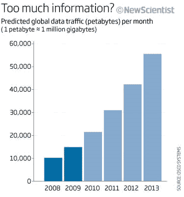

# Les journalistes nous gazent

Si je crois que le Flux imprègne notre société, je crois aussi qu’il n’est pas homogène. [Si comme je l’ai défini](densite-du-flux.md), il dépend du rapport entre le trafic d’information ramené au nombre de liens entre les informations, il existe des zones fluides et d’autres beaucoup moins fluides. Nous ne vivons pas toujours dans le Flux. La plupart d’entre-nous n’y ont même sans doute jamais mis les pieds (alors même qu’ils passent leur temps sur le net).

Les évolutionnistes comme Robin Dunbar pensent [que nous sommes câblés pour acquérir de nouvelles informations](http://www.newscientist.com/article/mg20527431.600-the-dangers-of-a-highinformation-diet.html). C’était initialement pour nous un moyen de survivre. Mais qu’advient-il quand nous croulons sous l’information ? Nous risquons de les consommer jusqu’à succomber d’information overload… parce que nous sommes persuadés que connaître procure un avantage.

[Danah Boyd](http://www.internetactu.net/2010/01/06/danah-boyd-ce-quimplique-de-vivre-dans-un-monde-de-flux/) attire l’attention vers ce danger, aussi le philosophe [Nick Bostrom](http://www.nickbostrom.com). Ils relèvent que ce n’est pas parce que nous disposons de plus d’information sur le monde, que nous nous y épanouissons et sommes plus intelligents ou plus créatifs.

Déjà Nicolas Taleb avait [dénoncé ce mythe du bien informé](../../2007/8/information-egale-desinformation.md) véhiculé par les médias. Bostrom va plus loin et parle d’[*information hazard*](http://www.nickbostrom.com/information-hazards.pdf), ayant peur que des données dangereuses pour l’humanité ne se propagent, la formule d’un virus par exemple.

Le trafic Internet, qui représente aujourd’hui l’essentiel du trafic d’information de l’humanité, ne cesse de grandir. Si en contre partie, nous ne créons pas en même temps les liens pour donner cohérence à ce corpus, nous risquons tout simplement de produire du bruit qui finira par étouffer les informations peut-être les plus intéressantes pour nous, qui ensevelira également les œuvres sous les ragots dont les médias, et même les blogueurs, se gargarisent pour se construire leur audience. Et même certaines informations potentiellement dangereuses circuleront sans garde-fou, c’est-à-dire sans l’attention de la communauté, attention qui me paraît de loin préférable à la censure qu’envisage Bostrom.

Sur mon [graphique des phases](densite-du-flux.md), l’accroissement du trafic sans des liens en contre partie nous emporte vers l’état gazeux, vers la dissolution, vers la superficialité… la quantité oui mais aussi l’anarchie. Il est alors intéressant de se positionner à titre individuel pour éviter le grand n’importe quoi.

Tenter d’évaluer le nombre d’information que nous ingurgitons par rapport au nombre de liens que nous établissons. Être dans le Flux, c’est être à l’équilibre. Ne pas s’enfermer dans un corpus et, à la fois, connecter tout ce qui nous traverse pour créer pour nous-même du sens. Sans ce travail, c’est la vie qui n’a plus aucun sens. Sens d’ailleurs que l’extérieur ne peut plus fournir à cause de la surenchère informationnelle. Nous devons impérativement nous construire notre sens.

Par le passé, la plupart des gens ne recevaient pas assez d’information de sources variées pour avoir une chance d’être dans le Flux. Ils étaient dans le solide. Ils consommaient des liens prémâchés. Aujourd’hui, nous risquons d’aller trop loin dans le gazeux, dans cette information sans lien, sans analyse, sans perspective. Nous devons apprendre à nous maintenir dans le liquide, dans cet état intermédiaire d’une certaine mesure favorable à la vie.

Je ne connais pas de recette miracle sinon le nomadisme. Je ne lis jamais systématiquement les médias. Je me contente de remonter les liens, ce qui mécaniquement interconnecte le corpus auquel je m’adresse. Je m’échappe parfois avec des requêtes sur les moteurs, mais souvent pas tout à fait au hasard puisque je suis en recherche. D’autre fois, c’est en suivant un lien produit par mon réseau social, encore une fois pas tout à fait au hasard. Et toujours je m’efforce de lier ce que j’apprends à ce que je sais déjà. J’évite de consommer de l’information pour me distraire, je préfère m’échapper avec les œuvres d’art. Une société qui confie de plus en plus son évasion à des informateurs connaît sans doute une profonde crise culturelle.

PS : Du coup, je me dis que Mythologie était par exemple beaucoup plus solide que je ne l’avais imaginé. Peu d’informations mais hyperlinkées. Et c’est nous qui risquerions la gazéification.

#netculture #coup_de_gueule #y2010 #2010-1-27-14h38
