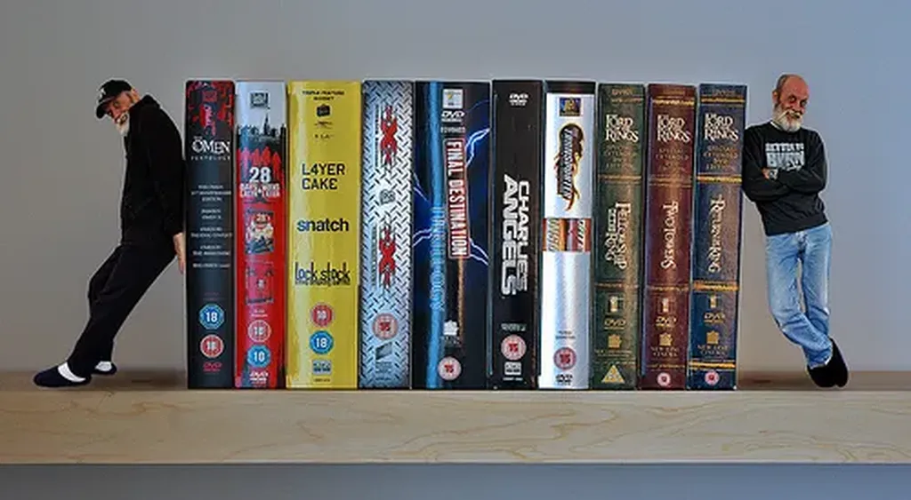

# Repenser le livre

« Ce livre n’est ni un essai, ni un traité d’expert, ni un document, ni un récit, ni un travail scientifique ou philosophique, ni une œuvre littéraire. Il se situe quelque part dans le flux mouvant qui interconnecte ces domaines, floutant les frontières qui jadis les séparaient. »

Je vais ajouter ce petit texte en préambule de *[L’alternative nomade](../../books/alternative-nomade.md)*, suivant le conseil de [Pierre Fraser](http://theoriedestendances.com/) qui vient de faire une lecture stimulante de mon livre et qui ne manquera pas d’avoir des répercutions sur le texte final. Cette idée d’un texte final a-t-elle d’ailleurs encore un sens ? Aujourd’hui, un livre ne doit-il pas ressembler à un logiciel et évoluer sans cesse, ne serait-ce que par les commentaires que déposent autour les lecteurs ?

Peut-être que tous les livres dorénavant devraient porter la même mise en garde. En tous cas, je me sens incapable de me glisser dans un costume taillé pour d’autres (l’essai, le roman, le document…).

En remerciant Pierre par mail, je me suis senti obligé de préciser ma démarche qui, si elle est mal comprise, peut orienter le lecteur dans une mauvaise direction. Il est peut-être bon que je la rappelle. 

Mon genre, si je devais en définir un, c’est le manifeste initiatique. Je m’intéresse avant tout à ce qui peut faire grandir l’homme, et pour commencer me faire grandir moi. Comme les philosophes grecs, j’ai commencé par vivre des [expériences optimales](experience-optimale.md) et c’est pour cette raison que j’écris, pour traquer ces moments, chercher à les revivre et pourquoi pas à les provoquer chez mes lecteurs.

Est-ce une ambition démesurée ? Il me semble que les artistes n’ont d’autre objectif et je me sens plus artiste que scientifique, ou que professeur ou que politologue. Décrire la réalité m’intéresse peu. Je veux la transformer. Pour moi, la société est malléable.

J’ai des intuitions, je les expose sur le blog, je cherche alors à tracer de plus en plus de liens pour provoquer une espèce d’explosion mentale, un hapax existentiel comme en parle Onfray. Pour moi, un livre, c’est un endroit où les idées se carambolent pour éventuellement produire le même effet dans la tête du lecteur.

Cela me paraît d’autant plus vrai aujourd’hui. Le livre devient un petit bout d’un ensemble plus vaste. Mon blog, c’est l’endroit où je creuse et discute les pistes ouvertes dans mes livres. Je suis incapable de concevoir un livre qui tiendrait seul, cela me paraît de plus en plus inimaginable.

Tout ce que j’ai écrit dans le blog, souvent je ne le répète pas. Et ce que je ne dis pas dans le livre, c’est qu’il faudra le développer dans le blog. L’incomplétude ne me gêne pas.

Quand j’écris, je ne cherche pas à me ranger dans une case mais hors de toutes les cases que je peux identifier. Je ne pense pas avoir une expertise et, si j’en ai une, je la récuse. Ce qui m’intéresse c’est de faire sauter les frontières pour entrer dans le Flux.

#cuisine #dialogue #y2010 #2010-1-12-22h20
