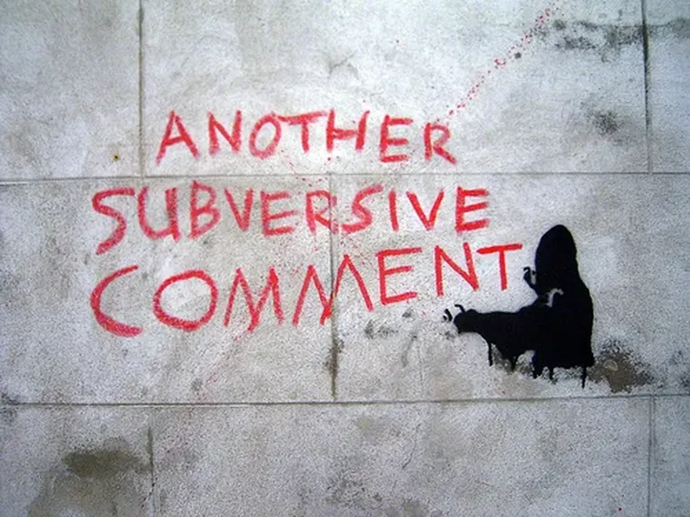

# Faut-il un statut pour les commentateurs ?

Notre activité en ligne est un puissant facteur de décentralisation. Quand nous écrivons un peu partout, nous multiplions les sources de textes et nous noyons les sources jadis considérées officielles (journaux, livres, revues scientifiques…).

Cette décentralisation, ce passage d’un monde discontinu, un monde avec quelques centres, à un monde totalement décentré, nous amène vers une société de flux, une société beaucoup plus continue que par le passé.

Tous les statuts anciens volent alors en éclat à cause de l’absence de frontière. Pourquoi questionnons-nous souvent le statut des journalistes ? Tout simplement parce que le monde des médias est le premier à subir l’émergence du Flux. Il n’a pas essuyé un tsunami mais reçoit un déluge permanent. Le même phénomène frappera tous les autres domaines, ce n’est qu’une question de temps.

Les statuts explosent non pas en attendant que nous en créions d’autres mais parce que la notion de statut n’a plus aucun sens dans le Flux, un monde où nous sommes de plus en plus divers, de plus en plus uns et irréductibles. À quoi bon un statut qui ne vaut que pour une personne ?

Dans notre monde décentralisé, chercher à statufier, les blogueurs par exemple, serait vouloir ramener ce monde à un état centralisé, un monde que nous connaissons bien car c’est le monde moderne que nous avons hérité de la révolution industrielle.

Nous devons au contraire apprendre à vivre la décentralisation extrême, apprendre à considérer les personnes avec qui nous interagissons pour ce quelles sont et non plus ce qu’elles représentent. Nous devons nous intéresser aux contenus propulsés et non pas à leur système de propulsion.

Je propulse avec WordPress. D’autres propulsent dans les pages du *Monde*. Ça ne fait aucune différence. Ce qui m’intéresse c’est le propulseur. Vous avouerez qu’on l’oublie souvent quand il utilise *Le Monde*. On suppose trop hâtivement que sa fusée est plus importante que lui. Que son entreprise le dépasse. Cela je n’en veux plus, cela c’est le monde industriel qui nie l’individu, qui l’assimile à un statut.

Quand je rencontre quelqu’un, je déteste qu’il me demande ce que je fais dans la vie. J’entends : « Dans quelle case tu te ranges ? » Je réponds souvent un truc du genre : « Je profite. » ou « Je vis. »

Pour moi, le propulseur est autant l’auteur d’un contenu que celui qui en parle, avec retweet par exemple, qu’un commentateur. C’est un concept suffisamment large pour qu’il englobe tous ceux qui poussent des bits dans le Flux, pour que ce concept de propulseur échappe à toute tentative de saucissonnage.

Par exemple, je ne crois qu’il ne faut différencier les producteurs d’information des propulseurs. On ne produit qu’en réaction à des évènements survenus dans notre vie. J’écris ce billet en réaction à vos commentaires, aux commentaires de Narvic et d’autres un peu partout. Je ne suis pas un producteur, je suis comme vous un propulseur, j’insuffle la vie dans le Flux.

Titre du prochain billet : Faut-il un statut pour pouvoir discuter dans les cafés ? Notez que ce billet n’est qu’un commentaire du [précédent](statut-blogueurs.md), lui même du précédent. Créer des statuts peut entraîner une mise en abyme vertigineuse.

#netculture #dialogue #y2010 #2010-1-3-15h16
