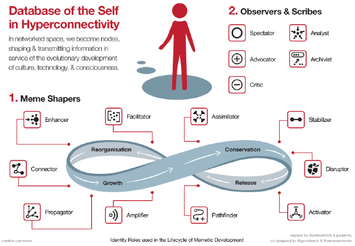

# Le 2.0 sans réciprocité, c’est l’hyper-capitalisme

Depuis une semaine, *[La tune dans le caniveau](../../page/tune-caniveau)* est officiellement disponible. Hubert Guillaud m’a signalé que [Cory Doctorow](http://www.npr.org/blogs/alltechconsidered/2010/10/25/130811846/doctorow) tentait lui aussi son [expérience inédite](http://blog.tcrouzet.com/tune-caniveau/#expi).

Il annonce qu’il gagnera de cette manière 80 000 dollars et qu’il a déjà gagné 10 000 dollars en vendant un tirage de tête à ses fans. Pour ma part, je partagerai les revenus, qui seront infiniment plus faibles, avec tous les membres de l’équipe éditoriale. Dans un mail, Cory m’a dit qu’il fonctionnait sur l’échange réciproque :

> Many of the participants in my project did it gratis, as part of a normal exchange of favors among friends, but a couple of the artists asked for points off the gross, and I’ve offered the sound mixer the same for the audiobooks.

Ce n’est que dans ces conditions que nous pouvons parler d’[interdépendance libératrice](../5/la-liberte-le-lien.md) et nous éloigner du 2.0 : « Tu m’aides en échange de la gloire, moi j’encaisse. » J’applaudis le 2.0 quand il s’accompagne de réciprocité, en revanche je le crois dangereux quand un seul en est réellement bénéficiaire (l’opérateur du service par exemple). Cela nous plonge plus que jamais dans la logique capitaliste et même nous ramène à une forme d’esclavage, c’est-à-dire d’un travail non rémunéré.

Quand nous avons lancé l’expérience inédite en septembre, c’était dans l’idée d’un partage. Nous avons donné notre temps, en échange nous partageons les revenus. Notre but : montrer qu’il est aujourd’hui possible d’éditer un texte de manière professionnelle sans recourir au capital, c’est-à-dire à une mise de fonds.

Où en sommes-nous ? Au rythme où on est parti, nous ne ferons pas fortune avec *La tune dans le caniveau*. Après une semaine de mise en ligne, nous en sommes sur mon blog à 102 téléchargements gratuits et 14 ventes directes. [Numériklivres](http://www.numeriklivres.com/Classique/Librairie___La_tune_dans_le_caniveau.html) et [la-coop.com](http://www.la-coop.org/index.php?mact=ShopMadeSimple,cntnt01,fe_product_detail,0&cntnt01product_id=12&cntnt01returnid=92) ont vendu respectivement une dizaine d’ebooks et de livres papiers. Au total, nous ferons côté ebooks aussi bien sans doute qu’un éditeur comme [Le Bélial](../9/renverser-economie-du-livre.md), mais il n’y a pas de quoi en tirer la moindre gloire.

L’expérience inédite ne peut fonctionner que si nous assistons à un réel mouvement de propulsion croisée. À ce jour, j’ai relevé 8 articles au sujet de l’expérience. C’est trop peu pour créer le moindre petit succès d’estime. La page de présentation de la nouvelle avec le formulaire de téléchargement n’a été vue que par 1 600 personnes. Avec un total de 116 téléchargements et ventes, cela nous donne un taux de conversion de 7 %, ce qui est plus qu’honorable. Il manque donc plus de visiteurs à la source. Sans recourir au capital, la seule solution pour accroître ce nombre c’est que plus de blogueurs chroniquent l’expérience (et je ne leur demande pas d’en dire du bien).

Vous verrez ce qui se produira avec Cory. Tout le monde en parlera, même en France où le texte ne sera pas traduit. Nous restons en fait prisonniers de la logique pyramidale. Le jour où Alexandre Jardin tentera son expérience inédite, il aura le support de tous les médias, et même des blogueurs qui d’ores et déjà sont au courant de mon expérience inédite.

Pourquoi ? Je pense qu’en parlant d’une célébrité on se sent valorisé. On s’illusionne de partager sa gloire et de recevoir en retour son respect (c’est à ce niveau que doit se produire une forme de réciprocité). Comme je ne suis rien que moi-même, un hurluberlu qui a choisi la liberté dans l’interdépendance, la plupart m’ignorent, faute d’un gain dans l’ancien monde.

Sur ce schéma qui résume la logique de la propulsion, nous découvrons tous les ingrédients nécessaire à la prise de la mayonnaise. Je suis à la fois un *disruptor* et un *activator*. Seul, je ne peux boucler cette boucle. Personne ne le peut. Nous avons tous besoin de relais, chacun avec ses qualités propres. Je suis bien obligé de constater que pour le moment la plupart manquent pour mener à son terme l’expérience inédite et d’une manière plus générale tous les projets éditoriaux des pure players du Web. Nous allons poursuivre notre effort, tenter d’emboîter patiemment toutes les pièces du puzzle.

J’espère tout au moins que les autres expérimentateurs se reconnaîtront dans notre expérience et que nous réussirons à nous interconnecter, comme [j’en ai fait l’appel pour tous les auteurs et tous les éditeurs](comment-inventer-un-datamining-plus-humain.md). Nous sommes en train d’essayer de construire une alternative, nous ne pouvons pas toujours nous lamenter sur sa lenteur et la résistance des indécrottables conservateurs.

Le plus terrible c’est que les plus fiers combattants du changement n’aspirent souvent qu’à une position dans l’ancienne société de classe. J’ai l’impression que, dans l’esprit de tous, il faut gagner la renommée dans cette société pour la transposer dans la nouvelle. Si tel est le cas, c’est tout simplement qu’il n’existe pas de nouveau monde, sinon dans l’imagination de quelques utopistes dont je suis. Alors ce monde nous pouvons le construire autour de nous, nous pouvons vivre le plus souvent suivant sa logique, mais de temps en temps nous sommes obligés de revenir vers l’ancien pour faire bouillir la marmite.

Un constat : pour que d’autres aient envie d’expérimenter un nouveau mode d’édition, il faut démontrer sa viabilité économique. Doctorow y réussira. Jardin aussi, je vous l’annonce en avant-première. Il serait bien qu’une petite équipe sur le Web, la nôtre ou une autre peu importe, puisse aussi connaître un petit succès. Faire aussi bien qu’un éditeur de genre comme Le Bélial ne me paraît pas suffisant. Il faut montrer qu’un projet éditorial peut être viable dans le nouvel écosystème, sans s’appuyer sur l’ancien. Faut-il encore que ce nouvel écosystème ait réellement envie d’exister. Parfois j’en doute.

Nous assistons à une forme de crispation qui me rend un peu amer. Plus personne ne s’engage la fleur au fusil. Tout le monde pleurniche mais peu tentent des choses. C’est sans doute une crise passagère. Peut-être est-ce que je la fantasme pour éviter d’admettre ma médiocrité. Vous pouvez vous interroger.

Avec l’expérience inédite, loin de l’ambition de Cory, on espérait se payer un bon repas. Au rythme actuel, on ne se paiera qu’un verre. Dans ces conditions, je vais être obligé, tout en poursuivant les expérimentations, de refaire un pas vers l’ancien monde et d’écrire à nouveau un livre grand-public suivant l’ancienne logique. Si personne ne joue le jeu de la promotion croisée, je ne vois pas quel autre recours j’ai. Soit pleurnicher, soit faire comme les autres, tenter de prouver que je sais encore faire comme eux. Je ne baisse pas les armes, je vais utiliser les seules qui marchent puisque celles qui pourraient marcher ne marchent pas faute de combattants.

#expi #edition #dialogue #y2010 #2010-10-31-15h7
