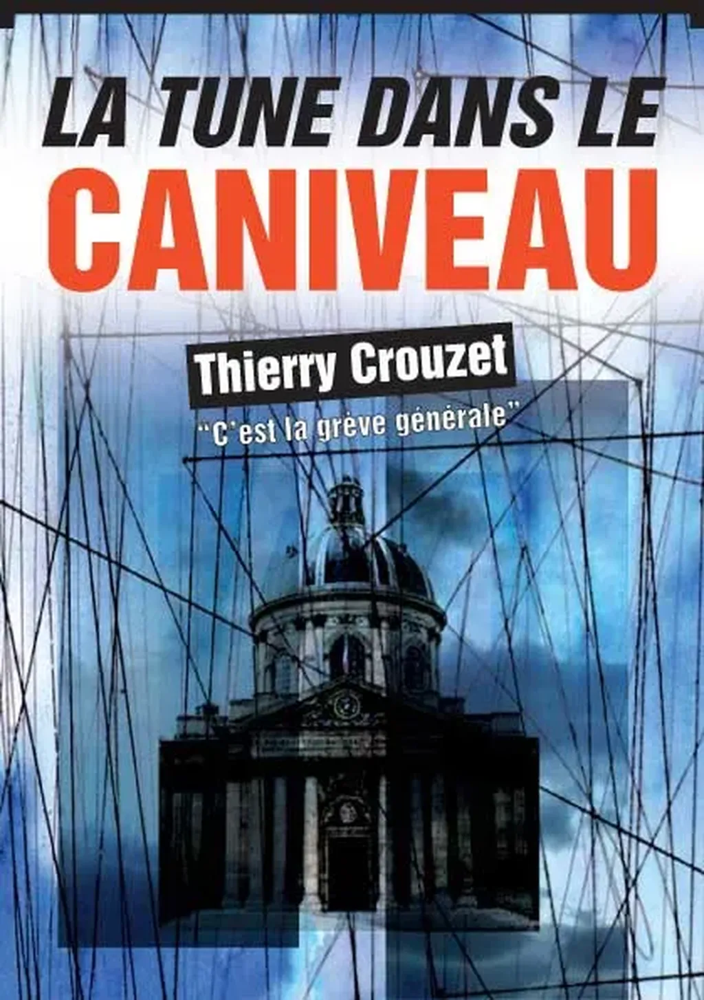

# Une envie de plumer les riches ?

Vous avez aimé la saga de l’été Bettencourt-Barnier ? Vous avez rêvé devant Dallas ? Vous êtes prêt pour la retraite à 75 ans ? Alors vous allez adorer faire la chasse aux riches en lisant *[La tune dans le caniveau](../../page/tune-caniveau)*, le dernier opus numérique de Thierry Crouzet. Dixit [Jean-François Gaillard](http://www.facebook.com/numeriklivres) sur Facebook pour annoncer la sortie du texte (maintenant disponible en papier et en ebook). Il ne vous reste plus qu’à le télécharger gratuitement ou, mieux, à l’acheter.

Suivant le principe du [prix d’auteur unique](veritables-prix-edition.md), si vous achetez le texte, quel que soit le canal de distribution, quel que soit le format, électronique ou papier, [l’équipe éditoriale](http://blog.tcrouzet.com/tune-caniveau/#expi) recevra 1,50 € HT.

Maintenant que le texte est disponible, [notre aventure éditoriale](#expi) entre dans sa phase promotion. J’espère que les blogueurs et autres chroniqueurs s’empareront du texte. Pour les motiver, [Bookeen](http://www.bookeen.com/fr/) leur propose de gagner sa toute nouvelle liseuse [Cybook Orizon](http://www.bookeen.com/fr/cybook/?id=2) ([reportez-vous au règlement du concours](../../page/tune-caniveau/concours)).

Vous êtes encore là ? Vous devriez déjà être en train de lire *[La tune dans le caniveau](../../page/tune-caniveau)*.

#ebook #expi #edition #noepub #dialogue #y2010 #2010-10-21-20h6
