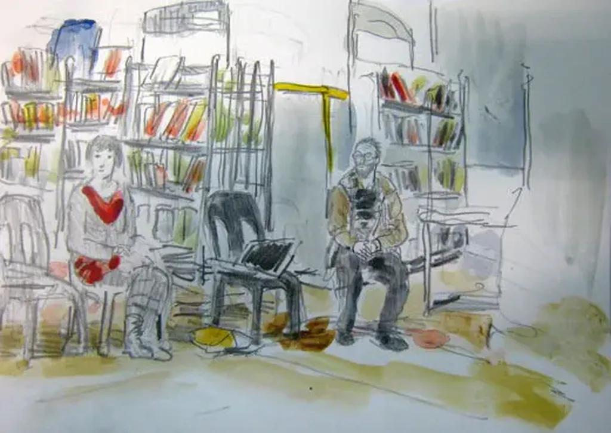

# Crouzet lu et croqué à Espezel

À l’invitation de [Nicolas Ancion](http://www.nicolasancion.com/) et à l’initiative de la bibliothèque départementale de l’Aude, j’étais hier soir dans la petite commune d’Espezel sur les hauteurs de l’Aude au-dessus de Quillan. Pendant que je discutais avec Nicolas ou que Valérie Schlée lisait quelques extraits de mes textes, [Didier Millotte](http://dimillotteblog.blogspot.com/) nous a croqués.
*[La tune dans le caniveau](../../page/tune-caniveau)* par Valérie (enregistrée à l’arrache)

[audio:2010latune\_valerie.mp3]

*[Croisade](../../page/la-quatrieme-theorie)* (version initiale de *La quatrième théorie*) 
[audio:2010croisade\_valerie.mp3]

*[J’ai eu l’idée](../../page/id)*

[audio:id\_valerie.mp3]

#buzz #y2010 #2010-11-5-15h3
