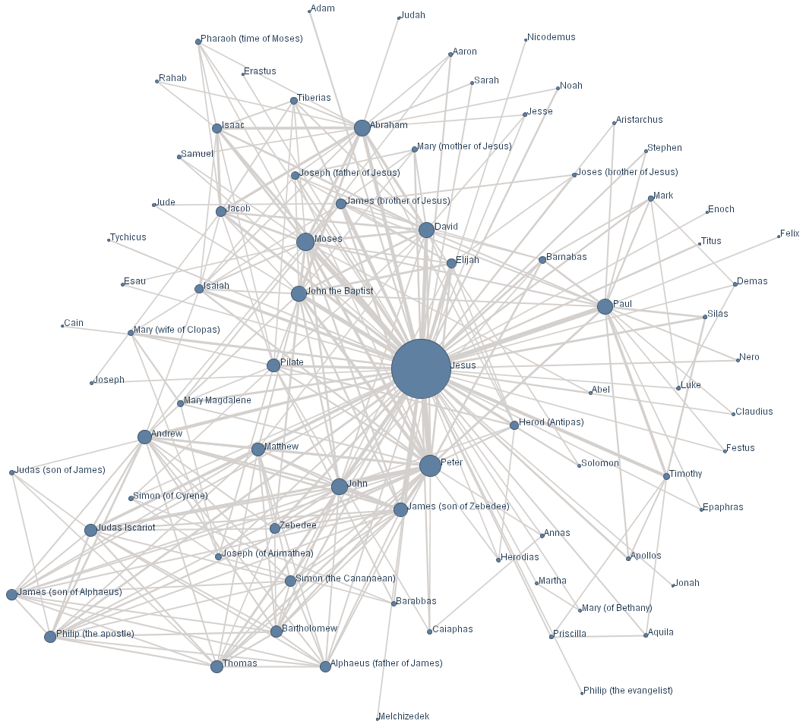

# La carte et le réseau social

Ce n’est pas tous les jours que nous découvrons une nouvelle carte. Au IIIe siècle avant Jésus-Christ en Alexandrie, [Ératosthène](#eratosthene) dessina le premier planisphère. Cette innovation ne fut digérée que 1800 ans plus tard par [Christophe Colomb](../../2009/6/l%E2%80%99erreur-de-christophe-colomb.md). Depuis quelques années, nous avons découvert un autre type de carte : le graphe social. Quand est-ce qu’il révolutionnera le monde ?

C’est à ma connaissance l’écrivain hongrois [Frigyes Karinthy](http://fr.wikipedia.org/wiki/Frigyes_Karinthy) qui le premier supposa que nous étions tous connectés les uns avec les autres par l’intermédiaire des amis de nos amis. En 1929, dans la nouvelle *Láncszemek* (« Chaînes ») publiée dans le recueil *Minden másképpen van*, il imagina que plutôt que de recevoir des informations venant d’en haut (gouvernement, journaux, patron…), nous étions capables de communiquer transversalement les uns avec les autres. 

Cette idée resta d’ordre poétique jusqu’à ce que le sociologue Stanley Milgram se demande combien d’intermédiaires séparaient effectivement deux personnes choisies au hasard. À cette époque, en 1967, Milgram était déjà célèbre pour [la fameuse expérience qui porte son nom](http://fr.wikipedia.org/wiki/Exp%C3%A9rience_de_Milgram). Il avait voulu savoir jusqu’à quel point nous pouvons faire souffrir nos semblables. Les résultats, même s’ils furent contestés, n’étaient pas encourageants : nous avions presque tous tendance à devenir des monstres.

Mais en 1967, Milgram avait une toute autre idée. Il proposa à des habitants du Nebraska et du Kansas d’envoyer une lettre à un Bostonien dont ils n’avaient jamais entendu parler. Quand il demandait à ses amis par combien d’intermédiaires devraient passer les lettres, ils estimaient qu’il en faudrait au moins une centaine.

À la grande surprise de Milgram, les lettres parvinrent à leur destinataire en passant par six intermédiaires en moyenne. La légende des six degrés de séparation était née : nous ne sommes pas socialement très éloignés les uns des autres. Je connais un employé de Microsoft qui connaît Bill Gates qui à son tour connaît de nombreuses sommités mondiales. Je me trouve donc à trois degrés d’elles ! Je ne sais pas si je dois m’en féliciter, mais tel est le cas. L’humanité forme un petit monde où nous nous connaissons indirectement presque tous.

Comme l’intuition de Frigyes Karinthy, l’expérimentation de Milgram n’eut pas de conséquence immédiate. Afin de cartographier le graphe social, il fallait tracer des liens entre chacun d’entre nous et chacune de nos connaissances. Même pour une communauté assez réduite, cette tâche paraissait irréalisable jusqu’à ce que deux étudiants de l’université de Virginie s’amusent à créer [oracleofbacon.org](http://oracleofbacon.org/).

Grâce à ce site ouvert en 1996, il est possible de connaître le degré de séparation entre deux acteurs de cinéma. Si vous saisissez les noms de deux acteurs aux registres aussi opposés que Jean Reno et Jean-Pierre Léaud, vous apprenez qu’ils sont néanmoins séparés par seulement deux degrés. En 1990, Jean Reno joua dans *Nikita* avec Jean-Claude Bolle-Reddat qui, en 2004, joua dans *Folle embellie* avec Jean-Pierre Léaud.

Après l’analyse de 800 000 filmographies, le degré moyen de séparation des acteurs apparaît voisin de trois. Si certains acteurs peu connectés n’ont joué que dans un film, d’autres, au contraire, apparaissent comme des hubs. En reliant tous les acteurs par les liens que forment les films dans lesquels ils ont joué, on obtient une carte du monde cinématographique qui ressemble à s’y méprendre à celle d’Internet ou d’un cerveau.

C’est alors qu’une autre idée surgit : si non content de tracer la carte du graphe social de l’humanité, on se donnait le pouvoir de la transformer en ajoutant des connexions et en réduisant les degrés de séparations qui nous séparent ! Je crois que c’est Geneviève Morand qui crée le premier réseau social sur Internet, [rezonance.ch](http://www.rezonance.ch/), en 1998. Mak Zuckerberg ne commence à travailler sur facebook qu’en 2004, année de l’ouverture d’[Orkut](http://www.orkut.com).

> La géographie tout entière est orientée vers la pratique du gouvernement, écrit [Strabon](http://fr.wikipedia.org/wiki/Strabon) au début de notre ère. Il serait plus facile de contrôler un pays si l’on connaissait ses dimensions, sa situation relative, les particularités originales de son climat et de sa nature.

Voilà où nous en sommes avec les réseaux sociaux. Ceux qui en détiennent les clés sont plus puissants que les hommes d’État, car ils possèdent la carte de l’humanité. Chaque fois que nous allons sur les réseaux sociaux pour interagir, nous renforçons leur pouvoir. D’un autre côté, nous complexifions sans cesse la carte. En étendant le territoire, nous le rendons de plus en plus impénétrable, donc rendons toute prise de pouvoir sur cette humanité de plus en plus difficile.

Il faut peser le pour et le contre, éviter de s’enflammer, éviter de jouer au mauvais augure. Le plus important est de prendre conscience de l’existence de la carte et de ce territoire qui se remodèle sans cesse, ce qui nous place plus que jamais en acteur de la réalité sociale.

La carte géographique est figée. Quand nous déménageons, nous ne changeons pas le territoire. Tout au plus pouvons-nous construire une maison et cultiver notre jardin. Seul l’État a quelques pouvoirs sur la géographie d’ensemble, en traçant des routes par exemple. Il sait aussi où vous habitez, où il doit vous envoyer vos feuilles d’impôts, aussi la police si nécessaire. Pour lui, maîtriser la carte, c’est maîtriser la population.

Sur un réseau social, en nous enregistrant, nous créons un nouveau point social, ce n’est guère différent que de construire une maison. En revanche, quand nous nous lions à quelqu’un, nous créons entre lui et nous un chemin. Plus de gens suivront ce chemin plus il s’élargira.

Nous avons le pouvoir de transformer la géographie sociale. Nous pouvons couper des routes, les boycotter. Nous pouvons même utiliser plusieurs identités, démultiplier la densité sociale en y accentuant notre présence.

Quand je me suis lié avec [Stéphane Laborde](http://www.creationmonetaire.info/), j’ai non seulement intégré ses idées sur le [dividende universel](#dividende-universel), j’ai aussi ouvert une voie entre les gens qui le lisent et ceux qui me lisent. À travers les liens, nous nous fécondons bien au-delà de nous-même. Le lien une fois tracé est ouvert à tous ceux qui sont liés avec nous.

L’existence objective du territoire social et de sa carte engendre du positif comme du négatif. Cette possibilité pour les idées de circuler de mieux en mieux implique une nouvelle armée de [community managers](../9/les-community-managers-sont-des-putes.md) qui tentent de diriger les flux pour en faire bénéficier quelques acteurs en particulier. Il ne faut pas être dupe. D’un autre côté, c’est la première fois que nous détenons entre nos mains autant de puissance. C’est la première fois que chacun de nous à titre individuel peut directement façonner le territoire à grande échelle.

> Cette carte était sublime : bouleversé, il se mit à trembler devant le présentoir, écrit Houellebecq dans *La carte et le territoire*. Jamais il n’avait contemplé d’objet aussi magnifique, aussi riche d’émotion et de sens que cette carte Michelin au 1/150 000 de la Creuse, Haute-Vienne. L’essence de la modernité, de l’appréhension scientifique et technique du monde, s’y trouvait mêlée avec l’essence de la vie animale.

Je fais mon coming out. J’ai toujours aimé les textes de Houellebecq mais là tu te plantes Michel, même si je note l’ironie. Déjà en parlant d’essence, ce qui est plutôt choquant sous ta plume, surtout en voyant dans la carte le symbole de la modernité. De quelle modernité ? Celle d’Ératosthène peut-être, voire de Christophe Colomb, mais pas la notre. La carte sublime qui devrait aujourd’hui nous bouleverser est celle du graphe social, une carte vivante, en continuelle transformation, qui elle-même est devenue animale.

*PS : J’ai écrit ce texte en me servant d’extraits du *[Peuple des connecteurs](../../page/le-peuple-des-connecteurs)* pour préparer [ma présentation avant la diffusion de *The Social Network*](the-social-network-a-meze.md)*

#netculture #dialogue #y2010 #2010-11-24-13h55
