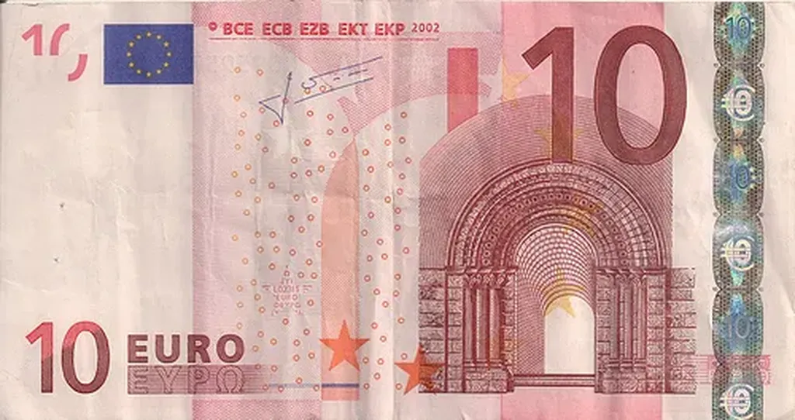

# La fin des faux-monnayeurs

Lors de la conférence sur le dividende universelle à Genève le 9 novembre, je ne sais pas si j’ai été convainquant, mais j’ai clairement désigné l’ennemi : les banquiers. Avant moi, Samuel Bendahan et [Stéphane Laborde](http://www.creationmonetaire.info/2010/11/video-de-la-conference-avec-richard.html) avaient été plus pédagogiques. Après moi, Stallman a déroulé son show bien huilé.
  

  

  

 

#conf #dividende_universel #noepub #revenu_de_base #dialogue #y2010 #2010-11-22-13h37
