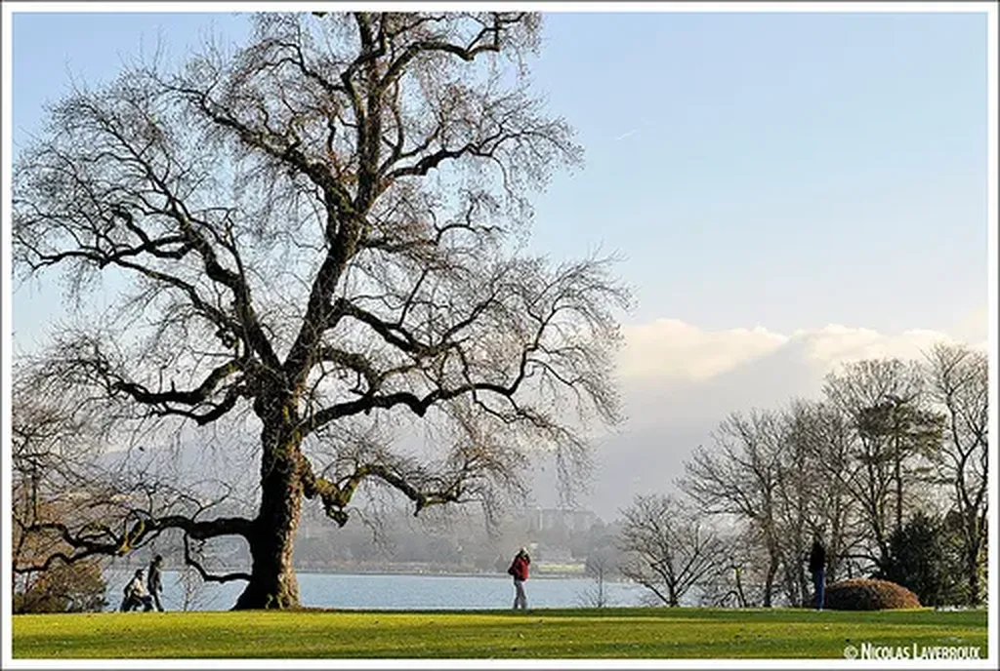

# Les dangers de l’hyperlocal

Dans *[L’alternative nomade](../../books/alternative-nomade.md)*, je prône la complexité volontaire par l’intermédiaire de la connexion entre les individus. Je défends qu’en créant en toute simplicité plus de liens, nous accroissons la complexité du système, ce qui mène à plus de liberté, d’intelligence collective et aussi à une transition vers un mode de vie plus culturel, donc moins dépendant des ressources matérielles.
Je critique les Khmers verts parce qu’ils prônent l’autonomie en de nombreux domaines, notamment alimentaire, ce qui revient à couper des liens, donc à simplifier le système, donc à réduire nos libertés et à nous faire courir le risque d’un retour à la dictature.

Avant de revenir sur ce point, il me paraît important de préciser des notions comme « simple », « compliqué » ou « complexe ». Une pyramide est une structure simple. On peut la schématiser sans difficulté – les organigrammes –, ou même la décrire avec quelques mots.

En revanche, la circulation de l’information y est compliquée (et onéreuse), puisqu’elle doit passer par des checkpoints obligatoires. De même, la construction de la pyramide est compliquée. Il faut faire entrer des gens aux différents niveaux, gens qui luttent alors pour gagner des places et des privilèges. Il suffit de relire Kafka pour avoir une idée de ce que compliqué signifie.

Un réseau social distribué avec un grand nombre de nœuds et d’interconnexions est une structure complexe. On ne peut le représenter qu’avec des logiciels de modélisation et sa description dans nos langages ordinaires est impossible, sinon de manière métaphorique.

Par ailleurs, un réseau social complexe présente une invariance d’échelle : si on prend une partie du réseau, on retrouve la même structure que si on regarde l’ensemble. C’est notamment de cette façon qu’on repère si un système est complexe ou non.

Le réseau social bien que complexe n’est pas compliqué à construire. Il suffit que quelqu’un se lie à quelqu’un d’autre sans ne rien demander à personne. Le réseau se bâtit selon un processus de pair à pair : la connexion.

C’est une caractéristique des structures complexes de reposer sur des mécanismes internes simples. Sans cette simplicité, il ne peut se produire de déploiement à vaste échelle. De même, ce n’est que dans ces conditions que l’émergence de structures inattendues est possible.

Une analogie végétale aide à mieux comprendre la différence entre simple, compliqué et complexe. Un chêne avec ses ramures est complexe. Il développe une architecture fractale foisonnante, mais ce foisonnement se construit de lui-même simplement.

Un arbre taillé en boule a une forme simple mais maintenir cette simplicité exige un effort constant des jardiniers, et donc des complications.

Une structure humaine pyramidale peut être comparée à un arbre taillé en boule. Bien que simple, il faut la cajoler et l’entourer de soins incessants pour qu’elle maintienne sa simplicité. En revanche, une structure en réseau se déploie d’elle-même en toute simplicité tout en réussissant à tendre vers la complexité qui laisse la possibilité au surgissement de phénomènes émergeants.

Un écologiste devrait donc toujours favoriser les structures qui simplifient les échanges à celles qui les compliquent, c’est-à-dire favoriser les réseaux complexes au profit des pyramides simplistes et dispendieuses.

C’est ce qu’ils font quand ils militent pour la production locale, avec un gain évident dans les transports. Ils coupent des liens longue distance et les intermédiaires pour établir des liens courte distance. C’est ce que je fais en achetant un panier bio chaque semaine.

Je ne suis donc pas pour le tout et n’importe quoi dans l’agriculture. Je ne trouve pas normal que des produits fassent trois fois le tour du monde avant d’arriver dans notre assiette. Tout cela est compliqué et en aucun cas complexe. Je crois en revanche que couper systématiquement les liens longue distance est dangereux, parce que derrière chaque lien commercial il y a des liens sociaux qui contribuent à complexification globale de l’humanité.

Un lien longue distance peut-être compliqué, c’est sûr, mais il peut aussi être simple et source de complexité, notamment quand il s’agit de mettre des gens en relation.

Nous devons certes favoriser la production locale de ce qui peut-être produit localement sans pour autant renoncer à ce qui ne peut qu’être produit ailleurs. Je ne vois pas, par exemple, pourquoi je ne mangerais pas des bananes.

Sébastien Kopp, un des deux fondateur de [Veja](http://www.veja.fr/), m’a expliqué que lorsqu’ils fabriquent leurs tennis bios et éthiques, ce qui coûte le plus cher en externalités négatives, c’est le transport en camion entre le port du Havre et Paris (du coup ils passent maintenant par des barges). Le transport en bateau depuis le Brésil étant alors négligeable (mais il faudra le remplacer par des tankers à voile).

Il faut donc chercher à réduire les externalités sans a priori couper tous les liens longues distances, surtout quand nous sommes capables de réduire les externalités. On peut d’un côté simplifier les circuits de distribution, les optimiser, sans de but en blanc couper les liens. Et si on le fait, à cause d’un coût énergétique trop grand par exemple, il faut immédiatement compenser par des liens sociaux autres que commerciaux.

Il faut toujours tisser le réseau pour éviter que les pyramides dispendieuses et autoritaires ne ressurgissent. Au nom de l’hyperlocal, il faut prendre garde de ne pas favoriser la complication de proximité en oubliant la complexité du système global.

PS : J’ai écrit ce billet suite à un [commentaire de Phyrezo](vacances-au-calvi-des-khmers-verts/#comment-85110.md). Je signale au passage que je me suis désintéressé de l’idée de superorganisme depuis qu’elle m’est apparue inféconde.

#netculture #dialogue #y2010 #2010-11-10-15h30
