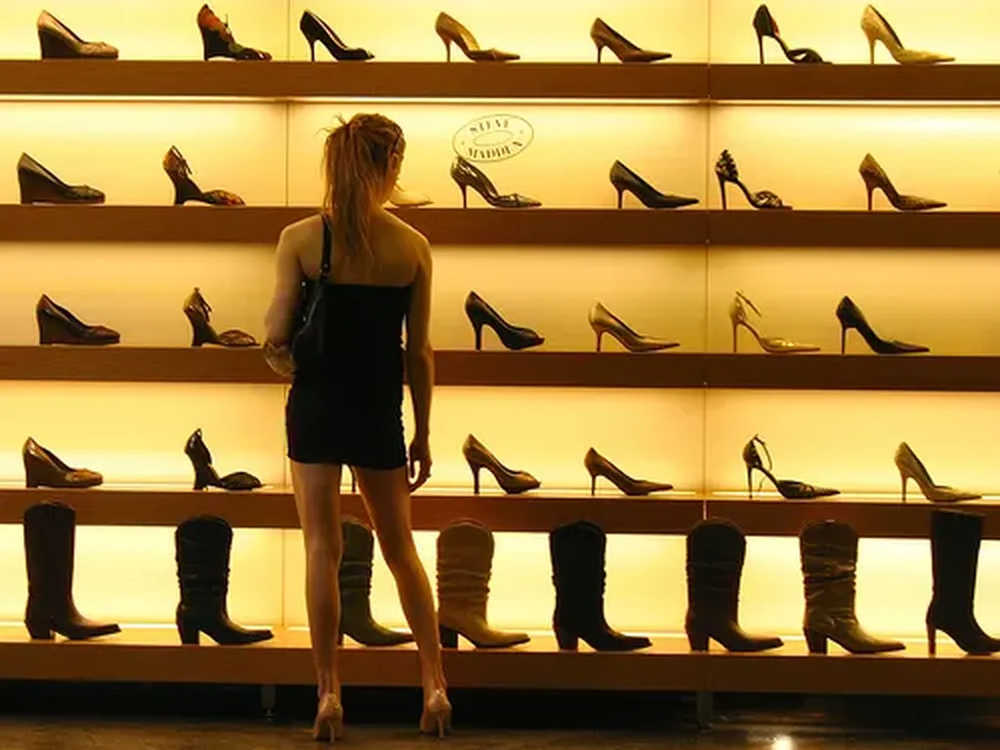

# Nous n’aimerions pas avoir le choix

J’évite les restaurants avec des menus qui s’étalent sur plusieurs pages. Ils trahissent la cuisine micro-onde. Quand j’ai le choix, je privilégie toujours les menus minimalistes qui me laissent peu de liberté. C’est une condition nécessaire, mais pas suffisante, à la pratique de la cuisine que j’aime.

Mon raisonnement est simple : si peu de plats sont proposés, il y a une chance qu’ils soient préparés à la demande. Je préfère donc voir ma liberté de choix réduite plutôt qu’on me laisse choisir entre beaucoup d’options aussi médiocres les unes que les autres.

Ma liberté ne dépend pas seulement de l’ampleur de l’offre mais de la qualité de l’offre. Bien sûr je peux me laisser abuser. Une offre réduite peut également être médiocre. Rien ne garantit la qualité, sinon l’expérience.

Quand j’ai parlé de [Youtubiser le livre](../10/youtubiser-le-livre.md), j’ai supposé qu’en élargissant l’offre de textes nous donnerions une chance à des formes de littérature qui peut-être n’avaient jamais trouvé leur place dans le circuit traditionnel de l’édition. Mais si les lecteurs se comportent dans les librairies comme moi au restaurant, ils préfèrent peut-être avoir moins de choix dans l’espoir d’être moins déçus.

[Andrew McAfee](http://blogs.hbr.org/hbr/mcafee/2010/11/why-people-want-less-choice.html) se demande si le succès de l’iPad, avec bientôt 13 millions d’unités vendues, ne proviendrait pas de ses limitations. La contrainte pousserait les usages dans certaines directions plutôt que dans d’autres. En limitant les choix, elle aiderait à choisir. En quelque sorte, nous n’aimerions pas autant qu’on veut le croire la liberté, surtout quand elle s’accompagne en contrepartie d’une prise de risque.

Mon analogie avec la restauration est toutefois limitée. Un restaurant ne possède qu’une cuisine alors que des écrivains innombrables concoctent leurs livres chacun dans leur propre cuisine. Un restaurant est plutôt l’équivalent d’un éditeur. S’il sort trop de livres, il n’a pas le temps de bien les préparer. Nous devrions nous méfier des éditeurs qui publient trop.

Mais n’avons-nous pas tendance à nous méfier dans un même élan d’un système qui publie trop ? Est-ce qu’au fond nous n’étions pas plus heureux avec un système éditorial plus élitiste ? D’ailleurs par le passé, disons entre 1950 et 1980, on publiait moins de livres mais chacun d’eux se vendait mieux et les auteurs vivaient mieux. Serions-nous devenus méfiants comme devant les menus de ces restaurants chinois qui nous offrent aussi des pizzas ?

La profusion favorise la création mais complique le choix. Plus il y a de possibilités, moins les gens choisissent. Ils finissent par être victimes plus que jamais du mimétisme. La longue traîne ne pourrait se développer à cause de la peur, ne serait-ce que la peur de perdre son temps, denrée rare s’il en est.

Mais qu’est-ce que je fais quand j’ai faim ? Je choisis un restaurant, avec même une préférence pour ceux qui n’ont qu’un plat du jour. Je ne restreints ma capacité de choix qu’une fois que je suis assis. Je n’aime pas les villes où il n’y a qu’un restaurant.

Dans le monde de l’édition, j’apprécierais donc qu’il y ait de plus en plus d’éditeurs, et même des auteurs autoédités (ceux qui ne proposent qu’un plat) mais avec des catalogues de préférence réduits.

#netculture #dialogue #y2010 #2010-11-14-11h36
