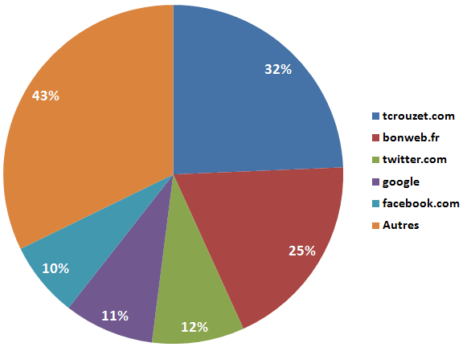
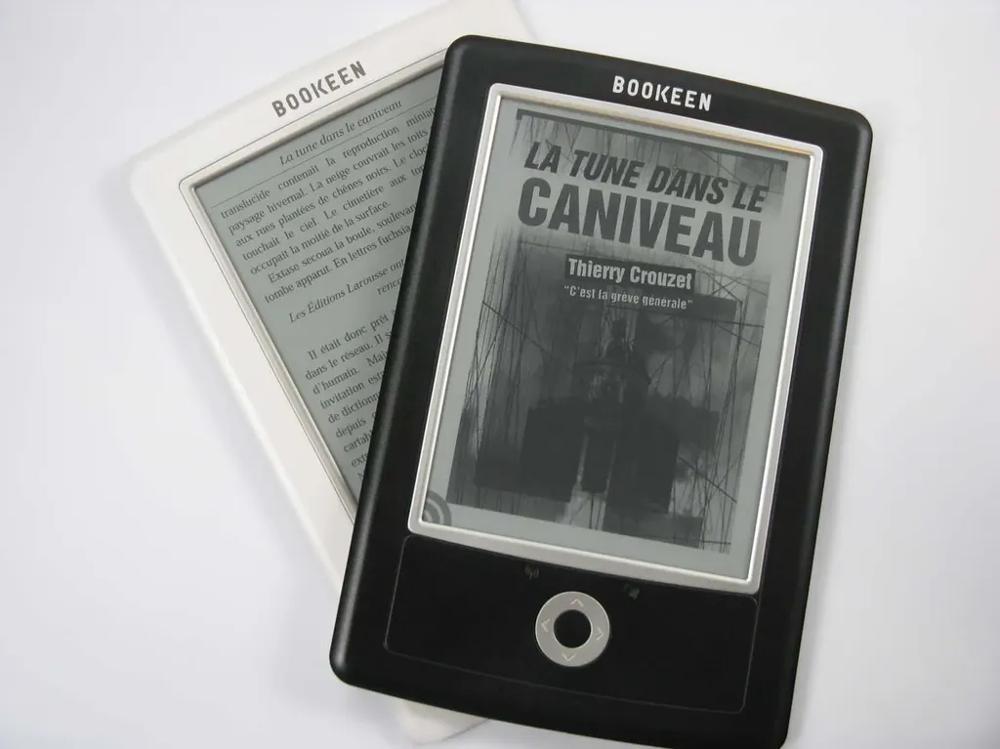

# Je vends plus de livres papier que d’ebooks

Quand je sortais des livres papier avec un éditeur traditionnel, je n’ai jamais vendu moins de 3 000 exemplaires. Aujourd’hui, quand avec [L’expérience inédite](../../page/tune-caniveau/experience-inedite) je sors *[La tune dans le caniveau](../../page/tune-caniveau)*, j’en vends 86 ! Il est temps de faire un bilan d’une aventure éditoriale expérimentale.

Petit résumé. En septembre, je lance l’idée de créer [un commando pour éditer un texte sans l’apport du moindre capital](../9/experimentons-le-revenu-unique-pour-les-auteurs.md) mais tout en respectant une logique éditoriale, c’est-à-dire travail sur le manuscrit, corrections, montage, façonnage et distribution. Mon but : montrer qu’on peut aujourd’hui éditer autrement.

Dès le lendemain, [l’équipe](../../page/tune-caniveau/experience-inedite) est sur pied et nous commençons à travailler sur un texte d’une trentaine de pages que j’ai écrit en quatre jours pour l’occasion.

Avons-nous dès ce moment commis une erreur, c’est-à-dire travaillé un texte qui n’en valait pas la peine ? C’est possible, d’ailleurs peu de [chroniqueurs](../../page/tune-caniveau/rp) ont été dithyrambiques, et nombre de mes amis du monde des ebooks n’ont même pas écrit la moindre ligne sur le texte.

Je ne perds pas de vue l’éventuelle médiocrité du texte mais je suis obligé de le nuancer. Pour que des gens puissent juger d’un texte, il faut qu’il soit lu, au moins feuilleté. Entre la publication officielle, le 21 octobre et aujourd’hui, mon blog a reçu 21 500 visiteurs uniques. Le formulaire de téléchargement était affiché sur toutes les pages, avec le plus souvent l’option gratuite présélectionnée. Résultat : 238 téléchargements gratuits et payants.

On tombe sur un taux de conversion de 1,1 %. Les spécialistes du marketing diront peut-être que ce n’est pas si mal. Mais si un auteur doit recevoir 200 000 visiteurs uniques par mois sur son blog pour arriver à vendre médiocrement ses livres en direct, l’affaire n’est pas gagnée.

Au États-Unis, le marché des ebooks représente cette année [9 % du total des ventes](http://www.readwriteweb.com/archives/ebooks_ereaders_top_trends_2010.php). Sur cette base et celle de mon score minimal de vente de 3 000, j’aurais donc dû vendre au minimum 270 ebooks. Après 6 semaines, nous en sommes en fait à 46 (25 en direct sur mon blog, 6 chez Apple, 1 chez Amazon, 6 chez [Numériklivres](http://www.numeriklivres.com/), 8 chez immateriel), soit 1,5 % de 3 000. Il se trouve qu’on ne doit pas être loin de la part de marché des ebooks en France. D’un point de vue statistique, nous ne serions pas franchement mauvais. Heureusement que nous avons écoulé 40 exemplaires papier via [la-coop.org](http://la-coop.org/) pour améliorer un peu ces chiffres.

On voulait s’offrir une bouffe avec les bénéfices. [Selon le principe du prix d’auteur unique](../10/veritables-prix-edition.md), on a gagné 86 x 1,5 euros, soit 129 euros. Pour le moment, on peut se payer un verre.

### Et le gagnant est…

Pour essayer de faire parler du livre, avec [Bookeen](http://www.bookeen.com/fr/), on a lancé [un petit concours](../../page/tune-caniveau/concours) qui se termine aujourd’hui. L’idée était de faire gagner une liseuse [Cybook Orizon](http://www.bookeen.com/fr/cybook/?id=2). [Une vingtaine de blogueurs ont participé.](../../page/tune-caniveau/rp)

Le principe était de chroniquer *La tune dans le caniveau*. Le gagnant devait être celui qui affichait le plus de fois sa chronique. Naïf, je croyais que Google Analytics traquait les affichages des images. J’aurais dû vérifier avant. Je n’avais pas pris cette peine parce que j’avais en parallèle les logs serveur. Manque de chance, un plantage du dit serveur a tout effacé. Je ne sais pas qui a gagné !

Je change donc le règlement à la volée. Et le gagnant est le chroniqueur du texte qui a envoyé le plus de visiteurs uniques vers mon blog depuis le 18 octobre, date de l’annonce du concours. Bravo Nessy !

1. [nessy.canalblog.com](http://nessy.canalblog.com/archives/2010/10/18/19365975.html) (43 visiteurs)

- [heresie.hautetfort.com](http://heresie.hautetfort.com/archive/2010/11/05/caniveau-parisien-post-apocalyptique.html) (42 visiteurs)

- [regarddejanus.wordpress.com](http://regarddejanus.wordpress.com/2010/11/29/livre-numerique-en-chair-et-en-os/) (39 visiteurs)

- [ancion.hautetfort.com](http://ancion.hautetfort.com/archive/2010/11/03/48h-avec-crouzet.html) (31 visiteurs)

- [tulisquoi.net](http://www.tulisquoi.net/la-tune-dans-le-caniveau-thierry-crouzet) (22 visiteurs)

- [rsfblog.canalblog.com](http://rsfblog.canalblog.com/archives/2010/11/25/19656046.html) (11 visiteurs)

- [la-book-melusine.over-blog.com](http://la-book-melusine.over-blog.com/article-la-tune-dans-la-caniveau-de-christian-crouzet-60362456.html) (10 visiteurs)

- [lespeuplesdusoleil.hautetfort.com](http://lespeuplesdusoleil.hautetfort.com/archive/2010/11/11/thierry-crouzet-la-tune-dans-le-caniveau.html) (visiteurs 10)

- [a-c-de-haenne.eklablog.com](http://a-c-de-haenne.eklablog.com/la-tune-dans-le-caniveau-de-thierry-crouzet-a2140159) (9 visiteurs)

- [lire-c-delivrant.eklablog.fr](http://lire-c-delivrant.eklablog.fr/la-tune-dans-le-caniveau-de-thierry-crouzet-a1865465) (9 visiteurs)

- [tiensquelleadresseincroyablementlonguedisdonc.over-blog.com](http://tiensquelleadresseincroyablementlonguedisdonc.over-blog.com/) (7 visiteurs)

- [larbracigogne.blogspot.com](http://larbracigogne.blogspot.com/2010/10/libraire-electronique.html) (5 visiteurs)

- [l-ecritoire.net](http://www.l-ecritoire.net/?p=44) (4 visiteurs)

- [abracadabibliothesque.wordpress.com](http://abracadabibliothesque.wordpress.com/2010/11/27/la-tune-dans-le-caniveau-de-thierry-crouzet/) (3 visiteurs)

- [paganiz.com](http://www.paganiz.com/2010/11/tune-caniveau-crouzet/) (3 visiteurs)

- [amotsdelies.free.fr](http://amotsdelies.over-blog.com/article-la-tune-dans-le-caniveau-59705635.html ) (2 visiteurs)

- [tortoise.servhome.org](http://tortoise.servhome.org/index.php?option=com_content&view=article&id=503:la-tune-dans-le-caniveau&catid=9:readingpatch&Itemid=24) (2 visiteurs)

- [histoires-de-livres.over-blog.com](http://histoires-de-livres.over-blog.com/article-la-tune-dans-le-caniveau-thierry-crouzet-60875882.html) (1 visiteur).

Je peux aussi analyser plus spécifiquement le trafic de la page dédiée à *[La tune dans le caniveau](../../page/tune-caniveau)*. Cette page à été affichée 2 527 fois pour un total de 1 913 consultations uniques.

La blogosphère a généré 43 % du trafic, dont seulement 5 % imputables aux chroniqueurs. Les réseaux sociaux comptent pour 22 %. Par rapport à mon article [sur leur inutilité dans l’absolu](les-reseaux-sociaux-ne-servent-a-rien.md), on voit que pour des sites à faible trafic comme le mien leur influence est loin d’être négligeable, bien supérieure à celle de Google.

Enfin, logiquement, mon blog, en conjonction avec un mailing sur la base [bonweb.fr](http://www.bonweb.fr/), a généré 57 % du trafic. Côté marketing le bug est là : j’ai tourné sur mon lectorat traditionnel, pas nécessairement constitué de lecteurs de livres, sans arriver à l’étendre. Avec 5 % du trafic total généré, le concours n’a eu pour ainsi dire aucun effet (ça confortera ceux qui ont crié à la manipulation et qui ont donc crié au loup pour rien).

À l’avenir, il faudra utiliser un système de tracking qui mettra à égalité les blogueurs et les socionautes. Un concours qui ne s’adresse qu’à la blogosphère est presque discriminatoire aujourd’hui. J’espère tout au moins que nous avons réussi à glisser l’idée de passer aux ebooks dans quelques esprits. Le meilleur exemple est le travail de vulgarisation dorénavant effectué par [larbracigogne](http://larbracigogne.blogspot.com/2010/11/lecture-numerique-4.html) depuis qu’elle s’est acheté un [Cybook Orizon](http://www.bookeen.com/fr/cybook/?id=2).

### Et la suite…

Il faudra recommencer ce genre d’expérience encore et encore pour faire histoire, pour donner des habitudes, tant aux lecteurs qu’aux chroniqueurs. Nous ne sommes qu’au début d’une aventure. Notre écosystème manque encore d’oxygène et je ne sais pas s’il réussira à se ventiler avant que ne débarquent les grosses machines éditoriales.

Si j’avais écrit un texte génial quel aurait été son sort ? Au regard des chiffres de diffusion des eBooks en France, c’est un peu comme si personne n’avait encore réussi à écrire un texte génial. Peut-être ! Mais croyez-vous que seuls les textes géniaux marchent en papier ? Je ne le pense pas. Nous n’avons tout simplement pas réussi à produire un texte suffisamment grand public pour qu’il explose les compteurs.

Bon, maintenant que le concours est terminé, vous pouvez écrire des articles au sujet de la tune. Le but n’est pas d’augmenter le nombre de ventes, vous avez compris qu’il faudra trouver une autre méthode, mais de poursuivre l’expérience. J’ai déjà publié une version 2.0 suite aux premiers articles. Il me paraît ainsi amusant de rebondir et de développer le texte de l’intérieur au fil de vos remarques. C’est un jeu oulipien. 

Quand nous aurons vendu les 50 exemplaires papier de cette édition 2.0, j’écrirai une version 3.0 car déjà des éléments commencent à s’assembler dans ma tête. Le numérique offre cette fluidité, il faut en profiter pour expérimenter des textes à géométrie variable. Et il faut bien comprendre que la littérarité d’un texte n’est pas que dans le texte lui-même, mais aussi dans sa dynamique évolutive, une notion peu présente jusqu’à aujourd’hui en littérature.

Merci encore à toute l’équipe de [L’expérience inédite](../../page/tune-caniveau/experience-inedite), merci à tous les chroniqueurs, à tous les socionautes, à tous les lecteurs… le texte reste accessible en téléchargement gratuit et aussi en version payante ici-même et sur toutes les plateformes de diffusion.

#autopublication #ebook #expi #edition #noepub #dialogue #y2010 #2010-12-6-18h2
