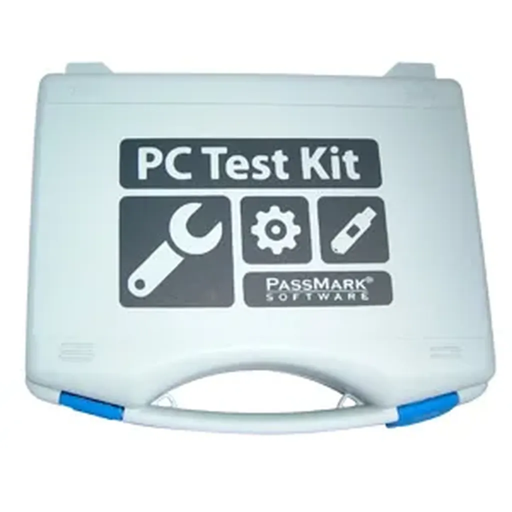

# Le Web a tué le journalisme technique

On gagne d’un côté, on perd d’un autre. Aucune innovation n’est jamais uniquement positive. Le Web n’échappe pas à cette règle, notamment dans le domaine éditorial. Je viens de l’expérimenter en voulant choisir un ordinateur portable pour Isabelle.

Il y a quinze ans qu’est-ce que j’aurais fait ? Je serais descendu chez le marchand de journaux et j’aurais acheté une revue informatique avec un bon gros comparatif. En moins d’une heure, j’aurais trouvé la machine idéale en fonction de mon cahier des charges.

Qu’est-ce que j’ai fait ces derniers jours ? J’ai passé plus d’une dizaine d’heures à parcourir les blogs spécialisés dans les portables et à tenter de croiser leurs articles et leurs bases de données. J’ai perdu mon temps à effectuer le travail d’un journaliste technique.

Les fameux blogs professionnels ne font qu’un travail amateur par rapport à ce que nous faisions durant les années 1990 dans la presse spécialisée. Ils se contentent de réécrire les fiches produits, sans guère ajouter d’information par rapport à celles publiées sur les sites des constructeurs.

Aucun produit n’est réellement testé. Le clavier, l’écran, le niveau sonore, la durée de la batterie, la puissance pure… ne sont pas évalués et pas commentés de manière systématique (j’insiste sur systématique).

Je me fiche qu’on me dise en trois phrases le type du processeur (parce que je sais lire une fiche produit). Je veux qu’on me parle plutôt de ce que je ne peux pas apprécier à distance. Je veux qu’on me donne l’impression que quelqu’un déballe le produit pour moi. Je veux lire quelqu’un d’objectif et de critique. Je ne veux pas d’un pisse-copie qui ne s’intéresse qu’au référencement de son article sur Google pour m’envoyer à la figure une publicité mal ciblée.

Quand je travaillais chez Ziff-Davis, nous avions mis au point une base de données que tous les magazines du groupe renseignaient. Elle était nourrie depuis les USA, la France, l’Angleterre, l’Allemagne… Chaque machine subissait la même batterie de tests. Nous pouvions comparer toutes les caractéristiques et toutes les performances. Tout cela s’est perdu. Nos blogueurs spécialisés, gloire de la blogosphère parce qu’ils gagneraient leur vie avec leurs blogs, ne sont que des forçats de l’info. Ils ne font qu’abaisser sans cesse la qualité de ce qui peut être écrit sur les produits technologiques. Ils sont devenus des publireporters.

Comme ces sites orientés produits et services sont profitables, il me semble qu’ils devraient profiter de leur rentabilité pour bien faire leur travail. Pourquoi ne pas construire une base de données unifiée. Utiliser systématiquement les outils de test disponibles en open source. Nous offrir au final des informations qui pourraient nous aider à choisir.

Dans l’état actuel des choses, je préfère encore interroger mon réseau social pour obtenir des conseils d’achats crédibles ou aller fouiner dans les forums. Je ne fais pas confiances aux blogueurs professionnels (professionnel signifiant qui gagne de l’argent avec son blog, là s’arrête le professionnalisme).

#journalisme #netculture #coup_de_gueule #y2010 #2010-12-29-13h43
