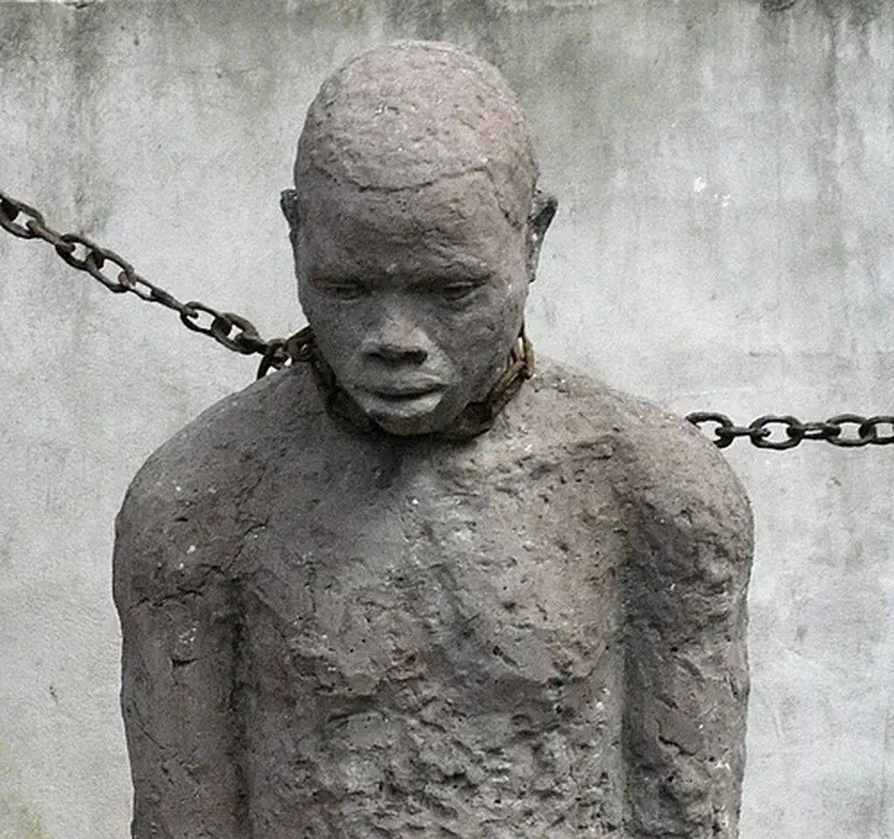

# Anarchisme : la force d’émancipation sociale

Dans un opuscule intitulé *Raison contre pouvoir, le pari de Pascal*, Jean Bricmont interviewe Noam Chomsky. Il lui demande notamment « N’est-il pas vrai que toutes les formes d’auto-organisation selon les principes anarchistes se sont finalement effondrées (pensez aux diverses communautés dans les années 1960 et 1970, mais il y a aussi des expériences antérieures) ? »

> Avec un raisonnement semblable, on aurait pu conclure au XVIIIe siècle que les tentatives d’établir la démocratie politique ou d’abolir l’esclavage ou de protéger les droits des femmes ou bien… ayant toujours échoué, pourquoi alors devrions-nous même essayer de promouvoir la paix et la justice et les droits de l’homme ? demande Chomsky. C’est là à coup sûr un piètre argument. […] Je suis aussi en désaccord avec l’observation historique que vous faites. Il n’y a pas de « principes anarchistes » fixes, une sorte de catéchisme auquel il faudrait prêter allégeance. L’anarchisme, du moins tel que je le comprends […] est une tendance de la pensée et de l’action humaine qui cherche à **identifier les structures d’autorité et de domination**, à les appeler à se justifier, et, dès qu’elles s’en montrent incapables (ce qui arrive fréquemment), à travailler à les surmonter. Loin d’avoir « échoué », l’anarchisme se porte très bien. Il est à la source de beaucoup de progrès - très réels - des siècles passés, y compris depuis les années 1960 et 1970. Des formes d’oppression et d’injustice qui étaient à peine reconnues, et encore moins combattues, dans un passé récent, ne sont plus considérées aujourd’hui comme tolérables.

Exemple d’une de ces luttes nouvelles : la bataille pour le revenu de base. Nous avons identifié chez les banquiers une structure d’autorité et de domination que nous devons éradiquer en distribuant leur pouvoir de création monétaire entre les mains de tous (ce n’est pas plus fou qu’abolir l’esclavage).

Internet est en train de nous permettre de distribuer la liberté d’expression entre tous alors que jadis seule une minorité se l’arrogeait. Cette bataille, cette décentralisation, est loin d’être achevée. Elle ne fait même que débuter, mais il s’agit bien d’un projet anarchiste au sens où le définit Chomsky et dans lequel je ne peux que me reconnaître.

Nous ne cessons d’identifier les structures d’autorité et de domination. C’est tout le problème pour les autorités en place. Nous contestons la production d’énergie centralisée, la distribution alimentaire centralisée, l’éducation centralisée, l’expertise centralisée… L’anarchisme n’a jamais été aussi vivant. Il le sera tant que le capitalisme ne sera pas vaincu, le capitalisme étant une structure d’autorité et de domination extraordinaire.

Toutes les contestations ont cela de particulier qu’elles peuvent s’exercer dans le cadre de forces politiques traditionnelles, mais, surtout, à titre individuel. Par le passé, il était difficile de se batte seuls contre les puissants. Quelques riches propriétaires l’ont fait contre l’esclavage, mais avec difficulté. Aujourd’hui, chacun à notre niveau nous pouvons agir parce que les nouvelles technologies démultiplient notre puissance d’action.

Nous commençons également à comprendre que les partis eux-mêmes sont des structures d’autorité et de domination. Alors nous ne pouvons pas nous engager dans ces structures pour lutter contre des structures de même nature. Cela reviendrait à déplacer éternellement le problème sans réellement le régler.

Il ne s’agit pas nécessairement d’agir seul mais de se lier dans des TAZ qui sauront mener un combat de guérilla et se redessiner en fonction des circonstances et des besoins. Ne nous leurrons pas. Depuis toujours les structures de pouvoir et de domination défenbent leurs privilèges jusqu’à la mort. Les forces anarchistes gagnent peu à peu du terrain tout en partant de très loin.

Internet peut apparaître comme une victoire incontestable des forces libres. Le réseau pensé par des hommes libres, tant bien même ils travaillaient pour l’armée américaine, est l’arme la plus fantastique dont n’ont jamais disposé les anarchistes.

Leurs adversaires de toujours ont fini par le comprendre. Au début, ils se sont laissés berner par les possibilités économiques du réseau. Maintenant, ils réagissent. Plus rien ne les arrête. Le Web est aux mains de quelques puissantes entreprises : Google, Facebook… qui ont réussi à recentraliser le réseau pour en phagocyter la créativité.

Les gouvernements, ces centres de domination, peuvent dès lors appliquer un contrôle de plus en plus drastique sur la part du réseau qui se joue hors de ces acteurs « officiels ». Une nouvelle bataille commence. Une nouvelle guerre de Sécession.

Choisissez votre camp. Préparez-vous à passer outre les barrages que plus aucune raison économique n’empêche de dresser maintenant que le Web tend à se structurer comme un pouvoir traditionnel. Et n’oubliez pas que la plus grande structure créée par l’humanité, celle qui lie aujourd’hui 2 milliards d’humains, Internet, est le fruit d’un fantastique processus d’auto-organisation. Quelques règles fécondes, TCP/IP par exemple, ont été adoptées et le réseau a bourgeonné à partir d’une multitude d’initiatives publiques, privées et individuelles. Nous pouvons vivre en minimisant les structures d’autorité et de pouvoir. Et celles qui subsistent sur Internet, comme les serveurs racines, peuvent elles aussi être éradiquées.

#anarchisme #auto-organisation #mrdb #revenu_de_base #coup_de_gueule #y2010 #2010-2-11-16h2
