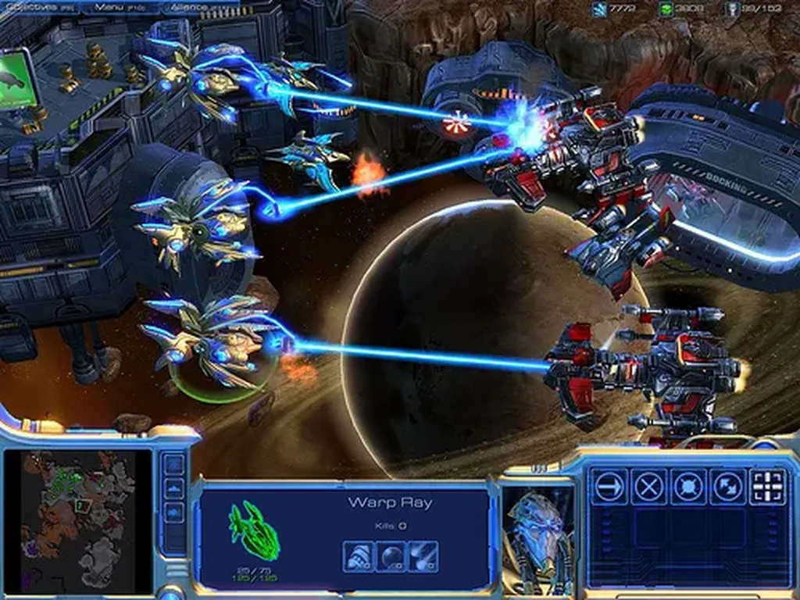

# Internet : terrain de bataille idéologique

Il y a un monde entre ce que font les gens, leurs usages, domaine souvent étudié par les sociologues, les historiens, et ce que peuvent faire les gens, domaine souvent étudié par les artistes, les activistes, les spécialistes du développement personnel. Ce n’est pas parce que nous observons que les gens font un truc taré qu’ils continueront de le faire pour la vie, et pour commencer que nous sommes obligés de les imiter.

Il est important d’observer ce que font les foules, ce qui guide nos comportements collectifs, mais non pas pour en déduire des lois physiques immuables, mais pour pouvoir changer ces lois, et pour commencer à notre niveau.

> On ne dira jamais assez le mal qu’à pu faire cette idéologie du Web 2.0 dans notre compréhension de ce qui se passe sur internet, écrit [Narvic](http://novovision.fr/?Dans-ce-nouveau-Web-de-masse-vous). Et je dis bien « idéologie », car c’en est une. Cette idéologie qui nous a encouragés à regarder le Web à travers le prisme d’idées préconçues, plutôt que d’en observer la réalité des usages.

Narvic évoque la nécessité de se désintoxiquer. Je dirais qu’il faut choisir son camp, ce qui revient au même peut-être. Il n’y a incompréhension que si, consciemment, on ne s’est pas positionné. Je suis un activiste. Je veux orienter l’histoire dans un sens qui me convient et qui ouvrira peut-être des portes nouvelles à l’humanité. Beaucoup d’autres et moi-même sommes des idéologues, non des victimes d’une idéologie, mais les constructeurs de cette idéologie. Nous le revendiquons.

Il ne faut pas nous confondre avec les entrepreneurs qui ne pensent qu’à leur carnet de chèques, qui cherchent à orienter l’histoire du Web pour leur seul bénéfice financier. Ils disent « partager » pour signifier « vendre » ou « attacher ». Ils organisent de vastes forums, ils bourrent le crâne de ceux qui ignorent les dessous technologiques, réussissant à leur faire croire que des idées vieilles de vingt ans viennent de surgir de leur imagination débordante... réussissant à faire croire qu’un business a un intérêt humanitaire (les journalistes sont les champions à ce petit jeu).

Depuis toujours l’informatique, puis Internet, puis le Web ont été pensés par des idéologues. Turing, Licklider, Stallmann, Berners-Lee… On n’est pas dans une démarche neutre, objective, mais bien dans la construction d’un monde possible en opposition à un monde existant. Il s’agit ni plus ni moins depuis le début d’une immense guerre intellectuelle et technologique, dont je raconte une bataille fictive dans mon [Thriller](http://twiller.tcrouzet.com/).

Quand on analyse un discours au sujet du Net, il faut savoir dans quel camp se situe l’émetteur (et être aussi conscient de sa position en tant qu’analyste). Pour schématiser, d’un côté il y a les [Terrans](../../2006/6/cosmists-vs-terrans.md). Ils poursuivent la richesse, le pouvoir, la domination des foules… De l’autre côté, il y a les [Hackers](#wark), ils s’intéressent à l’aventure de la conscience, de la fraternité, de la culture…

Bien sûr ces camps se croisent, des gens sautent d’un à l’autre, mais souvent ils ont tendance à défendre un des points de vue avec plus de pugnacité. En vérité, la plupart des gens ignorent ces deux camps et la bataille qu’ils se livrent. Ils sont serfs des Terrans. Leur comportement ne reflète que la volonté des Terrans.

Mais pourquoi cette guerre est-elle critique pour l’avenir de l’humanité ? Parce que la technologie des Terrans, [notamment leur technologie sociale](la-technologie-sociale.md), est incapable de gérer la crise de la complexité.

Chez les Terrans, je place Google, Apple, Microsoft, Dailymotion, Sarkozy, Obama… toutes ces entreprises, tous ces hommes, qui raisonnent avec une logique industrielle. Leur seul désir est que leurs produits et leur domination s’étendent au plus grand nombre. Ils défendent une idéologie pour assoir leur suprématie.

Apple est un exemple intéressant. Steve Jobs serait plutôt un Hacker, mais il gère son entreprise comme n’importe quel Terrans, ce qui traduit chez lui une certaine schizophrénie. Par ailleurs, il cible en apparence les Hackers, mais dans le seul but de les transformer en Terrans.

Système propriétaire fermé. Interface unique à vocation hégémonique. Réduction des possibilités. Simplification caricaturale. Contrôle continuel. Passage par des check-points obligatoires. Partage centralisé ce qui est le pire des paradoxes. Séduction à tout prix. Les Hackers ne devraient que s’insurger. Surtout ne jamais succomber. Ou pour détourner les machines et les services Apple, les craquer, en combattre la logique de l’intérieur.

Je suis assez malheureux de voir tous ceux qui se disent progressistes plébisciter Apple. Vous êtes en train de trahir votre idéal. D’approcher le moment où les Terrans seront à nouveau seuls maîtres à bord.

J’en reviens à [la critique de Narvic](http://novovision.fr/?L-avenir-radieux-de-l-internet-ne). Oui, les Hackers s’emportent souvent, penchent vers l’enthousiasme utopique, mais il ne faut pas oublier que soldats ils mènent une guerre d’indépendance, ils ne sont pas en train de professer une vérité. L’historien pourra décrypter leurs discours, en attendant eux se battent et l’historien devrait choisir son camp, car la guerre est encore loin d’être achevée.

Au fond, dans le Web, il n’y a qu’une chose importante : les liens. Tout le reste n’est que marketing pour nous détourner de cette arme révolutionnaire dont j’ai une nouvelle fois cherché à décrire la puissance dans *[L’alternative nomade](../../books/alternative-nomade.md)*. Nous disposons de la puissance de changer le monde, et même les foules apparemment soumises aux Terrans utilisent cette arme, elles créent du réseau.

Nous sommes effectivement tous créateur, mais pas créateur d’information, d’œuvre d’art, de connaissance, créateur d’une nouvelle infrastructure sociale, cette structure qui permettra peut-être à [l’auto-organisation](#auto-organisation) de faire ses preuves là où on ne l’attend pas.

Il ne s’agit pas de construire un monde mièvrement égalitaire, idéalement démocratique, mais un monde capable de supporter sa propre complexité et de poursuivre l’aventure de la conscience et de la culture. Sans oublier que nous, Hackers, dans ces conditions, entendons mener des vies pleines. Quand nous parlons, c’est de ce que nous faisons, de ce que les autres pourraient faire s’ils voulaient nous rejoindre.

Les usages sont faits pour changer.

#netculture #coup_de_gueule #y2010 #2010-2-4-16h57
