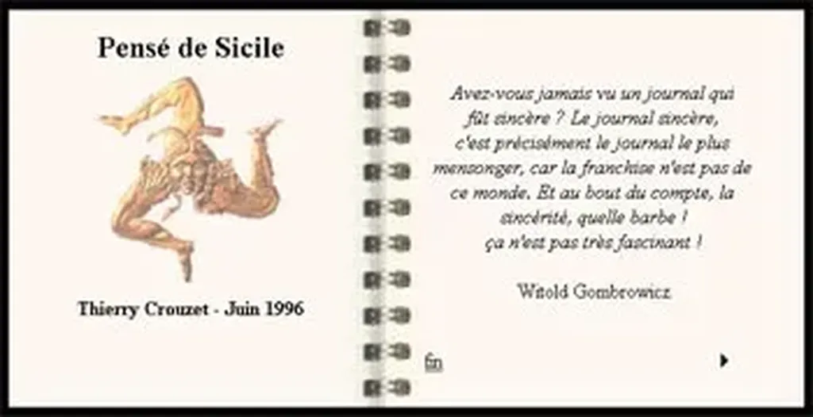

# J’existe en ligne depuis 1996

[En racontant sa vie sur le Web](http://www.tierslivre.net/spip/spip.php?article2050), François Bon m’a donné l’idée de creuser dans mon passé Web. J’ai retrouvé le premier texte que j’ai publié, déjà sous la forme d’un livre électronique, [un carnet de voyage en Sicile](http://lab.tcrouzet.com/sicile1996/). HTML garanti vintage, initialement publié chez Europe Online dont à l’époque, avant la faillite de cette proto-startup, j’étais l’administrateur français.

#autobiographie #breves #y2010 #2010-2-17-18h7
