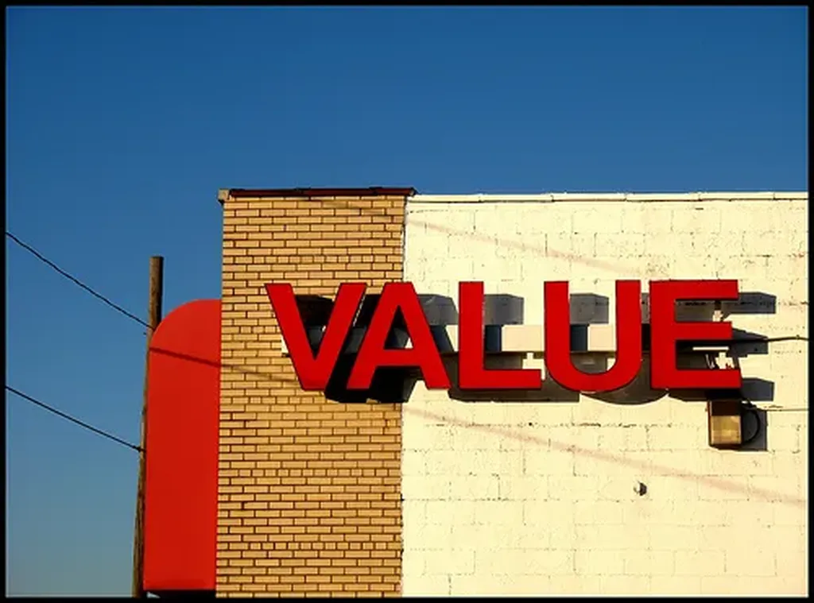

# Avons-nous des valeurs ?

Quelles sont mes valeurs ? Je ne suis pas sûr de savoir répondre à cette question et je suis d’autant plus intéressé par [les réponses que Raveline propose à ma place](http://raveline.posterous.com/le-silence-des-passions-i).

Est-ce que je revendique la légèreté, la rapidité, l’exactitude, la visibilité, la multiplicité et la consistance, six valeurs qui en 1979 caractérisaient la modernité selon Calvino ?

J’ai beaucoup lu Calvino. *Si par une nuit d’hiver un voyageur…* Après un tel texte, comment ne pas avoir envie de devenir écrivain ? Non pas pour raconter des histoires, mais pour jouer avec la littérature elle-même. Écrire l’écriture.

Sous l’influence de [François Bon](http://www.tierslivre.net/), je replonge d’ailleurs en ce moment dans les *Petits traités* de Pascal Quignard. J’échoue sur des plages de sable chaud puis je me perds dans des phrases récursives qui se regardent trop pour mes goûts d’aujourd’hui. Je suis passé à une écriture de combat.

*Légèreté*, si possible, objectif inaccessible, je me sens plutôt lourd.

*Rapidité*, j’aimerais ralentir mais j’ai du mal, la lourdeur implique beaucoup d’inertie.

*Visible*, sinon pourquoi écrire.

*Multiplicité*, parce que les anciennes catégories ont explosé, parce que nous vivons une transition, qu’il faut aborder par plusieurs perspectives.

*Consistance*, en apparence seulement, la multiplicité implique la contradiction, la complexité n’est ni blanche ni noire, un coup l’un, un coup l’autre (je n’aime pas le gris donc je pratique le chaud froid plutôt que le tiède une fois pour toutes).

Ces valeurs valent pour mon écriture. Guident-elles ce que j’écris ? Sans doute. Mais peut-on parler de valeurs ? Il s’agit plutôt d’une méthode de travail, d’une façon de penser. C’est comme mon refus de ces antinomiques que sont le relativisme et le platonisme. L’existentialisme, cette tentation de mettre en avant l’existence, est-il une valeur ? Non. Encore une méthode, une méthode de vie et aussi de travail. On parle de philosophie. Je peux donc me revendiquer de cette philosophie. Mais quelles valeurs ? Il n’en est toujours pas question.

Comment d’ailleurs quelqu’un qui s’oppose au platonisme peut-il définir des valeurs ? Est-ce qu’il peut exister pour lui des valeurs ? Des principes de vie oui… une éthique oui, mais des valeurs je ne suis pas sûr... alors des valeurs provisoires.

Quand je me définis comme un expert de rien ce n’est pas en référence à mon passé d’ingénieur qui, pour être précis, n’est en fait que mon passé d’étudiant et de rien d’autre. Il est vrai qu’un ingénieur est un généraliste, quelqu’un capable de s’adapter à des problèmes changeants. Il me semble que ce n’est pas une qualité inutile au cours d’une époque de transition. J’ai toutefois autre chose en tête. Je pense à l’éclectisme, à Ératosthène et à tous les polymathes.

J’ai longuement écrit sur ce sujet, j’y reviens en quatrième partie de *[L’alternative nomade](../../books/alternative-nomade.md)*. L’éclectique est pour moi un hyperspécialiste. À force de voyager à travers les domaines, les métiers, les communautés, il finit par devenir l’unique spécialiste de sa spécialité, une spécialité qu’il s’est créée pour lui seul. Au cours de leur vie, les artistes et les philosophes parcourent ce chemin vers l’individuation, un chemin qui répugne aux politiciens qui veulent nous ranger dans des boîtes faciles à étiqueter puis à contrôler et à manipuler.

Je ne suis donc pas modeste mais terriblement prétentieux, prétentieux au point de me voir dans une case qui ne vaut que pour moi… et j’ai l’espoir que de plus en plus de gens puissent m’imiter. La politique entre alors en jeu et peut-être que des valeurs pointent le bout de leur nez. La liberté ne se gagne qu’à ce prix. Que quand on a réussi à couper les câbles qui nous reliaient aux mêmes leviers de commande que tous les autres.

La pratique de l’éclectisme – l’expertise de rien pour devenir l’unique spécialiste d’une spécialité qui ne peut avoir de nom – implique des principes/valeurs. Des raisons de se battre je préfère dire. La liberté avec la possibilité de la gagner, de la défendre, de l’augmenter sans cesse. Le culte du lien sans lequel il ne peut exister de liberté, ni de société. La fraternité comme valeur, l’amitié chère aux épicuriens. Le rejet de l’ethnocentrisme, c’est-à-dire le multiculturalisme. Le refus des structures d’autorités devenues inutiles, n’est-ce pas une façon d’accorder de la valeur à l’auto-organisation ?

Je défends ces pseudo-valeurs parce que sans elles il n’y a pas d’individuation possible, il n’y a pas d’existentialisme possible, il n’y a qu’esclavage plus ou moins déguisé.

Je ne suis donc pas en train de décrire l’état du monde mais bien de chercher comment y mener une existence. Je fais de la politique même si elle peut paraître éloignée de celle qui se donne en spectacle. Nous verrons bien dans la durée celle qui aura une influence sur le monde. Les deux sans doute. Voilà pourquoi il ne faut en négliger aucune. À chacun de choisir la méthode qui lui convient et lui semble la plus efficace.

*PS : Ravine m’a fait flipper. En le lisant, j’avais l’impression d’être mort. Comme si on parlait de moi dans un lointain futur. Je ne pouvais pas ne pas répondre. L’écriture est devenue interactive. Les auteurs peuvent dire ce qu’ils pensent et non ce qu’on veut leur faire penser (même si chacun est libre de comprendre à sa façon).*

#politique #dialogue #y2010 #2010-2-17-15h8
