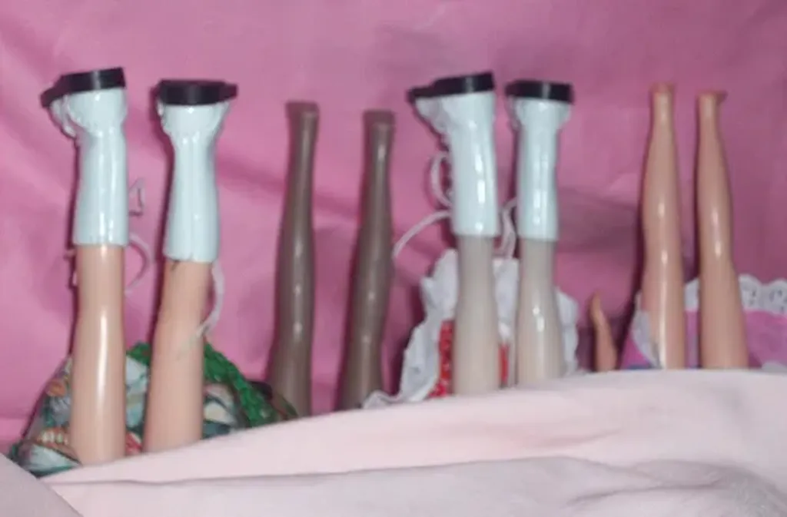

# Facebook et Twitter, bons pour la politique à papa

J’ai été invité par les étudiants de Paris 11 pour donner une conférence sur les réseaux sociaux et la politique. Je me suis dit que j’allais reprendre du début (et commencer par citer quelques passages du *Peuple des connecteurs*). D’abord, donner à ruminer une citation de Nietzsche, paragraphe 4 du *Gai savoir*.

> Le nouveau cependant est dans tous les cas le Mal en tant que ce qui veut conquérir, fouler aux pieds les anciennes bornes des frontières et les anciennes piétés ; et seul l’ancien constitue le Bien ! Les hommes bons de chaque époque sont ceux qui labourent à fond les anciennes pensées, et qui les font fructifier ; ce sont les cultivateurs de l’esprit. Mais à la fin tel champ ne rapporte plus et sans cesse il faut que le soc de la charrue du Mal vienne le remuer de nouveau.

### Les six degrés de séparation

En 1929, l’écrivain hongrois Frigyes Karinthy pressentit l’avènement d’un nouvel ordre social. Il imagina que nous étions tous connectés les uns aux autres par l’intermédiaire des amis de nos amis. Plutôt que de recevoir des informations venant d’en haut (gouvernement, journaux, patron…), nous étions, selon lui, capables de communiquer transversalement les uns avec les autres.

Cette idée resta d’ordre poétique jusqu’à ce que le sociologue Stanley Milgram se demande combien d’intermédiaires séparaient effectivement deux personnes choisies au hasard. En 1967, Milgram proposa à des habitants du Nebraska et du Kansas d’envoyer une lettre à un Bostonien dont ils n’avaient jamais entendu parler.

-- Quand je demandai à un ami intelligent par combien d’intermédiaires devraient passer les lettres, il estima qu’il en faudrait au moins une centaine, expliqua Milgram.

À sa grande surprise, les lettres parvinrent à leur destinataire en passant par six intermédiaires en moyenne. La légende des six degrés de séparation était née : nous ne sommes pas socialement très éloignés les uns des autres. L’humanité forme un petit monde où nous nous connaissons indirectement presque tous.

L’idée de cartographier la société était née. Il fallut attendre la fin des années 1990 pour que les premières cartes apparaissent, et surtout les années 2000 et l’apparition des réseaux sociaux pour obtenir des cartes détaillées.

### Les trois familles de réseau

À quoi pouvaient bien ressembler ces cartes ? Le 8 janvier 1959, à la suite de Che Guevara, Fidel Castro entra dans La Havane et chassa le dictateur Fulgencio Batista y Zaldivar. Cette prise de pouvoir entraîna le durcissement de la guerre froide. L’URSS apporta son soutien économique à Cuba puis installa sur l’île des missiles balistiques. La peur de l’embrasement nucléaire était à son comble.

En Californie, dans les bureaux de RAND Corporation, Paul Baran reçut pour mission de dessiner un système de communication permettant de résister à une attaque atomique. Cet ingénieur de 38 ans, qui venait de quitter une société pionnière dans la fabrication d’ordinateurs – domaine qu’il jugeait de peu d’avenir –, fut malgré lui ramené à l’informatique. Il analysa les réseaux de communication existant au début des années 1960 et découvrit qu’ils étaient de deux sortes.

1. Dans un réseau en étoile, toutes les stations communiquent avec une station centrale, le nœud du réseau. Il suffit qu’elle soit détruite ou victime d’une panne pour que le réseau s’effondre. Cette architecture hautement centralisée ne possède aucune robustesse (entreprise pyramidale, dictature avec dictateur au sommet...).
2. Le plus souvent, les réseaux en étoile s’interconnectent entre eux par l’intermédiaire de leur nœud et forment une architecture décentralisée. Si les nœuds sont faiblement interconnectés, le réseau reste vulnérable (liaisons aériennes avec des aéroports qui jouent le rôle de hub).

-- La question devint de trouver comment construire une structure fiable à partir de composants vulnérables, expliqua Paul Baran.

En 1964, il proposa un nouveau type d’architecture : le réseau distribué. Dans un tel réseau, qui forme un filet au maillage étroit, aucun des nœuds ne joue un rôle prédominant. Tous les nœuds s’interconnectent à d’autres nœuds : si l’un d’eux est détruit, les communications restent néanmoins possibles. Cette architecture, bien plus résistante que l’architecture centralisée du réseau en étoile, apparaît aussi plus résistante que l’architecture décentralisée. Le réseau distribué est, en fait, un réseau hautement décentralisé (réseau routier).

Les militaires, habitués à vivre dans un monde dominé par la hiérarchie, apprécièrent peu la suggestion de Paul Baran. De son côté, l’opérateur téléphonique AT&T déclara la solution techniquement irréalisable. Pourtant, Internet n’allait pas tarder à voir le jour, suivant cette topologie imaginée par Paul Baran mais sans s’appuyer sur ses travaux, plusieurs personnes et institutions pensant chacune des bouts d’Internet sans encore le savoir.

Internet a poussé sans que personne ne le décide, le planifie, le commandite. Aujourd’hui, il interconnecte 2 milliards d’hommes et de femmes. C’est la démonstration que en l’absence de chef et de coordination top-down nous pouvons construire de grandes choses..

J’en reviens aux réseaux sociaux naturels (ceux observés par les sociologues), comme à ceux que nous créons sur Facebook ou Twitter. Spontanément, ils adoptent cette topologie distribuée et hautement décentralisée imaginée par Paul Baran. Il y existe des étoiles, des gens plus connectés que d’autres, mais les branches aussi s’interconnectent.

### Centralisé ou décentralisé

On dit toujours que Facebook avec ses 400 millions d’utilisateurs est le plus grand réseau social. Faux. **Le Web est déjà un réseau social.** Pensez aux blogs, aux forums, aux sites communautaires comme [4chan](http://www.4chan.org/)…

Tous ces sites ne se contentent pas de lier entre elles des informations, mais surtout, avant tout, les gens qui les produisent et qui les discutent (je les appelle les **propulseurs**). Pourquoi Facebook est-il devenu si populaire ? Parce qu’il facilite l’interaction. Mais cette facilité a un prix faramineux.

Le Web est un environnement décentralisé pour créer un réseau social décentralisé. Facebook est un environnement centralisé pour créer un réseau décentralisé. Le résultat est en apparence identique, mais j’insiste sur les dessous, décentralisation dans un cas, centralisation dans un autre.

C’est un peu comme si je vous parlais de deux voitures allant à la même vitesse, possédant les mêmes caractéristiques, l’une avec un moteur essence, l’autre un moteur diésel. Si vous n’êtes pas un fan de mécanique, vous vous fichez certainement du moteur tant que la voiture vous aide à vous déplacer. De même, tant que vous utilisez les réseaux sociaux pour badiner, le moteur ne pose guère de problème. Il en va tout autrement si vous êtes engagés politiquement.

### La révolution iranienne de 2009

Facebook et Tweeter ont bien sûr aidé les Iraniens à se coordonner et à communiquer avec le reste du monde mais, parce que ces réseaux reposent sur des environnements centralisés, ils ont été tout de suite pris en main par le gouvernement iranien.

Rien de plus facile que de repérer les leaders, de faire circuler leurs photos, de les traquer, de les emprisonner… Il suffisait d’aller sur Facebook ou sur Twitter, deux lieux centralisés. C’est un peu comme si les résistants durant la Seconde Guerre mondiale donnaient l’adresse de leurs réunions aux nazis.

Si un gouvernement, même totalitaire, ne peut de but en blanc couper Internet, dont dépend aujourd’hui l’économie, il peut en revanche bloquer certains sites, les ralentir, les espionner à loisir.

Quand on se trouve dans un pays politiquement agité, il est donc important de faire attention aux environnements qui sous-tendent les réseaux sociaux. Si on veut faire la révolution contre le totalitarisme, qui se traduit souvent par un excès de centralisation, il faut utiliser des outils antinomiques, c’est-à-dire se glisser partout sur le web, de préférence à travers des services P2P qui garantissent l’anonymat, [freenet](http://freenetproject.org/fr/index.html) par exemple.

### Mais en démocratie

Vous allez me dire qu’en Occident nous ne trouvons pas dans la même situation que les Iraniens. Vous avez raison. Si vous entendez vous engager dans un parti officiel et jouer le jeu démocratique traditionnel, celui admis dans votre pays, utilisez des outils clé en main comme Facebook.

Comme ils sont centralisés, vos opposants comme le gouvernement pourront vous surveiller avec facilité, mais, comme vous êtes dans la légalité, ils exerceront sur vous peu de pression.

En revanche, si avec ces outils centralisés vous sortez de la légalité, vous aurez vite des problèmes. **Est-ce si difficile de sortir de la légalité ?** Ne suffit-il pas de télécharger des films et de les partager ? Ne suffit-il pas ainsi de militer pour une société de l’abondance face à une société de la rareté ?

J’en reviens à la citation de Nietzsche. Les méchants d’une époque deviennent souvent les bons d’une autre. Un réformateur commence par être un méchant. En tant qu’opposant de la loi Hadopi, je suis dans le camp des méchants, un jour si le gouvernement durcit sa position je devrais comme les Iraniens obligatoirement passer par des outils sociaux décentralisés… pour échapper à la chasse aux sorcières.

Ainsi pas besoin d’être un terroriste d’Al Qaïda pour attirer la suspicion même en démocratie. Un autre exemple : vous militez pour la légalisation des monnaies alternatives et le droit pour chacun de créer de la monnaie, pire vous mettez en application vos idées. Vous êtes hors la loi dans les démocraties modernes (ce qui montre bien que nous n’avons pas fini d’inventer la démocratie).

Vous le voyez, on a vite fait de se mettre en position tangentielle. Alors si vous êtes tentés par des idées nouvelles, n’utilisez surtout pas les réseaux sociaux centralisés. Ne commettez pas la même erreur que les Iraniens. Vous devez construire vos réseaux sur le Web lui-même, suivant des structures décentralisées, plus difficiles à surveiller, à verrouiller, à infiltrer, à prévoir…

Pour résumer, Facebook et Twitter sont bons pour la politique à papa. Le Web reste le seul réseau social qui nous permet de repenser la politique, et de repenser la démocratie elle-même. En tout cas, si vous estimez qu’elle doit être encore perfectionnée.

### Bottom-up vs top-down

Pour terminer, il me parait important de rappeler la différence entre le top-down et le bottom-up.

Le top-down, vous connaissez. C’est « Fait ça et tais-toi. » C’est le système qui prévaut dans les organisations pyramidales et dans de nombreux partis politiques. Les cadres définissent les mots d’ordre et organisent le travail des militants. Dans ces conditions, les réseaux sociaux deviennent des outils de communication, sortes de TV améliorées, pratiques pour récupérer des adresses et compter ses rangs.

Pour moi, en France, les partis en sont encore à ce stade. Il n’est d’ailleurs pas étonnant qu’ils déploient tous leurs réseaux sociaux maison. Ils ont bien compris que Facebook était facile à espionner et que les patrons de Facebook disposaient d’une richesse inestimable, la carte sociale. Ils veulent alors s’approprier cette richesse, tout en maximisant leur contrôle sur leurs membres. Voilà pourquoi ils déploient des outils centralisés. S’ils étaient progressistes, ces partis feraient un pas vers le réseau social décentralisé.

Le bottom-up maintenant. Les Iraniens se sont organisés de manière spontanée, en plusieurs points du pays, pour créer un mouvement d’ensemble qui a grossi. Nous avons assisté au même phénomène en 2005 en France avec les partisans du non lors des élections européennes. Comme pour Internet, personne ne s’est décrété a priori le chef de ces mouvements. Ils sont nés d’eux-mêmes, par une espèce de pression sociale tout azimut. Dans le premier cas, je le rappelle, grâce à des outils centralisés. Dans le second, à travers le Web d’une manière totalement décentralisée.

Le bottom-up, boosté par les réseaux sociaux, ne garantit pas l’indépendance. Lui aussi être une arme entre les mains des politiciens. Obama, lors de sa près-campagne et de sa campagne 2007-2008, nous en a fait la démonstration. Dans une moindre mesure, Ségolène Royal en 2006 lors des primaires au PS. Le bottom-up peut-être organisé de manière top-down. C’est une façon de profiter de l’intelligence collective, de la mettre au service d’une structure de pouvoir traditionnelle. Cela est facilité lorsque le bottom-up se fédère sur des outils centralisés.

A priori, en théorie, aucune méthode d’organisation n’est meilleure que les autres. Tout dépend des combats, des situations. Il est en tout cas important de prendre conscience du cadre dans lequel on agit.

1. Top-down et obéissance.
2. Bottom-up contrôlé top-down.
3. Bottom-up spontané avec des outils centralisés.
4. Bottom-up spontané avec des outils décentralisés, c’est ce que j’appelle le cinquième pouvoir. Il nous a donné Internet, le Web, Wikipedia dans une certaine mesure... et j’espère qu’il nous donnera une meilleure démocratie dans un monde plus humain.

#facebook #politique #dialogue #y2010 #2010-3-19-9h13
