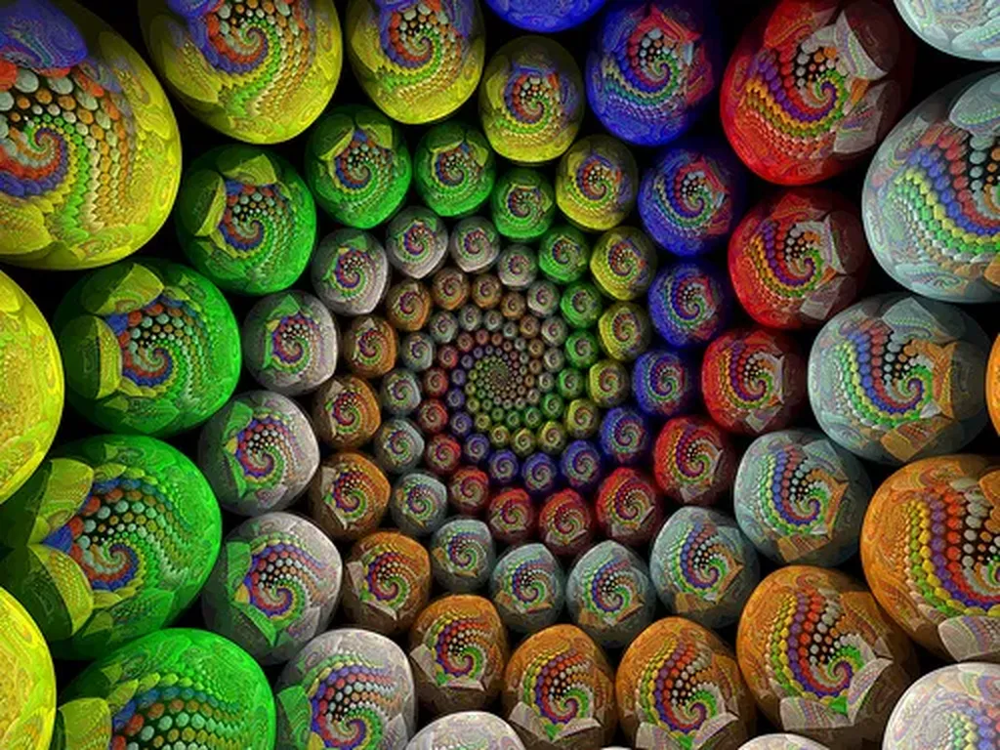

# Les blogs meurent, vive nos blogs

Tous les matins, [François Bon](http://tierslivre.net) constate que [que son Netvibes est désespérément vide](http://twitter.com/fbon/statuses/14286950636), ce qui implique que les blogueurs publient de moins en moins. Je n’aurais pas pu faire le même constat vu que je ne consulte pratiquement jamais mon agrégateur, préférant dérouler le fil de ma pensée, la suivre de lien en lien, sans aucun passage obligé (et donc, je ne vais que là ou mes pas me mènent, ils ne peuvent me montrer les vides, les manques, les béances…).

Est-ce de ma faute, et de la faute de tous ceux qui m’imitent, si la blogosphère s’assèche ? Ce serait un peu simpliste comme analyse. Mais, au moins, on peut s’entendre sur ce constat d’un assèchement. [Je me faisais déjà cette remarque en 2007.](../../2007/9/le-blog-est-mort-vive-le-blog.md) La tendance se confirme.

Alors, on peut se poser quelques questions. Y a-t-il moins de lecteurs ? Ou y’a-t-il toujours eu peu de lecteurs ? Est-ce qu’ils se concentrent sur les blogs qui restent ?

Personnellement, quand je regarde mes statistiques, je ne vois pas beaucoup de différences. Quand en 2006 ou 2007 je parlais beaucoup de politique, j’avais 30 000 visiteurs uniques par mois, aujourd’hui j’en ai 15 000 pour peu que je publie régulièrement, contrainte que je ne m’impose pas (et si je fais un pas de côté vers le people je remonte en flèche). Il me suffirait d’imiter les médias pour décupler l’audience. Constat : elle ne s’est pas évaporée, même si elle a cessé de gonfler d’elle-même, par un simple phénomène d’entraînement.

Je ne crois donc pas qu’il y ait moins de lecteurs, qu’ils aient tous fui vers les réseaux sociaux ou les pure players. Si la blogosphère s’assèche, c’est de l’intérieur, en partie à cause de ses acteurs.

1. Même si le lectorat ne diminue pas, il n’a jamais été innombrable, pas plus vaste que ces 3 % de lecteurs de livres. Le gâteau à se partager n’est pas infini, ce qui peut décourager la plupart de ceux qui aspirent à une forme reconnaissance.

- La reconnaissance justement. À l’âge d’or de la blogosphère, tout le monde s’intéressait aux blogueurs, nous avions une reconnaissance médiatique, reconnaissance qui s’est accrochée aux vieux blogueurs fossilisés qui d’ailleurs, au fond, ne bloguaient que pour promouvoir leur business « à côté ».

- Un business qui ne s’est jamais incarné dans les blogs eux-mêmes, pas plus que dans les médias pure player d’ailleurs. Rue89 est condamné à faire de formation et du développement pour vivre. Un peu comme tous les écrivains qui accumulent les petits boulots. Pour les blogueurs, c’est pire. Ils ressemblent plutôt aux poètes qui paient pour imprimer leurs opuscules et qui courent les festivals pour écouler leur camelote. Y’a de quoi décourager les plus valeureux.

- Que font les survivants ? Pour la plupart, ils chroniquent ce que les autres disent (quand ils ne traduisent pas des articles américains, parfois sans le dire). Franchement quel intérêt. Certains comme [Seb Musset](http://sebmusset.blogspot.com/), [Agnès Maillard](http://blog.monolecte.fr/), [Vivin](http://cdelasteyrie.typepad.com/) ont un talent évident. Mais les autres se contentent de déborder de rage. On peut un jour communier avec vous, mais la même rage nous habite et savoir que vous êtes enragés ne nous fait pas avancer, au contraire, on se fige sur la colère et on s’enferme et on boucle… perte de temps… puisque les médias ne sont déjà que commentaires de commentaires.

- La rage se tourne vers l’extérieur plutôt que vers ceux qui tentent de construire à l’intérieur… ainsi le réseau de liens perd en densité. Par liens, [j’entends ces liens de qualité](qualite-des-liens.md), pas de simples liens hypertextes, ces liens qui s’accompagnent de conversations croisées, d’articles qui répondent à d’autres articles, en une vaste œuvre collective.

- Je ne dis pas que ce projet n’existe plus. [Zoupic](http://www.zoupic.com/) comme [Galuel](http://www.creationmonetaire.info/) nous démontrent le contraire. C’est eux qu’il faut prendre en exemple par les pleurnichards antisarkozystes ou les adorateurs de la gauche décadente ou même les cassandres qui nous annoncent sans cesse une crise plus terrible sans au fond rien proposer de novateur. En France des gens pensent, simplement ils ne pensent pas là où on les attends… là où on les attend, personne ne pense, mais il serait dangereux, comme beaucoup de gens le font, d’en déduire qu’il n’existe pas de penseurs contemporains.

En résumé, la blogosphère s’assèche par manque de motivation des blogueurs, par manque de récompenses, par une trop grande attirance pour les médias traditionnels, par le refus d’être auteur et de s’engager dans la création d’une œuvre originale, ce qui implique un lent processus de maturation et d’inévitables traversées du désert. Au final, il n’y a aucune raison pour qu’il y ait plus de blogueurs que d’écrivains ou que de poètes. La blogosphère n’est pas la noosphère, mais une de ses composantes. Ne durent que les blogueurs qui ont la vocation et un projet qui les travaille au plus profond (j’oublie ceux qui durent pour que dure leur business… les lire ne m’a jamais intéressé).

#netculture #coup_de_gueule #y2010 #2010-5-20-11h6
