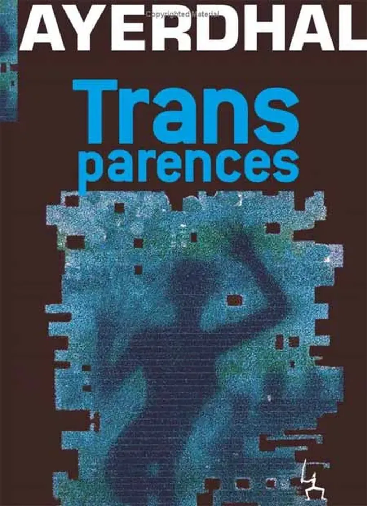

# Le désespoir, c’est l’absence de tout espoir

[Ayerdhal](http://fr.wikipedia.org/wiki/Ayerdhal) termine pratiquement sur ces mots, « le désespoir, c’est l’absence de tout espoir », [*Résurgences*](http://www.amazon.fr/gp/product/284626211X/), sont vingt-et-unième roman. À la suite de Sartre, il affirme la nécessité de l’engagement créatif autant que politique. Et l’on comprend que, lui, l’auteur engagé, a décidé de s’engager plus encore, non seulement dans la dénonciation de ce qui ne tourne pas rond dans nos sociétés, mais aussi dans la construction d’une nouvelle harmonie.

> Je crois que mon prochain bouquin ne plaira pas à tout le monde et qu’il ne fera rire personne.

N’ouvrez *Résurgences* qu’après un parcours initiatique, facilité par les rééditions [des premiers livres d’Ayerdhal au Diable Vauvert](http://www.audiable.com/livre/?GCOI=84626100167230&fa=author&person_id=9).

J’avais parlé avec enthousiasme de [*Demain, une oasis*](../../2006/11/demain-une-oasis.md), il est temps de tout reprendre au début et de commencer par [*La Bohême et l’Ivraie*](http://www.amazon.fr/Bohême-lIvraie-Ayerdhal/dp/2846261342/). Ce roman que je n’ai pas réussi à lâcher, ce qui est rare chez moi, expose [comme je le disais hier](non-violence-revisitee.md) une pratique décalée de la non-violence, une révolte par la complexification émotionnelle de l’humanité. Il y est question avec vingt ans d’avance d’[egocasting](http://theoriedestendances.com/2010/01/07/egocasting-le-pivot-de-la-conscience-numerique/) et d’egocratie (conséquence ultime du cinquième pouvoir), de ses dangers comme de ses espoirs.

Au fil de ma lecture, je n’ai pu m’empêcher de faire le parallèle avec deux monuments de la littérature, deux livres fondateurs des récits initiatiques : *Les Années d’apprentissage de Wilhelm Meister*, écrit par Goethe en 1795 et 1796, et *Le jeu des perles de verre*, publié par Hermann Hesse en 1943.

Une grande différence toutefois : Ayerdhal ne s’arrête pas à l’initiation, racontée dans sa première partie, il passe dans la suite à l’action sociale, à la réinvention de l’humanité. Je retrouve cette dichotomie dans la saga de Naïs, avec [*Transparences*](http://www.amazon.fr/Transparences-Ayerdhal/dp/2253101125/) en ouverture et *Résurgences* qui creuse une tranchée sanglante dans l’ignominie contemporaine.

Autant dire que vous devez lire trois livres si vous voulez en même temps goûter l’histoire, tant celle des personnages d’Ayerdhal que celle d’Ayerdhal lui-même. En quelque sorte un cycle se boucle avec ce texte charnière. L’auteur atteint sa maturité et, comme il nous le promet en conclusion, il se prépare à de nouvelles investigations.

*PS : Sur Amazon, vous pouvez commencer à lire les trois romans. Retrouvez Ayerdhal et asticotez-le [sur une page d’un service dont je ne devrez plus prononcer le nom](http://www.facebook.com/pages/Ayerdhal/182872030566). Yal, tu devrais fuir cet endroit qui accumule tous les maux que nous dénonçons.*

#critique #litterature #sf #dialogue #y2010 #2010-5-12-10h21
