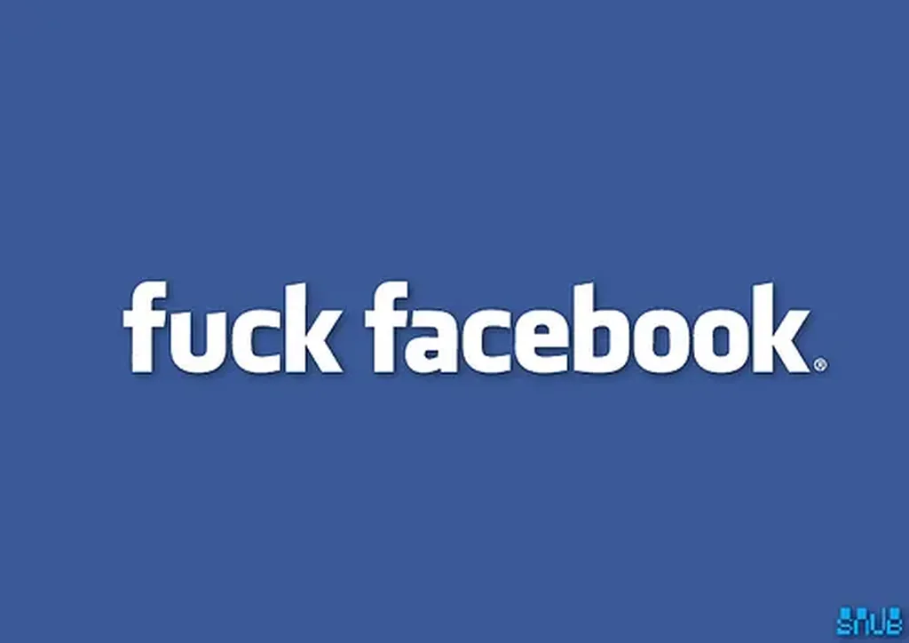

# Facebook n’est pas le seul danger qui plane sur le Web

Les consciences s’éveillent. Il était temps. [Affordance dénonce les risques pour l’écosystème du Web](http://affordance.typepad.com/mon_weblog/2010/05/le-like-tuera-le-lien.html), [Framablog et *Wired* rappellent les dangers pour la confidentialité et la main mise sur nos données](http://www.framablog.org/index.php/post/2010/05/13/facebook-wired), [*The New York Times* proclame le Web comme le plus grand des réseaux social](http://www.nytimes.com/2010/05/16/business/16digi.html)… Enfin Facebook est montré du doigt. Je suis soulagé. [Depuis 2007, j’avais l’impression de me battre contre des moulins à vent](../../2007/7/hypercentralisation.md) et [de pousser des gueulantes pour rien](#facebook).

Oui, [le Web est le plus grand des réseaux social](../3/facebook-et-twitter-bons-pour-la-politique-a-papa.md). Il suffit de lui adjoindre quelques add-ons pour que nous puissions nous passer de Facebook. [Zuckergerg est trop con](http://owni.fr/2010/05/14/encules-de-facebookeurs/) pour que nous ne cherchions pas à détruire son bel empire. Tout cela n’existera plus dans quelques années, à moins que les internautes continuent de succomber au plus primaire des désirs mimétiques.

Mais ne nous focalisons pas sur l’ogre. Toute force centralisatrice constitue un danger pour l’environnement Internet. Non, je ne place pas au-dessus de tout la décentralisation. Dans *[Croisade](../../page/la-quatrieme-theorie)*, je relève les dangers de structures décentralisées de type essaim, qui nient les individus. En revanche, depuis *[Le peuple des connecteurs](../../page/le-peuple-des-connecteurs)*, je dénonce la capacité des structures centralisées à gérer la complexité, d’autant plus la complexité sociale.

Internet et le Web nous offrent des opportunités politiques parce, par leur décentralisation, ils s’adaptent à l’état du monde contemporain. Ils nous aident à nous individuer, à maximiser la complexité, [à accroître nos libertés](la-liberte-le-lien.md), notamment la liberté d’expression. Les structures centralisatrices, avec leur volonté de puissance et de contrôle, ne peuvent qu’enrayer ce processus. En ce sens, Facebook est un danger pour la socialisation de l’humanité. **Lorsque le réseau social est centralisé, nous sommes en dictature. Facebook ne fait que nous y préparer.**

C’est à chacun de nous de prendre ses responsabilités. Personnellement, je ne vais plus sur Facebook depuis 2007. Je me contente d’y reproduire automatiquement grâce à des robots les données que je publie ailleurs. Il est hors de question que j’aille dans cet environnement entretenir des liens. J’utilise Facebook pour décentraliser mes données, mais je n’y centralise pas mon activité Web.

Je noue les liens les plus intenses chez moi, sur mon blog. Pourtant, la structure même du blog me satisfait de moins en moins. Mon blog est en effet centralisé. Disponible à un URL donné, hébergé sur un serveur donné. Je pourrais certes proposer des sites miroirs, mais chacun d’eux resterait centralisé et donc vulnérable, à la censure comme aux attaques des pirates qui pourraient vouloir combattre mes idées.

Le Web bien que décentralisé connecte des nœuds localisés, donc des points dans une certaine mesure centraux à leur écosystème respectif. La seule solution, c’est de rendre les sites Web autonomes, [d’en faire des paquets de données qui circulent librement sur l’infrastructure sociale](web-sans-site-web-2.md) et qui communiquent les uns avec les autres pour s’actualiser.

Si le blog même me pose problème, il va sans dire que je vois d’un mauvais œil tous les sites qui reprennent le vieux modèle du portail. Je pense notamment aux sites d’actualités pseudo sociaux qui tentent d’agréger les articles des blogueurs, qui se veulent les vitrines du Web et du monde sur le modèle de la vielle presse. À terme, ils sont tout aussi dangereux que Facebook. Leur centralisation grandissante leur donne un pouvoir grandissant, par appauvrissement incident de la blogosphère, et les rend de plus en plus vulnérables aux jeux de pouvoir.

Hommes et femmes libres, nous devons nous tenir à distance d’eux. Continuer à créer des îles sur le Net et à les interconnecter pour tresser une architecture sociale animée de liens profonds.

### Notes

1. Je sais qu’[on peut gagner de l’audience en s’activant sur Facebook](http://www.mikiane.com/node/2010/05/16/pollinisation-de-contenus-ma-m-thode-r-v-l-e). Je crois que nous ne devons pas nourrir la bête, sinon il ne faudra pas se plaindre plus tard. La pollinisation doit s’effectuer de pair à pair.
2. OK, j’ai créé [coZop.com](http://cozop.com), c’est un service centralisé. Dès que j’aurais le temps, et surtout le courage, je virerai le système de replublication systématique, pour ne conserver que le mécanisme de recommandation sociale.

#blogosphere #centralisation #facebook #netculture #coup_de_gueule #y2010 #2010-5-17-10h35
